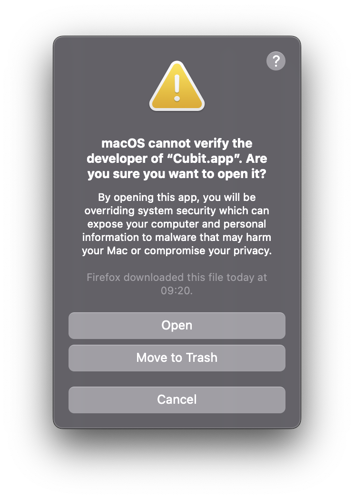
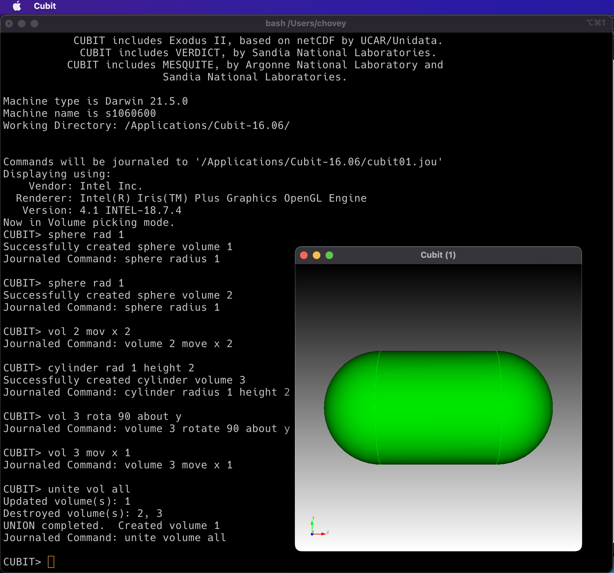
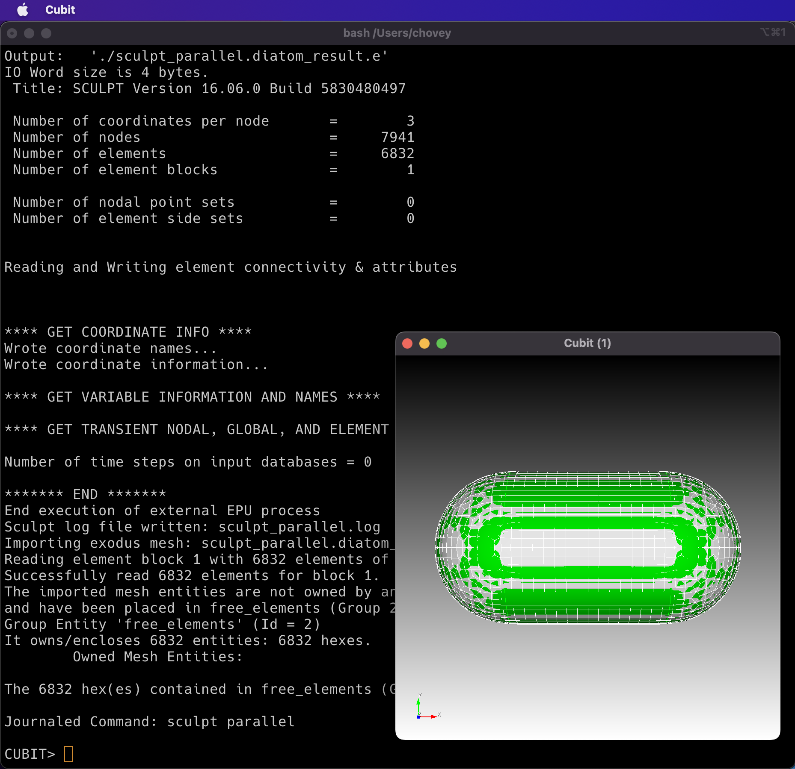
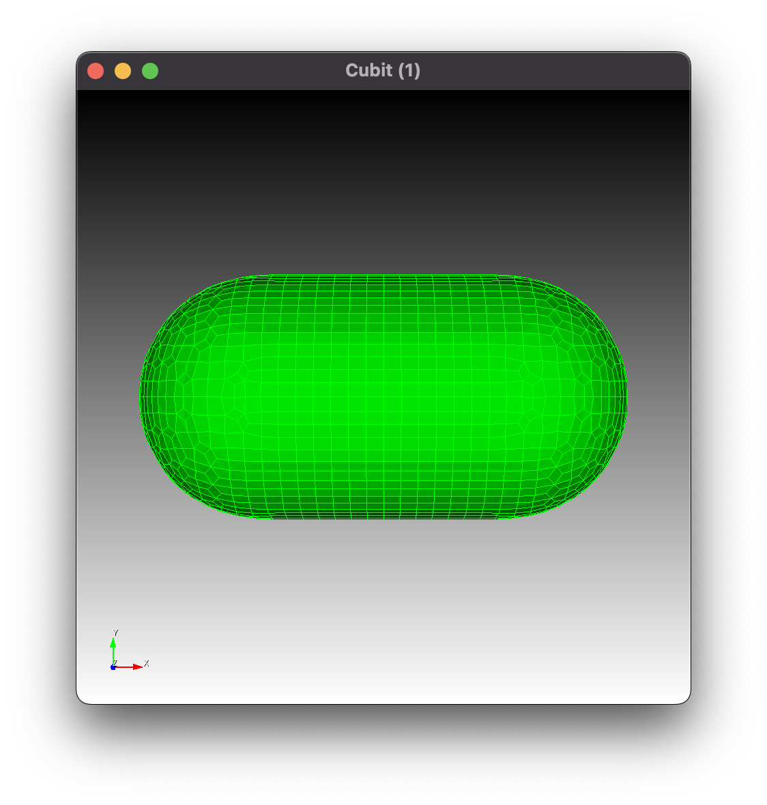
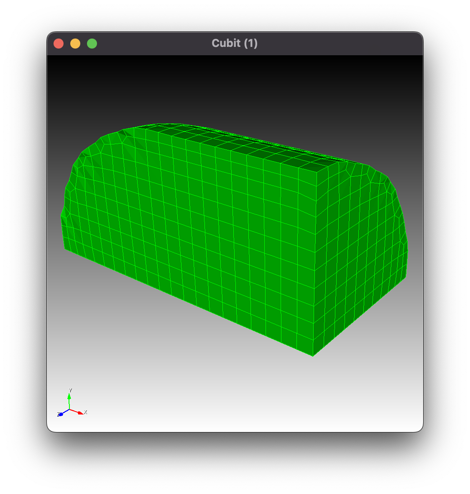
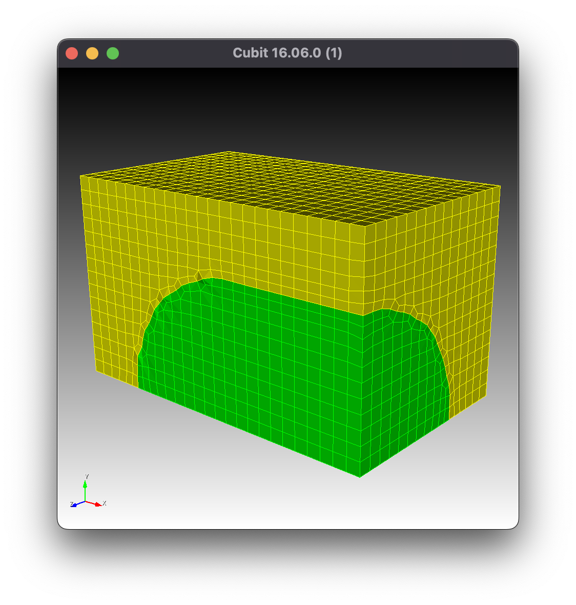
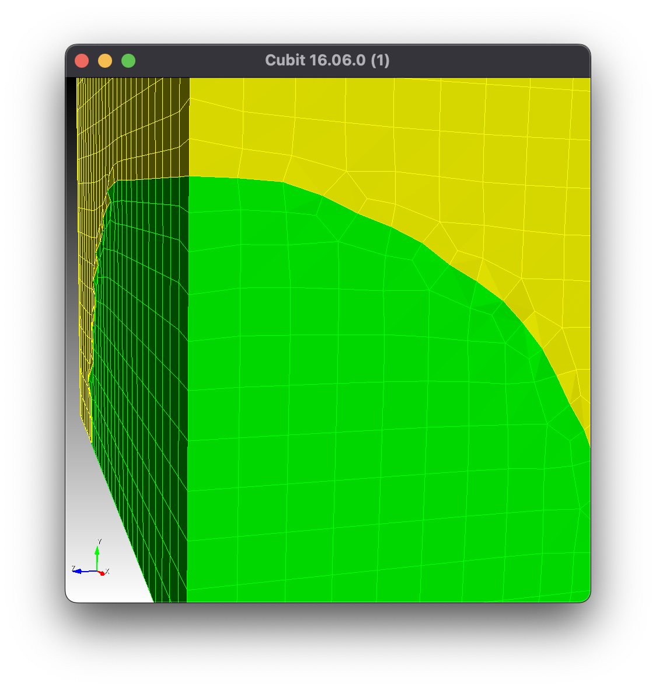

# Cubit local installation

* See also: [Sculpt API](../doc/sculpt-api.md)

## Download

* *2023-03-03: Upgrade Cubit from version 16.08, 16.10 (used in 2023), and 16.14 (used in 2024).**
  * Cubit [download](https://cubit.sandia.gov/downloads/)
  * The [public Cubit page](https://cubit.sandia.gov/downloads/) directs Sandia users to download the latest version of Cubit [here](https://sharepoint.sandia.gov/sites/meshing).
  * Removed `/Applications/Cubit-16.08`
  * Installed `Cubit-16.10.1-Mac64.dmg` (374 MB) released 2023-03-03
* *2022-10-06: Upgrade Cubit from version 16.06 to 16.08.  All notes below, created for 16.06, remain relevant.*
  * Removed `/Applications/Cubit-16.06` (379.4 MB) released 2022-07-12
  * Installed `Cubit-16.08.0-Mac64.dmg` (379.5 MB) released 2022-07-12
* *All notes below, created for 16.06, remain relevant.*

Problem | Solution
-- | --
Double-click to open `Cubit.app` will not work on the first attempt because macOS is guarding the operating system from a newly-downloaded application. </br></br>[Ctrl] + [right click] to open the `Cubit.app`, a warning dialog appears, click Open: | 

### Quarantine Removal

Open a terminal window and navigate to the `/Applications/Cubit16.06` directory.

List the full permissions:

```bash
ls -l
```

Check to see if the permissions end with a `@` character, which indicates that Apple has placed the item into "quarantine".

For example:

```bash
/Applications/Cubit-16.06✔> ls -l

drwxr-xr-x@ 3 chovey  admin    96B Jul 12 12:56 Cubit.app/
-rwxr-xr-x@ 1 chovey  admin   1.7K Jul 25 13:22 cubit.command*
-rw-r--r--@ 1 chovey  admin    38K Jun 30 16:11 license.txt
```

As shown above, both the `Cubit.app/` and `cubit.command` are in quarantine.

Remove the quartantine restriction:

```bash
xattr -r -d com.apple.quarantine Cubit.app
xattr -r -d com.apple.quarantine cubit.command
```

Confirm the quarantine is removed by the absence of the `@` in the permissions:

```bash
/Applications/Cubit-16.06✔> ls -l

drwxr-xr-x  3 chovey  admin    96B Jul 12 12:56 Cubit.app/
-rwxr-xr-x  1 chovey  admin   1.7K Jul 25 13:22 cubit.command*
-rw-r--r--@ 1 chovey  admin    38K Jun 30 16:11 license.txt
```

Then, open command line Cubit:

```bash
bash-3.2$ ./cubit.command


                   CCCCC    UU   UU   BBBBBB    IIII   TTTTTT
                  CC   CC   UU   UU   BB   BB    II      TT
                  CC        UU   UU   BB   BB    II      TT
                  CC        UU   UU   BBBBBB     II      TT
                  CC        UU   UU   BB   BB    II      TT
                  CC   CC   UU   UU   BB   BB    II      TT
                   CCCCC     UUUUU    BBBBBB    IIII     TT  tm

                            MESH GENERATION TOOLKIT
                                      FOR
                   PRE-PROCESSING OF FINITE ELEMENT ANALYSES

                 User community mailing list: cubit@sandia.gov
         Report bugs and enhancement requests to cubit-help@sandia.gov


                         Cubit Version 16.06.0 64-Bit Build 5830480497
                               VTK Version 8.2.0
                              ACIS Version 31.0.0.0
                            Exodus API Version 8.03
                            MeshGems Version 2.14-1
                     Copyright 2001-2019 Sandia Corporation
              Revised Fri Jul 1 14:23:35 2022 -0600
                        Running 07/21/2022 09:34:10 AM

                 CUBIT includes MeshGems by Spatial Inc.
                  CUBIT includes ACIS software by Spatial Inc.
                  CUBIT includes LP Solve by Michel Berkelaar.
                       CUBIT includes VTK by Kitware Inc.
           CUBIT includes Exodus II, based on netCDF by UCAR/Unidata.
            CUBIT includes VERDICT, by Sandia National Laboratories.
          CUBIT includes MESQUITE, by Argonne National Laboratory and
                         Sandia National Laboratories.

Machine type is Darwin 21.5.0
Machine name is s1060600
Working Directory: /Applications/Cubit-16.06/


Commands will be journaled to '/Applications/Cubit-16.06/cubit01.jou'
Displaying using:
    Vendor: Intel Inc.
  Renderer: Intel(R) Iris(TM) Plus Graphics OpenGL Engine
   Version: 4.1 INTEL-18.7.4
Now in Volume picking mode.
CUBIT>
```

## Set Writable Working Directory for GUI

In the Cubit GUI, change the working directory from `/`, which is the default and has write protection, which will prevent sculpt from running, so one's home directory, e.g., `/Users/chovey`, which allows writing.

* File menu
  * Set Directory menu item
    * Choose Working Directory dialog box
      * A writable path, e.g., `/Users/chovey`, and
      * [x] Restore Working Directory on Startup (checked item).

## Test Installation

Following is a small unit test of Cubit and Sculpt.  Following [SculptSANDReport.pdf](https://drive.google.com/file/d/1g_BYRmrX1PpK5VnCHw1uhl452NLdP4CP/view?usp=sharing) (24 MB), page 135:

```bash
CUBIT> 
reset # clear database
sphere rad 1
sphere rad 1
vol 2 mov x 2
cylinder rad 1 height 2
vol 3 rota 90 about y
vol 3 mov x 1
unite vol all
```



Then run sculpt:

```bash
sculpt parallel # (a macOS dialog will appear, click "Accept")

CUBIT> sculpt parallel
STL file written: "sculpt_parallel_Volume_1.stl"
Diatoms file written: "sculpt_parallel.diatom"
Run file written: "sculpt_parallel.run"
Begin execution of external Sculpt process...
/Applications/Cubit-16.06/Cubit.app/Contents/MacOS/sculpt --cubit_launch -j 4 -x 36 -y 20 -z 20 -t -1.349116 -u -1.305064 -v -1.305064 -q 3.349116 -r 1.305064 -s 1.305064 -e sculpt_parallel.diatom_result -d sculpt_parallel.diatom
SCULPT Running on host name: s1060600
At time: Thu Jul 21 09:53:45 2022

Initializing MPI on 4 Processors: mpiexec = /Applications/Cubit-16.06/Cubit.app/Contents/MacOS/mpiexec


/Applications/Cubit-16.06/Cubit.app/Contents/MacOS/mpiexec --mca oob_tcp_if_include lo0 --mca btl ^tcp -np 4 /Applications/Cubit-16.06/Cubit.app/Contents/MacOS/psculpt -j 4 -x 36 -y 20 -z 20 -t -1.349116 -u -1.305064 -v -1.305064 -q 3.349116 -r 1.305064 -s 1.305064 -e sculpt_parallel.diatom_result -d sculpt_parallel.diatom
                 SANDIA NATIONAL LABORATORIES

     SSSSS     CCCCC    UU   UU   LL        PPPPPP    TTTTTT
    SS   SS   CC   CC   UU   UU   LL        PP   PP     TT
    SS        CC        UU   UU   LL        PP   PP     TT
     SSSSS    CC        UU   UU   LL        PPPPPP      TT
         SS   CC        UU   UU   LL        PP          TT
    SS   SS   CC   CC   UU   UU   LL        PP          TT
     SSSSS     CCCCC     UUUUU    LLLLLLL   PP          TT

                     PARALLEL HEX MESHING
                            FROM
                     VOLUME FRACTION DATA

              SCULPT Version 16.06.0 Build 5830480497
              Copyright 2015 Sandia Corporation
      Revised Fri Jul 1 14:23:35 2022 -0600
      User Support and Bug Reports: cubit-help@sandia.gov

     SCULPT includes CAMAL by Sandia National Laboratories
  SCULPT includes CTH Diatoms by Sandia National Laboratories
  SCULPT is a companion application to the CUBIT Geometry and
       Meshing Toolkit by Sandia National Laboratories

Input: /Applications/Cubit-16.06/Cubit.app/Contents/MacOS/psculpt
  --num_procs   -j  4
  --diatom_file -d  sculpt_parallel.diatom
  --exodus_file -e  sculpt_parallel.diatom_result
  --nelx        -x  36
  --nely        -y  20
  --nelz        -z  20
  --xmin        -t  -1.349116
  --ymin        -u  -1.305064
  --zmin        -v  -1.305064
  --xmax        -q  3.349116
  --ymax        -r  1.305064
  --zmax        -s  1.305064


Total Cells                = 14400
Number of Processors       = 4
Approx. Num Cells per Proc = 3600

Decomposing Cartesian grid for parallel...
  Rank 0 Number of cells/segment in directions X 	 18
  Rank 0 Number of cells/segment in directions Y 	 20
  Rank 0 Number of cells/segment in directions Z 	 10
  Global Number of grid segments in directions X 	 2
  Global Number of grid segments in directions Y 	 1
  Global Number of grid segments in directions Z 	 2

initializing geometry...
 Parsing diatom input
 Finished loading diatom master buffer
 Finished communicating diatom master buffer
 Finished creating diatoms

Broadcasting 30957 elements of stl geom data

STL summary: fn=sculpt_parallel_Volume_1.stl vertices=8844 Triangles=2948
  Bounding box:
   xmin=-1.000000 xmax=2.998103
   ymin=-1.000000 ymax=1.000000
   zmin=-1.000000 zmax=1.000000
  Side length min=0.000031 length max=2.003784
  angle min=0.000877 angle max=176.538474 degrees
  area min=1.116803e-07 area max=0.123091
 Checking Triangle Side Matches Triangle Id=0
  Diatom STL All Sides Properly matched

inserting volume fractions...
begin SCULPT meshing...
(1/9) computing normals...
(2/9) classifying materials...
(3/9) resolving non-manifolds...
(4/9) computing dual edge intersections...
(5/9) computing material interfaces...
(6/9) generating geometry...
(7/9) generating buffer hexes...
(8/9) generating interior hexes...
(9/9) begin smoothing...
Begin smoothing hexes using:
  Curve Smoothing              = SMOOTH_CURV_VFRAC
  Surface Smoothing            = SMOOTH_SURF_HYBRID
  Volume Smoothing             = SMOOTH_VOL_HYBRID_CAMAL
  Boundary Buffer Improvement  = YES
  Surface Projection Type      = LINEAR_SURFACE_PROJECTION
  Laplacian Iterations         = 2
  Maximum Optimization Iters   = 5
  Optimization Threshold       = 0.600000
  Curve Opt. Threshold         = 0.100000
  Max Parallel Coloring Iters  = 100
  Parallel Coloring Threshold  = 0.200000
  Max Guaranteed Quality Iters = 0
  Guaranteed Quality Threshold = 0.200000
Laplacian Iter: 1
Laplacian Iter: 2
Smoothing 6832 hexes on 4 processors
Jacobi Opt Iter: 1,  Num bad: 0, Num poor: 0, Min SJ: 0.283456
Jacobi Opt Iter: 2,  Num bad: 0, Num poor: 0, Min SJ: 0.325482
Jacobi Opt Iter: 3,  Num bad: 0, Num poor: 0, Min SJ: 0.326913
Jacobi Opt Iter: 4,  Num bad: 0, Num poor: 0, Min SJ: 0.340501
Jacobi Opt Iter: 5,  Num bad: 0, Num poor: 0, Min SJ: 0.338385
Begin parallel color smoothing 0 nodes below threshold 0.200000
No parallel color smoothing performed: min SJ > 0.200000
Begin parallel color smoothing 0 nodes below threshold 0.200000
No parallel color smoothing performed: min SJ > 0.200000
building exodus mesh...
generating global ids...
generating parallel communication maps...
================ MESH SUMMARY ===================
Base Filename	sculpt_parallel.diatom_result
Num Procs	4
Num Nodes	7941
Num Elements	6832
Num Blocks	1
Num Nodesets	0
Num Sidesets	0
Num Bad Qual	0
Num Poor Qual	0
Min Quality	0.399690
Avg Quality	0.907892
Min Edge Len	0.060411
Min Qual Rank	2

Job Completed Thu Jul 21 09:53:46 2022

Elapsed Time		0.413765 sec. (0.006896 min.)
Total Time on 4 Procs	1.653496 sec. (0.027558 min.)
Slow Rank		2
Done!
Sculpt log file written: sculpt_parallel.log
Begin execution of external EPU process...
/Applications/Cubit-16.06/Cubit.app/Contents/MacOS/epu -p 4 sculpt_parallel.diatom_result
epu --  E Pluribus Unum
	(Out of Many One -- see http://www.greatseal.com/mottoes/unum.html)
	ExodusII Parallel Unification Program
	(Version: 3.38) Modified: 2012/02/14
Input(0): './sculpt_parallel.diatom_result.e.4.0'
...
Input(3): './sculpt_parallel.diatom_result.e.4.3'

**** READ LOCAL (GLOBAL) INFO ****
Node map is contiguous.
Finished reading/writing Global Info


**** GET BLOCK INFORMATION (INCL. ELEMENT ATTRIBUTES) ****
Global block count = 1

Getting element block info.
Element id map is contiguous.

**** GET SIDE SETS *****

**** GET NODE SETS *****

**** BEGIN WRITING OUTPUT FILE *****
Output:   './sculpt_parallel.diatom_result.e'
IO Word size is 4 bytes.
 Title: SCULPT Version 16.06.0 Build 5830480497

 Number of coordinates per node       =        3
 Number of nodes                      =     7941
 Number of elements                   =     6832
 Number of element blocks             =        1

 Number of nodal point sets           =        0
 Number of element side sets          =        0


Reading and Writing element connectivity & attributes


**** GET COORDINATE INFO ****
Wrote coordinate names...
Wrote coordinate information...

**** GET VARIABLE INFORMATION AND NAMES ****

**** GET TRANSIENT NODAL, GLOBAL, AND ELEMENT DATA VALUES ****

Number of time steps on input databases = 0

******* END *******
End execution of external EPU process
Sculpt log file written: sculpt_parallel.log
Importing exodus mesh: sculpt_parallel.diatom_result.e
Reading element block 1 with 6832 elements of type HEX...
Successfully read 6832 elements for block 1.
The imported mesh entities are not owned by any geometry,
and have been placed in free_elements (Group 2).
Group Entity 'free_elements' (Id = 2)
It owns/encloses 6832 entities: 6832 hexes.
	Owned Mesh Entities:

The 6832 hex(es) contained in free_elements (Group 2) are: 1 to 6832

Journaled Command: sculpt parallel

CUBIT>
```



```bash
CUBIT>
draw block all
```



### Domain Modification

Next, clip the original geometry using a bounding box, and mesh the void srrounding the remaining original geometry.  Use a `size` and bounding `box`:

> In this case we have used the size option to define the base cell size for the grid. We have also used the box option to define a bounding box in which the mesh will be generated. Any geometry falling outside of the bounding box is ignored by Sculpt. 

```bash
CUBIT>
delete mesh
sculpt parallel size 0.1 box location position -1.5 0 -1.5 location position 1 1.5 0
draw block all
```



```bash
CUBIT>
delete mesh
sculpt parallel size 0.1 box location position -1.5 0 -1.5 location position 1 1.5 0 void 1
draw block all
```

> Notice that this example is precisely the same as the last with the exception of the addition of the `void` option. Mesh is generated in the space surrounding the volume out to the extent of the bounding box. In this case, an additional material block is defined and automatically assigned an ID of 2. The nodes and element faces at the interface between the two blocks are shared between the two materials.





## Command Line Sculpt

### Input

* `sculpt.diatom`
* `sculpt.i`
* `sculpt.run*` (chmod +x)
* `sculpt_Volume_1.stl`

The `sculpt.diatom` file contains:

```bash
  diatoms
    package 'Volume_1'
      material 1
      insert stl
        FILE = 'sculpt_Volume_1.stl'
      endinsert
    endp
  enddia
````

The `sculpt.i` file contains:

```bash
$ Input file created: Mon Feb 26 15:50:31 2024

BEGIN SCULPT

  xmin = -11.250942
  ymin = -11.250042
  zmin = -11.251125
  xmax = 11.249058
  ymax = 11.249958
  zmax = 11.248875
  cell_size = 0.500000
  stair = full
  gen_sidesets = variable
  exodus_file = sculpt.diatom_result
  diatom_file = sculpt.diatom

END SCULPT
```

The `sculpt_run*` file contains:

```bash
/Applications/Cubit-16.14/Cubit.app/Contents/MacOS/sculpt -j 2 -t -11.250942 -u -11.250042 -v -11.251125 -q 11.249058 -r 11.249958 -s 11.248875 -cs 0.500000 -str full -SS 2 -e sculpt.diatom_result -d sculpt.diatom
```

The `sculpt_Volume_1.stl` file contains:

```bash
solid Volume_1
  facet normal 1.259654e-01 9.611645e-01 2.455512e-01
    outer loop
      vertex 1.355226e+00 9.642606e+00 2.216244e+00
      vertex 9.780558e-01 9.725248e+00 2.086242e+00
      vertex 1.057382e+00 9.620792e+00 2.454422e+00
    endloop
  endfacet
  facet normal 1.440759e-01 9.694937e-01 1.983030e-01
    outer loop
      vertex 1.307024e+00 9.728552e+00 1.831079e+00
      vertex 9.780558e-01 9.725248e+00 2.086242e+00
      vertex 1.355226e+00 9.642606e+00 2.216244e+00
    endloop
  endfacet

  ... // snip //

  facet normal 8.399346e-02 9.632378e-01 2.551825e-01
    outer loop
      vertex 6.286438e-01 9.682890e+00 2.361140e+00
      vertex 1.057382e+00 9.620792e+00 2.454422e+00
      vertex 9.780558e-01 9.725248e+00 2.086242e+00
    endloop
  endfacet
endsolid Volume_1
```

### Output

* `sculpt.diatom_result.e.2.0`
* `sculpt.diatom_result.e.2.0`

## Developer Mode

```bash
Cubit> set developer on # for in-development GUI
```

## Help

* Streaming [Channel](https://wp.sandia.gov/digital-ops/) channels, CompSim, Sculpt
* CompSim [knowledge base](https://sems-atlassian-srn.sandia.gov/servicedesk/customer/portal/6)
* Teams channel, CompSim Community, Geometry and Meshing
* Office Hours Mondays 1530-1630 hr
