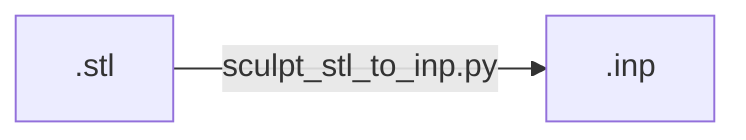

# Workflow

## stl to inp

| `sphere.stl`                   | to  | `sphere.inp`                                 |
| ------------------------------ | --- | -------------------------------------------- |
|  |     |  |
