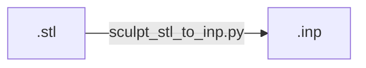

# Workflow

## stl to inp



| `sphere.stl`                   | to  | `sphere.inp`                                 |
| ------------------------------ | --- | -------------------------------------------- |
|  |     |  |

### Quality

| front                                                    | isometric                                                                            |
| -------------------------------------------------------- | ------------------------------------------------------------------------------------ |
|            |            |
|  |  |

Histogram:

```
CUBIT> quality hex all scaled jacobian histogram

 Hex quality, 6672 elements:
	Scaled Jacobian ranges from 3.518e-01 to 1.000e+00 (6672 entities)
	     Red ranges from 3.518e-01 to 4.444e-01 (69 entities)
	 Magenta ranges from 4.444e-01 to 5.370e-01 (172 entities)
	DkYellow ranges from 5.370e-01 to 6.296e-01 (213 entities)
	  Yellow ranges from 6.296e-01 to 7.222e-01 (598 entities)
	   Green ranges from 7.222e-01 to 8.148e-01 (1039 entities)
	    Cyan ranges from 8.148e-01 to 9.074e-01 (232 entities)
	    Blue ranges from 9.074e-01 to 1.000e+00 (4349 entities)

 Hex quality, 6672 elements:
------------------------------------
   Function Name    Average      Std Dev      Minimum   (id)      Maximum   (id)
 ---------------    ---------    ---------    ----------------    --------------
 Scaled Jacobian    8.881e-01    1.507e-01    3.518e-01 (3515)    1.000e+00 (30)
------------------------------------
```


