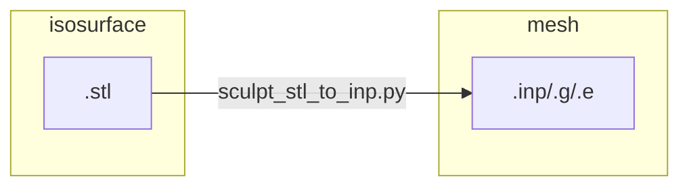
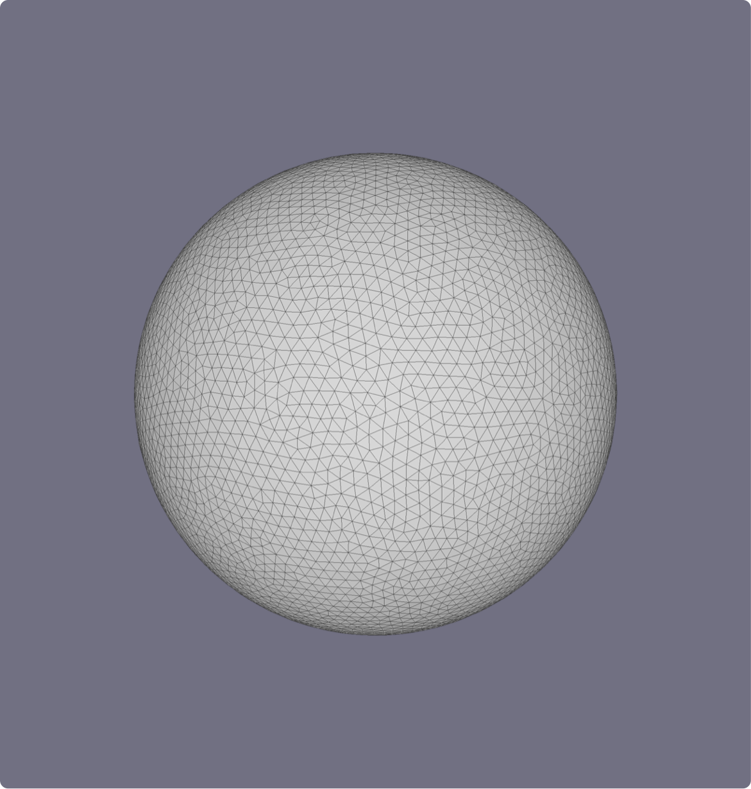
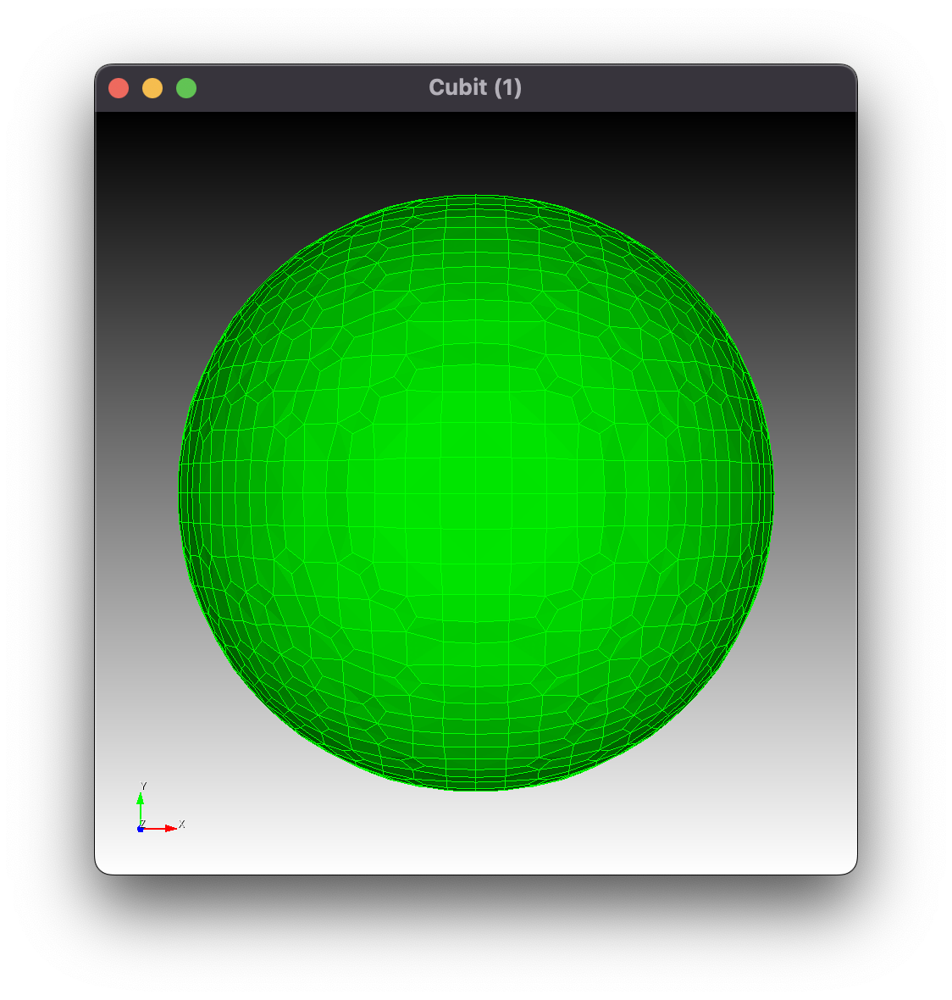
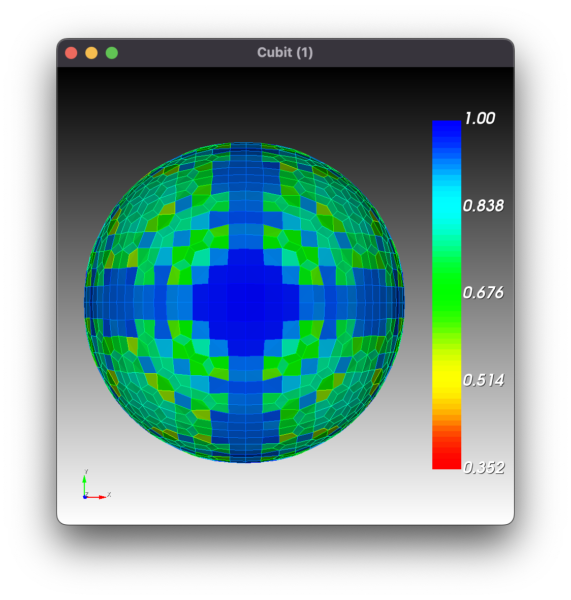
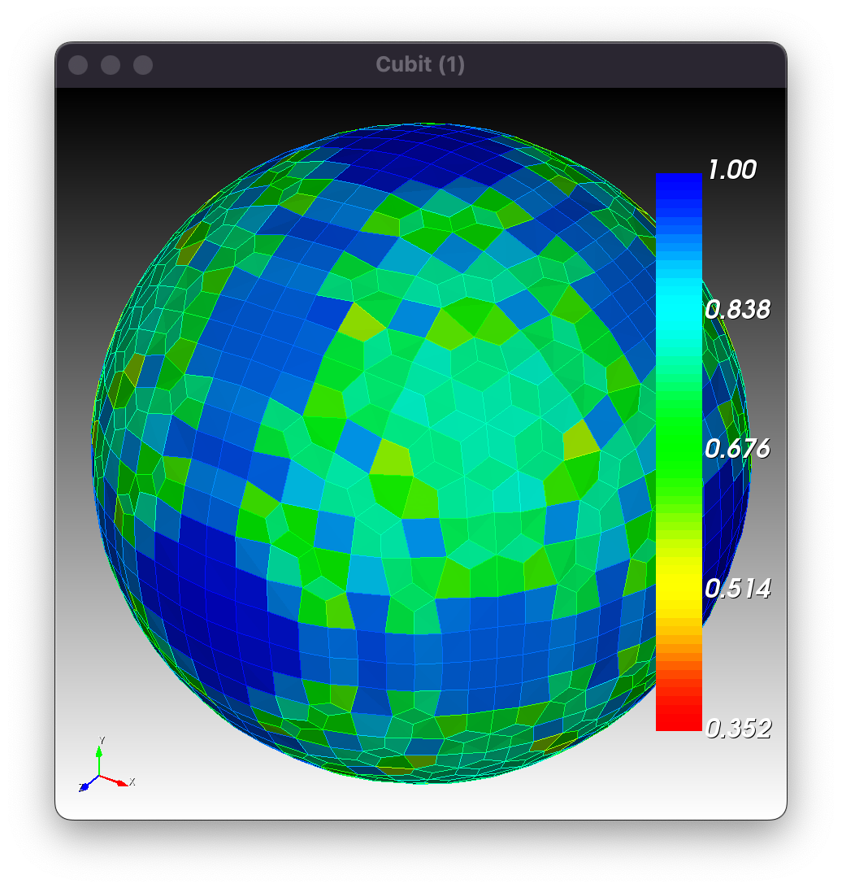
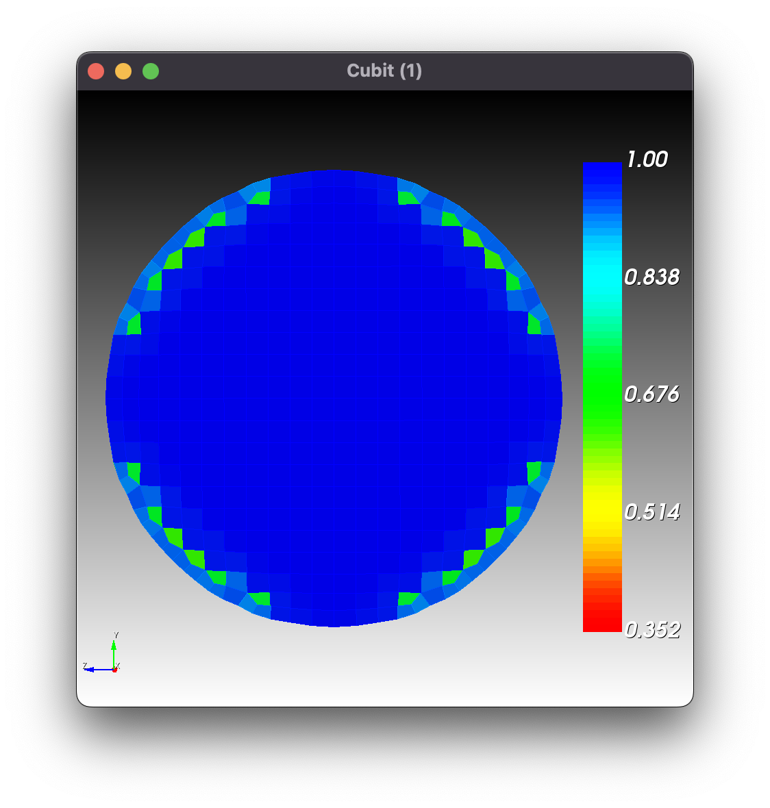
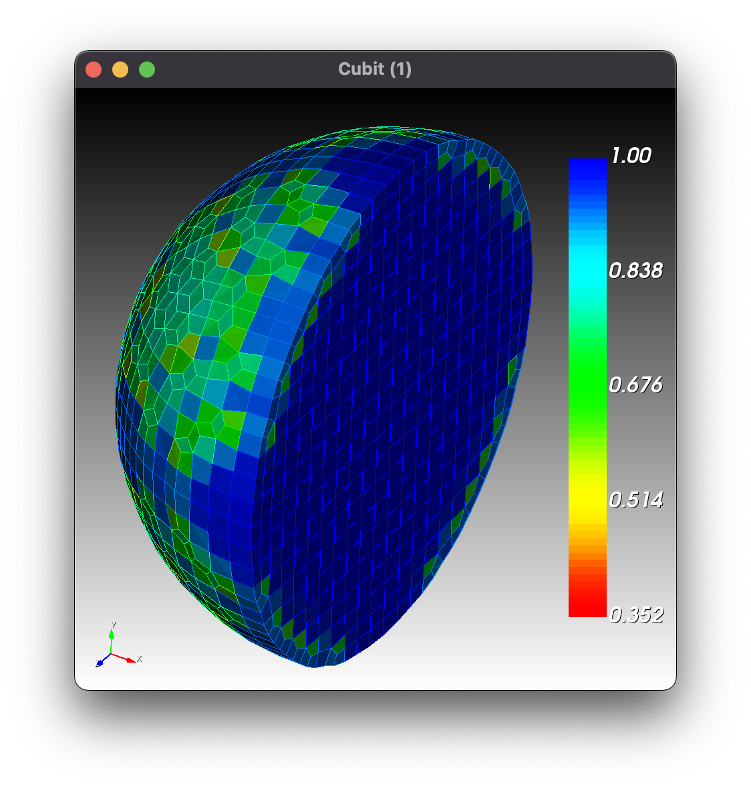
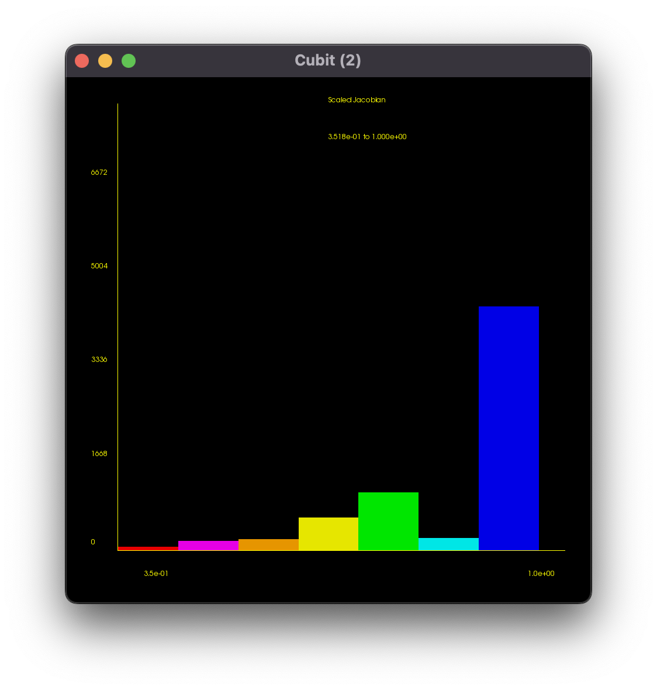

# Workflow

The goals for this section are

* Run Cubit interactively, from either the teriminal or via the GUI command line terminal, to verify that the Cubit installation is functional.
* Demonstrate, in a general context as manual steps, the processes that are automated through [`sculpt_stl_to_inp.py`](../src/atmesh/sculpt_stl_to_inp.py).

## stl to inp



| `sphere.stl`                   | to  | `sphere.inp`                                 |
| ------------------------------ | --- | -------------------------------------------- |
|  |     |  |

### Manual Steps

```bash
Users/chovey/autotwin/mesh> /Applications/Cubit-16.10/./cubit.command

                   CCCCC    UU   UU   BBBBBB    IIII   TTTTTT
                  CC   CC   UU   UU   BB   BB    II      TT
                  CC        UU   UU   BB   BB    II      TT
                  CC        UU   UU   BBBBBB     II      TT
                  CC        UU   UU   BB   BB    II      TT
                  CC   CC   UU   UU   BB   BB    II      TT
                   CCCCC     UUUUU    BBBBBB    IIII     TT  tm

                            MESH GENERATION TOOLKIT
                                      FOR
                   PRE-PROCESSING OF FINITE ELEMENT ANALYSES

                 User community mailing list: cubit@sandia.gov
         Report bugs and enhancement requests to cubit-help@sandia.gov


                         Cubit Version 16.10.1 64-Bit Build 890417fa0e
                               VTK Version 9.2.1
                              ACIS Version 31.0.0.0
                            Exodus API Version 8.03
                            MeshGems Version 2.14-1
                     Copyright 2001-2019 Sandia Corporation
              Revised Mon Feb 27 15:45:21 2023 -0700
                        Running 04/11/2023 09:37:10 AM

                 CUBIT includes MeshGems by Spatial Inc.
                  CUBIT includes ACIS software by Spatial Inc.
                  CUBIT includes LP Solve by Michel Berkelaar.
                       CUBIT includes VTK by Kitware Inc.
           CUBIT includes Exodus II, based on netCDF by UCAR/Unidata.
            CUBIT includes VERDICT, by Sandia National Laboratories.
          CUBIT includes MESQUITE, by Argonne National Laboratory and
                         Sandia National Laboratories.

Machine type is Darwin 22.4.0
Machine name is s1088757
Working Directory: /Users/chovey/autotwin/mesh/


Commands will be journaled to '/Users/chovey/autotwin/mesh/cubit01.jou'
Displaying using:
    Vendor: Apple
  Renderer: Apple M1 Pro
   Version: 4.1 Metal - 83.1
Now in Volume picking mode.
CUBIT>

cd "/Users/chovey/Downloads/scratch"
  Current directory is '/Users/chovey/Downloads/scratch/'
  Journaled Command: cd "/Users/chovey/Downloads/scratch"

import stl "/Users/chovey/autotwin/data/stl/sphere.stl" feature_angle 135.0 merge
  Reading facets...
    16890 facets read.
  Building facet-based geometry from 16890 facets...
  Body successfully created.
    Number of new vertices = 0
    Number of new curves = 0
    Number of new surfaces = 1
    Number of new shells = 1
    Number of new volumes = 1
    Number of new bodies = 1
  Geometry engine set to: Facet Geometry Engine version 10.0.0
  Journaled Command: import stl "/Users/chovey/autotwin/data/stl/sphere.stl" feature_angle 135 merge

# sculpt -j 2 -x 26 -y 26 -z 26 -t -0.624136 -u -0.624091 -v -0.624146 -q 0.624042 -r 0.624087 -s 0.624033 -e sculpt.diatom_result -d sculpt.diatom

# sculpt volume all gen_sidesets 2

sculpt
  STL file written: "sculpt_Volume_1.stl"
  Diatoms file written: "sculpt.diatom"
  Run file written: "sculpt.run"
  Begin execution of external Sculpt process...
  /Applications/Cubit-16.10/Cubit.app/Contents/MacOS/sculpt --cubit_launch -j 10 -x 26 -y 26 -z 26 -t -0.624136 -u -0.624091 -v -0.624146 -q 0.624042 -r 0.624087 -s 0.624033 -e sculpt.diatom_result -d sculpt.diatom
  SCULPT Running on host name: s1088757
  At time: Tue Apr 11 11:28:23 2023
  
  Initializing MPI on 10 Processors: mpiexec = /Applications/Cubit-16.10/Cubit.app/Contents/MacOS/mpiexec
  
  
  /Applications/Cubit-16.10/Cubit.app/Contents/MacOS/mpiexec --mca oob_tcp_if_include lo0 --mca btl ^tcp -np 10 /Applications/Cubit-16.10/Cubit.app/Contents/MacOS/psculpt -j 10 -x 26 -y 26 -z 26 -t -0.624136 -u -0.624091 -v -0.624146 -q 0.624042 -r 0.624087 -s 0.624033 -e sculpt.diatom_result -d sculpt.diatom
                   SANDIA NATIONAL LABORATORIES
  
       SSSSS     CCCCC    UU   UU   LL        PPPPPP    TTTTTT
      SS   SS   CC   CC   UU   UU   LL        PP   PP     TT
      SS        CC        UU   UU   LL        PP   PP     TT
       SSSSS    CC        UU   UU   LL        PPPPPP      TT
           SS   CC        UU   UU   LL        PP          TT
      SS   SS   CC   CC   UU   UU   LL        PP          TT
       SSSSS     CCCCC     UUUUU    LLLLLLL   PP          TT
  
                       PARALLEL HEX MESHING
                              FROM
                       VOLUME FRACTION DATA
  
                SCULPT Version 16.10.1 Build 890417fa0e
                Copyright 2015 Sandia Corporation
        Revised Mon Feb 27 15:45:21 2023 -0700
        User Support and Bug Reports: cubit-help@sandia.gov
  
       SCULPT includes CAMAL by Sandia National Laboratories
    SCULPT includes CTH Diatoms by Sandia National Laboratories
    SCULPT is a companion application to the CUBIT Geometry and
         Meshing Toolkit by Sandia National Laboratories
  
  Input: /Applications/Cubit-16.10/Cubit.app/Contents/MacOS/psculpt
    --num_procs   -j  10
    --diatom_file -d  sculpt.diatom
    --exodus_file -e  sculpt.diatom_result
    --nelx        -x  26
    --nely        -y  26
    --nelz        -z  26
    --xmin        -t  -0.624136
    --ymin        -u  -0.624091
    --zmin        -v  -0.624146
    --xmax        -q  0.624042
    --ymax        -r  0.624087
    --zmax        -s  0.624033
  
  
  Total Cells                = 17576
  Number of Processors       = 10
  Approx. Num Cells per Proc = 1757
  
  Decomposing Cartesian grid for parallel...
    Rank 0 Number of cells/segment in directions X 	 26
    Rank 0 Number of cells/segment in directions Y 	 13
    Rank 0 Number of cells/segment in directions Z 	 6
    Global Number of grid segments in directions X 	 1
    Global Number of grid segments in directions Y 	 2
    Global Number of grid segments in directions Z 	 5
  
  initializing geometry...
   Parsing diatom input
   Finished loading diatom master buffer
   Finished communicating diatom master buffer
   Finished creating diatoms
  
  Broadcasting 177348 elements of stl geom data
  
  STL summary: fn=sculpt_Volume_1.stl vertices=50670 Triangles=16890
    Bounding box:
     xmin=-0.499664 xmax=0.499570
     ymin=-0.499477 ymax=0.499473
     zmin=-0.499503 zmax=0.499390
    Side length min=0.012968 length max=0.028866
    angle min=30.611144 angle max=107.792557 degrees
    area min=9.447424e-05 area max=0.000263
   Checking Triangle Side Matches Triangle Id=0
   Checking Triangle Side Matches Triangle Id=10000
    Diatom STL All Sides Properly matched
  
  inserting volume fractions...
  begin SCULPT meshing...
  (1/9) computing normals...
  (2/9) classifying materials...
  (3/9) resolving non-manifolds...
  (4/9) computing dual edge intersections...
  (5/9) computing material interfaces...
  (6/9) generating geometry...
  (7/9) generating buffer hexes...
  (8/9) generating interior hexes...
  (9/9) begin smoothing...
  Begin smoothing hexes using:
    Curve Smoothing              = SMOOTH_CURV_VFRAC
    Surface Smoothing            = SMOOTH_SURF_HYBRID
    Volume Smoothing             = SMOOTH_VOL_HYBRID_CAMAL
    Boundary Buffer Improvement  = YES
    Surface Projection Type      = LINEAR_SURFACE_PROJECTION
    Laplacian Iterations         = 2
    Maximum Optimization Iters   = 5
    Optimization Threshold       = 0.600000
    Curve Opt. Threshold         = 0.100000
    Max Parallel Coloring Iters  = 100
    Parallel Coloring Threshold  = 0.200000
    Max Guaranteed Quality Iters = 0
    Guaranteed Quality Threshold = 0.200000
  Laplacian Iter: 1
  Laplacian Iter: 2
  Smoothing 6672 hexes on 10 processors
  Jacobi Opt Iter: 1,  Num bad: 0, Num poor: 0, Min SJ: 0.319154
  Jacobi Opt Iter: 2,  Num bad: 0, Num poor: 0, Min SJ: 0.329610
  Jacobi Opt Iter: 3,  Num bad: 0, Num poor: 0, Min SJ: 0.327291
  Jacobi Opt Iter: 4,  Num bad: 0, Num poor: 0, Min SJ: 0.316680
  Jacobi Opt Iter: 5,  Num bad: 0, Num poor: 0, Min SJ: 0.292629
  Begin parallel color smoothing 0 nodes below threshold 0.200000
  No parallel color smoothing performed: min SJ > 0.200000
  Begin parallel color smoothing 0 nodes below threshold 0.200000
  No parallel color smoothing performed: min SJ > 0.200000
  building exodus mesh...
  generating global ids...
  generating parallel communication maps...
  ================ MESH SUMMARY ===================
  Base Filename	sculpt.diatom_result
  Num Procs	10
  Num Nodes	7731
  Num Elements	6672
  Num Blocks	1
  Num Nodesets	0
  Num Sidesets	0
  Num Bad Qual	0
  Num Poor Qual	0
  Min Quality	0.351785
  Avg Quality	0.888099
  Min Edge Len	0.023974
  Min Qual Rank	6
  
  Job Completed Tue Apr 11 11:28:24 2023
  
  Elapsed Time		0.695329 sec. (0.011589 min.)
  Total Time on 10 Procs	6.752280 sec. (0.112538 min.)
  Slow Rank		3
  Done!
  Sculpt log file written: sculpt.log
  Begin execution of external EPU process...
  /Applications/Cubit-16.10/Cubit.app/Contents/MacOS/epu -p 10 sculpt.diatom_result
  epu --  E Pluribus Unum
  	(Out of Many One -- see http://www.greatseal.com/mottoes/unum.html)
  	ExodusII Parallel Unification Program
  	(Version: 3.38) Modified: 2012/02/14
  Input(0): './sculpt.diatom_result.e.10.00'
  ...
  Input(9): './sculpt.diatom_result.e.10.09'
  
  **** READ LOCAL (GLOBAL) INFO ****
  Node map is contiguous.
  Finished reading/writing Global Info
  
  
  **** GET BLOCK INFORMATION (INCL. ELEMENT ATTRIBUTES) ****
  Global block count = 1
  
  Getting element block info.
  Element id map is contiguous.
  
  **** GET SIDE SETS *****
  
  **** GET NODE SETS *****
  
  **** BEGIN WRITING OUTPUT FILE *****
  Output:   './sculpt.diatom_result.e'
  IO Word size is 4 bytes.
   Title: SCULPT Version 16.10.1 Build 890417fa0e
  
   Number of coordinates per node       =        3
   Number of nodes                      =     7731
   Number of elements                   =     6672
   Number of element blocks             =        1
  
   Number of nodal point sets           =        0
   Number of element side sets          =        0
  
  
  Reading and Writing element connectivity & attributes
  
  
  
  **** GET COORDINATE INFO ****
  Wrote coordinate names...
  Wrote coordinate information...
  
  **** GET VARIABLE INFORMATION AND NAMES ****
  
  **** GET TRANSIENT NODAL, GLOBAL, AND ELEMENT DATA VALUES ****
  
  Number of time steps on input databases = 0
  
  ******* END *******
  End execution of external EPU process
  Sculpt log file written: sculpt.log
  Importing exodus mesh: sculpt.diatom_result.e
  Reading element block 1 with 6672 elements of type HEX...
  Successfully read 6672 elements for block 1.
  The imported mesh entities are not owned by any geometry,
  and have been placed in free_elements (Group 2).
  Group Entity 'free_elements' (Id = 2)
  It owns/encloses 6672 entities: 6672 hexes.
  	Owned Mesh Entities:
  
  The 6672 hex(es) contained in free_elements (Group 2) are: 1 to 6672
  
  Journaled Command: sculpt

quality hex all scaled jacobian draw mesh histogram

view iso

graphics clip on location position 0 0 0 direction vector -1 0 0

graphics clip manipulation off

view left
view right
```

### Quality

| front                                                    | isometric                                                                            |
| -------------------------------------------------------- | ------------------------------------------------------------------------------------ |
|            |            |
|  |  |

Histogram:

```
CUBIT> quality hex all scaled jacobian histogram

 Hex quality, 6672 elements:
	Scaled Jacobian ranges from 3.518e-01 to 1.000e+00 (6672 entities)
	     Red ranges from 3.518e-01 to 4.444e-01 (69 entities)
	 Magenta ranges from 4.444e-01 to 5.370e-01 (172 entities)
	DkYellow ranges from 5.370e-01 to 6.296e-01 (213 entities)
	  Yellow ranges from 6.296e-01 to 7.222e-01 (598 entities)
	   Green ranges from 7.222e-01 to 8.148e-01 (1039 entities)
	    Cyan ranges from 8.148e-01 to 9.074e-01 (232 entities)
	    Blue ranges from 9.074e-01 to 1.000e+00 (4349 entities)

 Hex quality, 6672 elements:
------------------------------------
   Function Name    Average      Std Dev      Minimum   (id)      Maximum   (id)
 ---------------    ---------    ---------    ----------------    --------------
 Scaled Jacobian    8.881e-01    1.507e-01    3.518e-01 (3515)    1.000e+00 (30)
------------------------------------
```



Next: [Two Spheres](two_spheres/README.md)
