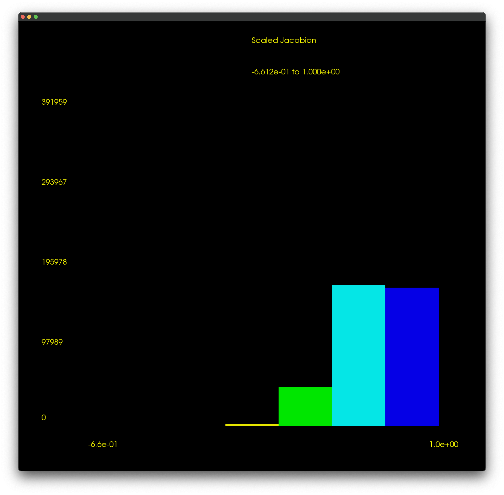
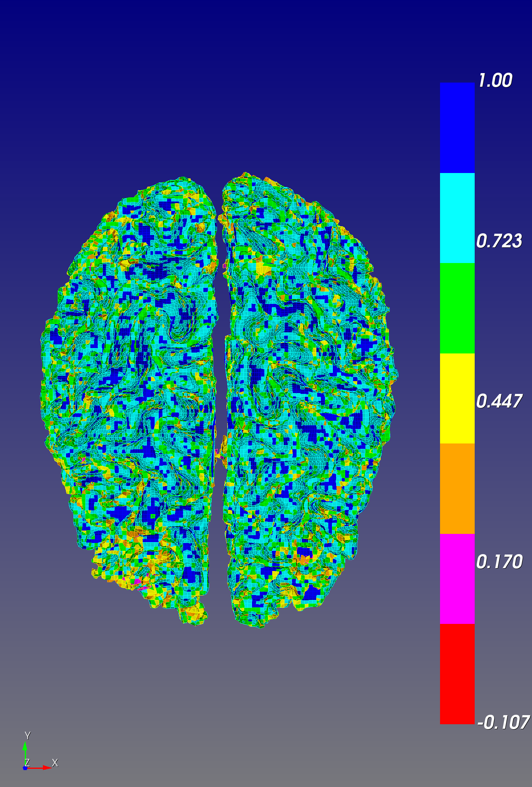

# Quality Assessment RMU model

2023-03-13 and 2023-03-20

## Introduction

At our team meeting (see [notes](https://github.com/autotwin/plan/blob/main/logs.md#2023-02-20)), Chad took an action to assess the initial element quality of the RMU model using the Python script that runs the Cubit element quality asessment engine.

The RMU model worked with ABAQUS, but the Utah model did did not work because ABAQUS encountered "excessive element distortion" at 3 ms (time step 1).

## Methods

Create [inp_to_msj.yml](inp_to_msj.yml).

```bash
# activate the virtual environment
~/autotwin/mesh> source .venv/bin/activate.fish

# convert .inp to minsj .csv
(.venv) ~/autotwin/mesh> arch -x86_64 python src/atmesh/cubit_inp_to_minsj_csv.py doc/all_hex_dec/inp_to_msj.yml
```

Errors occurred in the conversion, see [output_excerpt.log](output_excerpt.log)

Edit the [box_plots_rmu.py](box_plots_rmu.py).

```bash
# post-process the .csv with box_plots_rmu.py
(.venv) ~/autotwin/mesh> python doc/box_plots_rmu.py
```

## Results

* As a baseline, and for context, first consider the Utah SCI model [results](https://github.com/autotwin/mesh/blob/main/doc/T1_Utah_SCI_brain/README.md#box-and-whisker-plots), based on a coarse and refined mesh density.  
* Then compare the Utah results with the new results obtained from assessment of the RMU model.

Previous Results | New Results
--- | ---
 |  
Figure 1: Coarse (32,248 elements) and refined (244,136 elements) mesh quality minimum scaled Jacobian distribution for the Utah SCI Brain Model. | Figure 2: Comparison of Utah model (left, element count 244,136) versus the RMU model (right, element count 1,171,570) minimum scaled Jacobian.

```bash
CUBIT> 
# didn't work:
# quality hex all scaled jacobian histogram

# didn't work:
# quality volume 1 scaled jacobian global draw histogram draw mesh list

# worked:
quality block all scaled jacobian global draw histogram draw mesh


ERROR: Malformed element.

 Hex quality, 1171570 elements:
    Scaled Jacobian ranges from -6.802e-01 to 1.000e+00 (1171570 entities)
         Red ranges from -6.802e-01 to -4.535e-01 (11 entities)
     Magenta ranges from -4.535e-01 to -2.267e-01 (36 entities)
    DkYellow ranges from -2.267e-01 to 0.000e+00 (126 entities)
      Yellow ranges from 0.000e+00 to 2.500e-01 (6532 entities)
       Green ranges from 2.500e-01 to 5.000e-01 (136001 entities)
        Cyan ranges from 5.000e-01 to 7.500e-01 (414545 entities)
        Blue ranges from 7.500e-01 to 1.000e+00 (614319 entities)

 Hex quality, 1171570 elements:
------------------------------------
   Function Name    Average      Std Dev      Minimum   (id)         Maximum   (id) 
 ---------------    ---------    ---------    -------------------    ---------------
 Scaled Jacobian    7.471e-01    1.892e-01    -6.802e-01 (1090373)    1.000e+00 (103)
------------------------------------
```

Min. Scaled Jacobian Mesh | Min. Scaled Jacobian Histogram
:--: | :--: 
 |  

```bash
CUBIT>
import abaqus mesh geometry "/Users/chovey/Downloads/scratch/all_hex_dec/All_Hex_Dec.inp" feature_angle 135.00 nobcs

# Reading Abaqus input file '/Users/chovey/Downloads/scratch/all_hex_dec/All_hex_dec.inp'...
# Processing 3229156 lines the file...


```

### Blocks

2023-03-21

| id | name                | # elements | # el MSJ $\in$ (-inf, 0)
|--: | --                  | --:        | --:
|  1 | PART-1-1.BS         |    10,375  |   0
|  2 | PART-1-1.C_GM_R     |    28,190  |   0
|  3 | PART-1-1.C_GM_L     |    27,354  |   0
|  4 | PART-1-1.C_WM_L     |     9,048  |   5
|  5 | PART-1-1.C_WM_R     |     8,488  |   0
|  6 | PART-1-1.GM         |   391,959  |  72
|  7 | PART-1-1.WM         |   272,220  |  11
|  8 | PART-1-1.MB         |    34,627  |   1
|  9 | PART-1-1.VENTRICLES |    10,325  |  11
| 10 | PART-1-1.DURA       |   119,277  |   0
| 11 | PART-1-1.CSF        |   206,432  |  72
| 12 | PART-1-1.SKULL      |    53,275  |   1
|    | `All_Hex_Dec.inp`   | 1,171,570  | 173

```bash
Cubit> draw block 1
quality block scaled jacobian global draw histogram draw mesh

 Hex quality, 10375 elements:
	Scaled Jacobian ranges from 8.375e-02 to 1.000e+00 (10375 entities)
	     Red ranges from 8.375e-02 to 2.146e-01 (10 entities)
	 Magenta ranges from 2.146e-01 to 3.455e-01 (146 entities)
	DkYellow ranges from 3.455e-01 to 4.764e-01 (443 entities)
	  Yellow ranges from 4.764e-01 to 6.073e-01 (910 entities)
	   Green ranges from 6.073e-01 to 7.382e-01 (1613 entities)
	    Cyan ranges from 7.382e-01 to 8.691e-01 (1441 entities)
	    Blue ranges from 8.691e-01 to 1.000e+00 (5812 entities)

 Hex quality, 10375 elements:
------------------------------------
   Function Name    Average      Std Dev      Minimum   (id)      Maximum   (id) 
 ---------------    ---------    ---------    ----------------    ---------------
 Scaled Jacobian    8.353e-01    1.902e-01    8.375e-02 (9984)    1.000e+00 (103)
------------------------------------
```

block 1 BS | Min. Scaled Jacobian Histogram
:--: | :--: 
 |  

```bash
Cubit>quality block 2 scaled jacobian global draw histogram draw mesh

 Hex quality, 28190 elements:
	Scaled Jacobian ranges from 1.334e-01 to 1.000e+00 (28190 entities)
	     Red ranges from 1.334e-01 to 2.572e-01 (46 entities)
	 Magenta ranges from 2.572e-01 to 3.810e-01 (419 entities)
	DkYellow ranges from 3.810e-01 to 5.048e-01 (1311 entities)
	  Yellow ranges from 5.048e-01 to 6.286e-01 (2286 entities)
	   Green ranges from 6.286e-01 to 7.524e-01 (4563 entities)
	    Cyan ranges from 7.524e-01 to 8.762e-01 (4145 entities)
	    Blue ranges from 8.762e-01 to 1.000e+00 (15420 entities)

 Hex quality, 28190 elements:
------------------------------------
   Function Name    Average      Std Dev      Minimum   (id)       Maximum   (id)   
 ---------------    ---------    ---------    -----------------    ----------------j
 Scaled Jacobian    8.393e-01    1.797e-01    1.334e-01 (36834)    1.000e+00 (17190)
------------------------------------
```

block 2 C_GM_R | Min. Scaled Jacobian Histogram
:--: | :--: 
 | 

```bash
Cubit>quality block 3 scaled jacobian global draw histogram draw mesh

 Hex quality, 27354 elements:
	Scaled Jacobian ranges from 1.506e-02 to 1.000e+00 (27354 entities)
	     Red ranges from 1.506e-02 to 1.558e-01 (9 entities)
	 Magenta ranges from 1.558e-01 to 2.965e-01 (123 entities)
	DkYellow ranges from 2.965e-01 to 4.372e-01 (686 entities)
	  Yellow ranges from 4.372e-01 to 5.779e-01 (2083 entities)
	   Green ranges from 5.779e-01 to 7.186e-01 (4049 entities)
	    Cyan ranges from 7.186e-01 to 8.593e-01 (5279 entities)
	    Blue ranges from 8.593e-01 to 1.000e+00 (15125 entities)

 Hex quality, 27354 elements:
------------------------------------
   Function Name    Average      Std Dev      Minimum   (id)       Maximum   (id)   
 ---------------    ---------    ---------    -----------------    -----------------
 Scaled Jacobian    8.358e-01    1.786e-01    1.506e-02 (64515)    1.000e+00 (50140)
------------------------------------
```

Min. Scaled Jacobian Mesh | Min. Scaled Jacobian Histogram
:--: | :--: 
 | 

```bash
Cubit>quality block 4 scaled jacobian global draw histogram draw mesh

ERROR: Malformed element.


 Hex quality, 9048 elements:
	Scaled Jacobian ranges from -4.063e-01 to 1.000e+00 (9048 entities)
	     Red ranges from -4.063e-01 to -2.709e-01 (1 entities)
	 Magenta ranges from -2.709e-01 to -1.354e-01 (2 entities)
	DkYellow ranges from -1.354e-01 to 0.000e+00 (2 entities)
	  Yellow ranges from 0.000e+00 to 2.500e-01 (51 entities)
	   Green ranges from 2.500e-01 to 5.000e-01 (900 entities)
	    Cyan ranges from 5.000e-01 to 7.500e-01 (2846 entities)
	    Blue ranges from 7.500e-01 to 1.000e+00 (5246 entities)

 Hex quality, 9048 elements:
------------------------------------
   Function Name    Average      Std Dev      Minimum   (id)       Maximum   (id)   
 ---------------    ---------    ---------    -----------------    -----------------
 Scaled Jacobian    7.810e-01    1.991e-01    -4.063e-01 (74696)    1.000e+00 (66886)
------------------------------------

```

Min. Scaled Jacobian Mesh | Min. Scaled Jacobian Histogram
:--: | :--: 
 | 

```bash
Cubit>quality block 5 scaled jacobian global draw histogram draw mesh

 Hex quality, 8488 elements:
	Scaled Jacobian ranges from 2.845e-02 to 1.000e+00 (8488 entities)
	     Red ranges from 2.845e-02 to 1.672e-01 (3 entities)
	 Magenta ranges from 1.672e-01 to 3.060e-01 (97 entities)
	DkYellow ranges from 3.060e-01 to 4.448e-01 (446 entities)
	  Yellow ranges from 4.448e-01 to 5.836e-01 (880 entities)
	   Green ranges from 5.836e-01 to 7.224e-01 (1617 entities)
	    Cyan ranges from 7.224e-01 to 8.612e-01 (1722 entities)
	    Blue ranges from 8.612e-01 to 1.000e+00 (3723 entities)

 Hex quality, 8488 elements:
------------------------------------
   Function Name    Average      Std Dev      Minimum   (id)       Maximum   (id)   
 ---------------    ---------    ---------    -----------------    -----------------
 Scaled Jacobian    7.881e-01    1.965e-01    2.845e-02 (76832)    1.000e+00 (78182)
------------------------------------
```

Min. Scaled Jacobian Mesh | Min. Scaled Jacobian Histogram
:--: | :--: 
 | 

```bash
Cubit>quality block 6 scaled jacobian global draw histogram draw mesh

ERROR: Malformed element.


 Hex quality, 391959 elements:
	Scaled Jacobian ranges from -6.612e-01 to 1.000e+00 (391959 entities)
	     Red ranges from -6.612e-01 to -4.408e-01 (6 entities)
	 Magenta ranges from -4.408e-01 to -2.204e-01 (20 entities)
	DkYellow ranges from -2.204e-01 to 0.000e+00 (46 entities)
	  Yellow ranges from 0.000e+00 to 2.500e-01 (2170 entities)
	   Green ranges from 2.500e-01 to 5.000e-01 (47756 entities)
	    Cyan ranges from 5.000e-01 to 7.500e-01 (172735 entities)
	    Blue ranges from 7.500e-01 to 1.000e+00 (169226 entities)

 Hex quality, 391959 elements:
------------------------------------
   Function Name    Average      Std Dev      Minimum   (id)        Maximum   (id)    
 ---------------    ---------    ---------    ------------------    ------------------
 Scaled Jacobian    7.100e-01    1.718e-01    -6.612e-01 (235447)    1.000e+00 (153177)
------------------------------------
```

Min. Scaled Jacobian Mesh | Min. Scaled Jacobian Histogram
:--: | :--: 
 | 

```bash
Cubit>quality block 7 scaled jacobian global draw histogram draw mesh

ERROR: Malformed element.


 Hex quality, 272220 elements:
	Scaled Jacobian ranges from -1.069e-01 to 1.000e+00 (272220 entities)
	     Red ranges from -1.069e-01 to 0.000e+00 (11 entities)
	 Magenta ranges from 0.000e+00 to 1.667e-01 (116 entities)
	DkYellow ranges from 1.667e-01 to 3.333e-01 (4895 entities)
	  Yellow ranges from 3.333e-01 to 5.000e-01 (25175 entities)
	   Green ranges from 5.000e-01 to 6.667e-01 (46909 entities)
	    Cyan ranges from 6.667e-01 to 8.333e-01 (84837 entities)
	    Blue ranges from 8.333e-01 to 1.000e+00 (110277 entities)

 Hex quality, 272220 elements:
------------------------------------
   Function Name    Average      Std Dev      Minimum   (id)        Maximum   (id)    
 ---------------    ---------    ---------    ------------------    ------------------
 Scaled Jacobian    7.685e-01    1.931e-01    -1.069e-01 (597786)    1.000e+00 (519484)
------------------------------------
```

Min. Scaled Jacobian Mesh | Min. Scaled Jacobian Histogram
:--: | :--: 
 | 

```bash
Cubit>quality block 8 scaled jacobian global draw histogram draw mesh

ERROR: Malformed element.


 Hex quality, 34627 elements:
	Scaled Jacobian ranges from -1.275e-01 to 1.000e+00 (34627 entities)
	     Red ranges from -1.275e-01 to 0.000e+00 (1 entities)
	 Magenta ranges from 0.000e+00 to 1.667e-01 (27 entities)
	DkYellow ranges from 1.667e-01 to 3.333e-01 (704 entities)
	  Yellow ranges from 3.333e-01 to 5.000e-01 (2679 entities)
	   Green ranges from 5.000e-01 to 6.667e-01 (5707 entities)
	    Cyan ranges from 6.667e-01 to 8.333e-01 (8956 entities)
	    Blue ranges from 8.333e-01 to 1.000e+00 (16553 entities)

 Hex quality, 34627 elements:
------------------------------------
   Function Name    Average      Std Dev      Minimum   (id)        Maximum   (id)    
 ---------------    ---------    ---------    ------------------    ------------------
 Scaled Jacobian    7.907e-01    1.981e-01    -1.275e-01 (772179)    1.000e+00 (753991)
------------------------------------
```

Min. Scaled Jacobian Mesh | Min. Scaled Jacobian Histogram
:--: | :--: 
 | 

```bash
Cubit>quality block 9 scaled jacobian global draw histogram draw mesh

ERROR: Malformed element.


 Hex quality, 10325 elements:
	Scaled Jacobian ranges from -5.629e-01 to 9.999e-01 (10325 entities)
	     Red ranges from -5.629e-01 to -3.753e-01 (2 entities)
	 Magenta ranges from -3.753e-01 to -1.876e-01 (2 entities)
	DkYellow ranges from -1.876e-01 to 0.000e+00 (7 entities)
	  Yellow ranges from 0.000e+00 to 2.500e-01 (195 entities)
	   Green ranges from 2.500e-01 to 5.000e-01 (2202 entities)
	    Cyan ranges from 5.000e-01 to 7.499e-01 (4329 entities)
	    Blue ranges from 7.499e-01 to 9.999e-01 (3588 entities)

 Hex quality, 10325 elements:
------------------------------------
   Function Name    Average      Std Dev      Minimum   (id)        Maximum   (id)    
 ---------------    ---------    ---------    ------------------    ------------------
 Scaled Jacobian    6.604e-01    2.063e-01    -5.629e-01 (785279)    9.999e-01 (785883)
------------------------------------
```

Min. Scaled Jacobian Mesh | Min. Scaled Jacobian Histogram
:--: | :--: 
 | 

```bash
Cubit>quality block 10 scaled jacobian global draw histogram draw mesh

 Hex quality, 119277 elements:
	Scaled Jacobian ranges from 1.007e-01 to 1.000e+00 (119277 entities)
	     Red ranges from 1.007e-01 to 2.292e-01 (93 entities)
	 Magenta ranges from 2.292e-01 to 3.577e-01 (2186 entities)
	DkYellow ranges from 3.577e-01 to 4.861e-01 (9940 entities)
	  Yellow ranges from 4.861e-01 to 6.146e-01 (13459 entities)
	   Green ranges from 6.146e-01 to 7.431e-01 (24218 entities)
	    Cyan ranges from 7.431e-01 to 8.715e-01 (28543 entities)
	    Blue ranges from 8.715e-01 to 1.000e+00 (40838 entities)

 Hex quality, 119277 elements:
------------------------------------
   Function Name    Average      Std Dev      Minimum   (id)        Maximum   (id)     
 ---------------    ---------    ---------    ------------------    -------------------
 Scaled Jacobian    7.580e-01    1.789e-01    1.007e-01 (908317)    1.000e+00 (1016914)
------------------------------------
```

Min. Scaled Jacobian Mesh | Min. Scaled Jacobian Histogram
:--: | :--: 
 | 

```bash
Cubit>quality block 11 scaled jacobian global draw histogram draw mesh

ERROR: Malformed element.


 Hex quality, 206432 elements:
	Scaled Jacobian ranges from -6.802e-01 to 1.000e+00 (206432 entities)
	     Red ranges from -6.802e-01 to -4.535e-01 (4 entities)
	 Magenta ranges from -4.535e-01 to -2.267e-01 (14 entities)
	DkYellow ranges from -2.267e-01 to 0.000e+00 (54 entities)
	  Yellow ranges from 0.000e+00 to 2.500e-01 (2552 entities)
	   Green ranges from 2.500e-01 to 5.000e-01 (34671 entities)
	    Cyan ranges from 5.000e-01 to 7.500e-01 (73291 entities)
	    Blue ranges from 7.500e-01 to 1.000e+00 (95846 entities)

 Hex quality, 206432 elements:
------------------------------------
   Function Name    Average      Std Dev      Minimum   (id)         Maximum   (id)    
 ---------------    ---------    ---------    -------------------    ------------------
 Scaled Jacobian    7.112e-01    2.041e-01    -6.802e-01 (1090373)    1.000e+00 (801165)
------------------------------------
```

Min. Scaled Jacobian Mesh | Min. Scaled Jacobian Histogram
:--: | :--: 
 | 

```bash
Cubit>quality block 12 scaled jacobian global draw histogram draw mesh

ERROR: Malformed element.


 Hex quality, 53275 elements:
	Scaled Jacobian ranges from -6.240e-02 to 1.000e+00 (53275 entities)
	     Red ranges from -6.240e-02 to 0.000e+00 (1 entities)
	 Magenta ranges from 0.000e+00 to 1.667e-01 (5 entities)
	DkYellow ranges from 1.667e-01 to 3.333e-01 (7 entities)
	  Yellow ranges from 3.333e-01 to 5.000e-01 (51 entities)
	   Green ranges from 5.000e-01 to 6.666e-01 (334 entities)
	    Cyan ranges from 6.666e-01 to 8.333e-01 (14784 entities)
	    Blue ranges from 8.333e-01 to 1.000e+00 (38093 entities)

 Hex quality, 53275 elements:
------------------------------------
   Function Name    Average      Std Dev      Minimum   (id)         Maximum   (id)     
 ---------------    ---------    ---------    -------------------    -------------------
 Scaled Jacobian    8.890e-01    9.095e-02    -6.240e-02 (1159257)    1.000e+00 (1122587)
------------------------------------
```

Min. Scaled Jacobian Mesh | Min. Scaled Jacobian Histogram
:--: | :--: 
 | 

## 2023-03-23

Additional [RMU analysis](2023-03-23-Wangy-Cubit_Negative_Jacobian.pdf).


