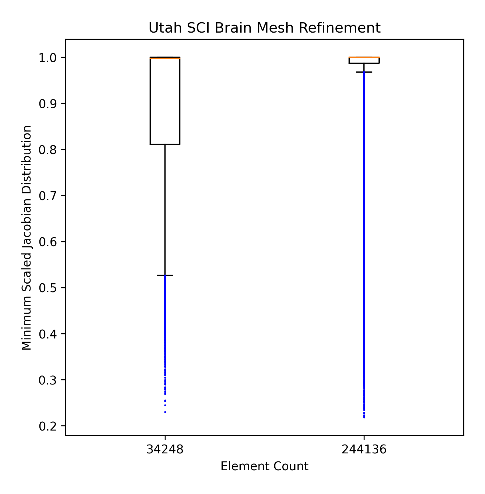

# Quality Assessment RMU model

2023-03-13 and 2023-03-20

## Introduction

At our team meeting (see [notes](https://github.com/autotwin/plan/blob/main/logs.md#2023-02-20)), Chad took an action to assess the initial element quality of the RMU model using the Python script that runs the Cubit element quality asessment engine.

The RMU model worked with ABAQUS, but the Utah model did did not work because ABAQUS encountered "excessive element distortion" at 3 ms (time step 1).

## Methods

Create [inp_to_msj.yml](inp_to_msj.yml).

```bash
# activate the virtual environment
~/autotwin/mesh> source .venv/bin/activate.fish

# convert .inp to minsj .csv
(.venv) ~/autotwin/mesh> arch -x86_64 python src/atmesh/cubit_inp_to_minsj_csv.py doc/all_hex_dec/inp_to_msj.yml
```

Errors occurred in the conversion, see [output_excerpt.log](output_excerpt.log)
```

Edit the [box_plots_rmu.py](box_plots_rmu.py).

```bash
# post-process the .csv with box_plots_rmu.py
(.venv) ~/autotwin/mesh> python doc/box_plots_rmu.py
```

## Results

* As a baseline, and for context, first consider the Utah SCI model [results](https://github.com/autotwin/mesh/blob/main/doc/T1_Utah_SCI_brain/README.md#box-and-whisker-plots), based on a coarse and refined mesh density.  
* Then compare the Utah results with the new results obtained from assessment of the RMU model.

Previous Results | New Results
--- | ---
 |  
Figure 1: Coarse (32,248 elements) and refined (244,136 elements) mesh quality minimum scaled Jacobian distribution for the Utah SCI Brain Model. | Figure 2: Comparison of Utah model (left, element count 244,136) versus the RMU model (right, element count 1,171,570) minimum scaled Jacobian.

```bash
CUBIT> 
# didn't work:
# quality hex all scaled jacobian histogram

# didn't work:
# quality volume 1 scaled jacobian global draw histogram draw mesh list

# worked:
quality block all scaled jacobian global draw histogram draw mesh


ERROR: Malformed element.

 Hex quality, 1171570 elements:
    Scaled Jacobian ranges from -6.802e-01 to 1.000e+00 (1171570 entities)
         Red ranges from -6.802e-01 to -4.535e-01 (11 entities)
     Magenta ranges from -4.535e-01 to -2.267e-01 (36 entities)
    DkYellow ranges from -2.267e-01 to 0.000e+00 (126 entities)
      Yellow ranges from 0.000e+00 to 2.500e-01 (6532 entities)
       Green ranges from 2.500e-01 to 5.000e-01 (136001 entities)
        Cyan ranges from 5.000e-01 to 7.500e-01 (414545 entities)
        Blue ranges from 7.500e-01 to 1.000e+00 (614319 entities)

 Hex quality, 1171570 elements:
------------------------------------
   Function Name    Average      Std Dev      Minimum   (id)         Maximum   (id) 
 ---------------    ---------    ---------    -------------------    ---------------
 Scaled Jacobian    7.471e-01    1.892e-01    -6.802e-01 (1090373)    1.000e+00 (103)
------------------------------------
```

Min. Scaled Jacobian Mesh | Min. Scaled Jacobian Histogram
:--: | :--: 
 |  
