# T1 Utah SCI brain

## Overview

* [Inputs](#inputs)
* Output 1: [Brain](#brain)
* Output 2: [Brain with outer](#brain-with-outer)
* Output 3: [Brain parameterized](#brain-parameterized)
* Output 4: [Brain with adaptivity](#brain-with-adaptivity)

## Methods

### Inputs

The `.stl` input files are visualized in Cubit.

#### Cubit

* `~/Downloads/scratch/Utah_SCI_brain/`
  * `T1_Utah_SCI_outer.stl`
  * `T1_Utah_SCI_brain.stl`

```bash
Cubit>
view back
view up -1 0 0

# vol 1
# outer stl location 143.5, 135.5, 113.5
color vol 1 grey

# vol 2
# brain stl location 122.000000, 146.000000, 112.500000
color vol 2 yellow
```

#### MeshLab

```bash
Opened mesh /Users/chovey/Downloads/scratch/Utah_SCI_brain/T1_Utah_SCI_brain.stl in 514 msec
All files opened in 2826 msec
Mesh Bounding Box Size 173.000000 179.000000 142.000000
Mesh Bounding Box Diag 286.590302 
Mesh Bounding Box min 35.500000 56.500000 41.500000
Mesh Bounding Box max 208.500000 235.500000 183.500000
Mesh Surface Area is 97148.531250
Mesh Total Len of 409491 Edges is 400174.187500 Avg Len 0.977248
Mesh Total Len of 409491 Edges is 400174.187500 Avg Len 0.977248 (including faux edges))
Thin shell (faces) barycenter: 113.117882 147.479492 112.247276
Vertices barycenter 112.869759 147.433685 112.203400
Mesh Volume is -1693481.250000
Center of Mass is 105.340324 149.991745 111.986588
Inertia Tensor is :
| -4201349888.000000 35231044.000000 -7353952.000000 |
| 35231044.000000 -3393064704.000000 148729.906250 |
| -7353952.000000 148729.906250 -4329582592.000000 |
Principal axes are :
| -0.057703 0.002327 -0.998331 |
| -0.997387 0.043403 0.057749 |
| 0.043465 0.999055 -0.000184 |
axis momenta are :
| -4330010112.000000 -4202457600.000000 -3391530496.000000 |
```

#### Autotwin Mesh

Create input file [cell_100_100_100.yml](cell_100_100_100.yml)

```bash
(.venv) ~/autotwin/mesh/doc/T1_Utah_SCI_brain> arch -x86_64 sculpt_stl_to_inp cell_100_100_100.yml 
```

Selected output:

```bash
Laplacian Iter: 1
Laplacian Iter: 2
Smoothing 244136 hexes on 2 processors
Jacobi Opt Iter: 1,  Num bad: 54, Num poor: 1393, Min SJ: -0.179743
Jacobi Opt Iter: 2,  Num bad: 8, Num poor: 794, Min SJ: -0.069065
Jacobi Opt Iter: 3,  Num bad: 0, Num poor: 363, Min SJ: 0.005107
Jacobi Opt Iter: 4,  Num bad: 0, Num poor: 178, Min SJ: 0.071267
Jacobi Opt Iter: 5,  Num bad: 0, Num poor: 169, Min SJ: 0.067287
Begin parallel color smoothing 1084 nodes below threshold 0.200000
Coloring Opt Iter: 0, Num Smooths: 0, Num bad: 0, Num poor: 572, Min SJ: 0.057330
Coloring Opt Iter: 5, Num Smooths: 169, Num bad: 0, Num poor: 97, Min SJ: 0.075854
Coloring Opt Iter: 6, Num Smooths: 170, Num bad: 0, Num poor: 96, Min SJ: 0.075854
Begin parallel color smoothing 1084 nodes below threshold 0.200000
Coloring Opt Iter: 0, Num Smooths: 0, Num bad: 0, Num poor: 572, Min SJ: 0.057330
Coloring Opt Iter: 5, Num Smooths: 169, Num bad: 0, Num poor: 97, Min SJ: 0.075854
Coloring Opt Iter: 6, Num Smooths: 170, Num bad: 0, Num poor: 96, Min SJ: 0.075854
building exodus mesh...
generating global ids...
building sidesets...
generating parallel communication maps...
================ MESH SUMMARY ===================
Base Filename	sculpt_parallel.diatom_result
Num Procs	3
Num Nodes	260669
Num Elements	244136
Num Blocks	1
Num Nodesets	0
Num Sidesets	1
Num Bad Qual	0
Num Poor Qual	0
Min Quality	0.217879
Avg Quality	0.943579
Min Edge Len	0.294380
Min Qual Rank	1
```

## Brain

`outer.stl` | `brain.stl`
:--: | :--:
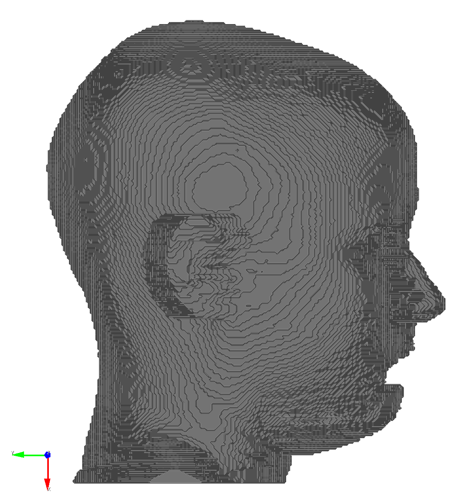 | 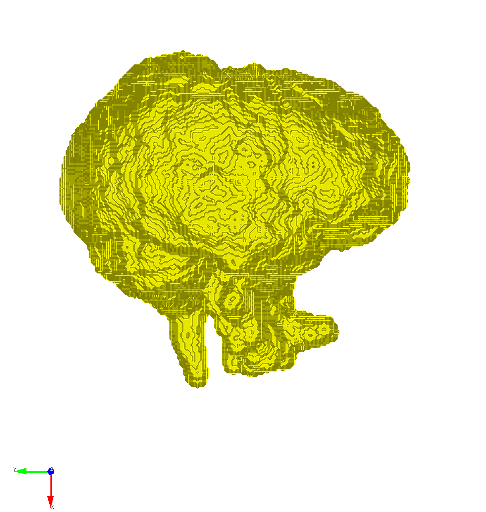

R | sup
:--: | :--:
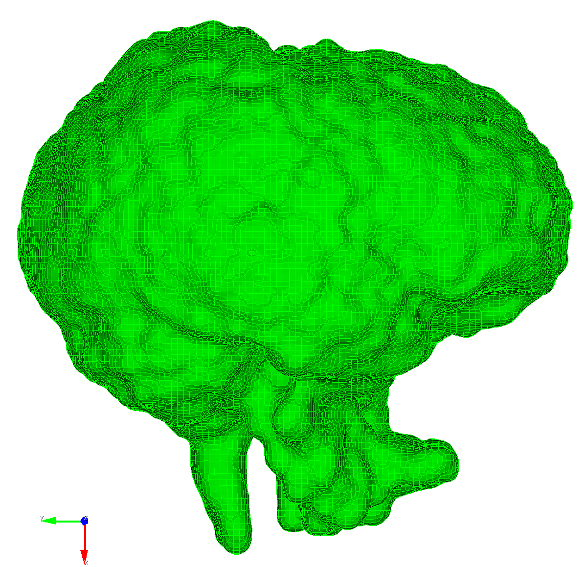 | 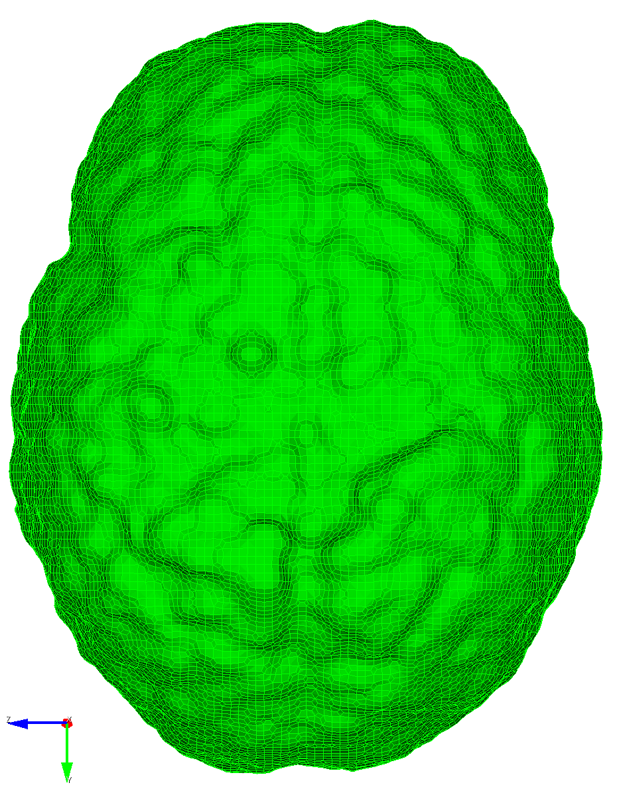

ant | L-inf-post
:--: | :--:
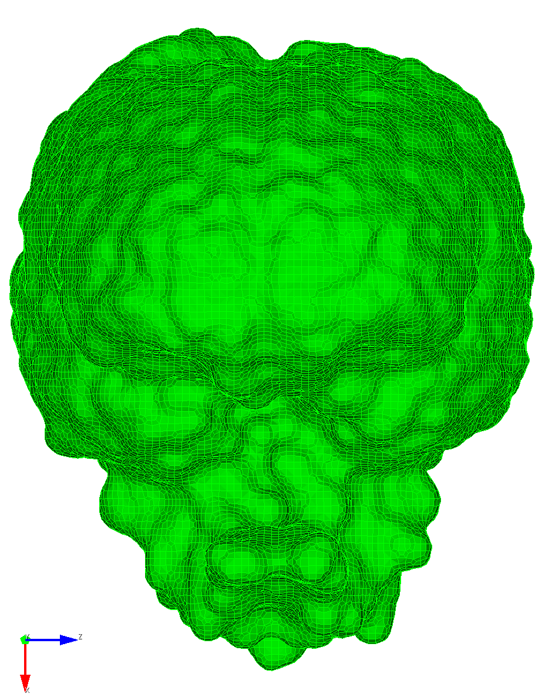 | 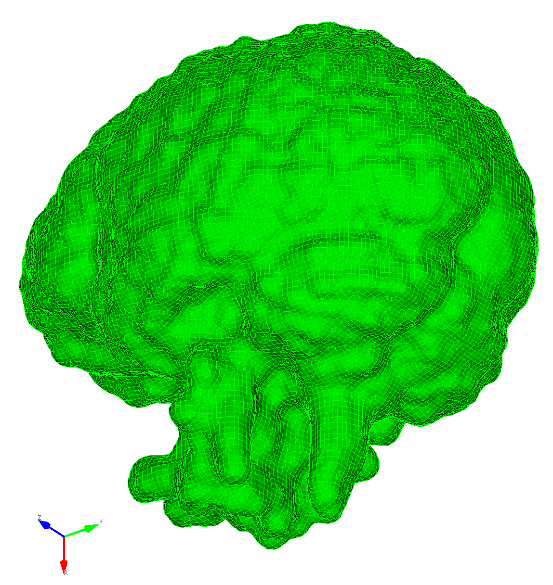

`cell_100_100_100.inp` | Min. Scaled Jacobian
:--: | :--: 
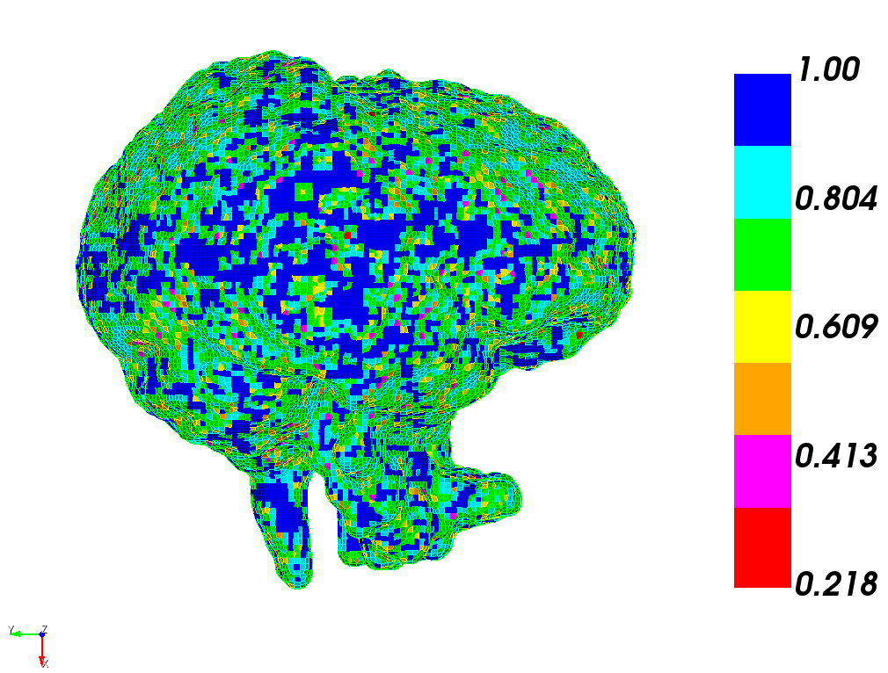 | 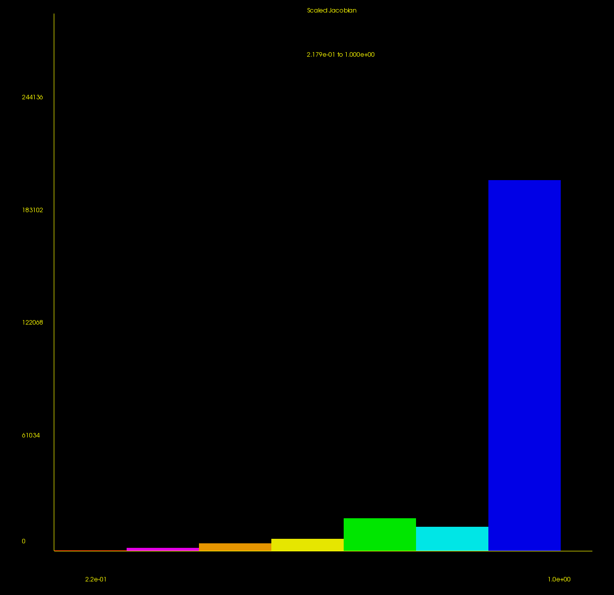

```bash
Cubit>quality volume 1  scaled jacobian global draw histogram draw mesh list

 Hex quality, 244136 elements:
  Scaled Jacobian ranges from 2.179e-01 to 1.000e+00 (244136 entities)
       Red ranges from 2.179e-01 to 3.296e-01 (209 entities)
   Magenta ranges from 3.296e-01 to 4.413e-01 (1630 entities)
  DkYellow ranges from 4.413e-01 to 5.531e-01 (4043 entities)
    Yellow ranges from 5.531e-01 to 6.648e-01 (6576 entities)
     Green ranges from 6.648e-01 to 7.765e-01 (17601 entities)
      Cyan ranges from 7.765e-01 to 8.883e-01 (13160 entities)
      Blue ranges from 8.883e-01 to 1.000e+00 (200917 entities)

Volume 1  Hex quality, 244136 elements:
------------------------------------
   Function Name    Average      Std Dev      Minimum   (id)       Maximum   (id)
 ---------------    ---------    ---------    -----------------    --------------
 Scaled Jacobian    9.436e-01    1.230e-01    2.179e-01 (52594)    1.000e+00 (19)
```

### Cell Size Parameterization

Input file for all studies: [T1_Utah_SCI_brain.stl](https://drive.google.com/drive/folders/19ul4aOjraVyYSeJfPZzSj-rAif6S4621) 

study | 1 | 2 |
-- | --: | --: |
`.yml` config | [cell_050_050_050.yml](cell_050_050_050.yml) | [cell_100_100_100.yml](cell_100_100_100.yml) |
image | 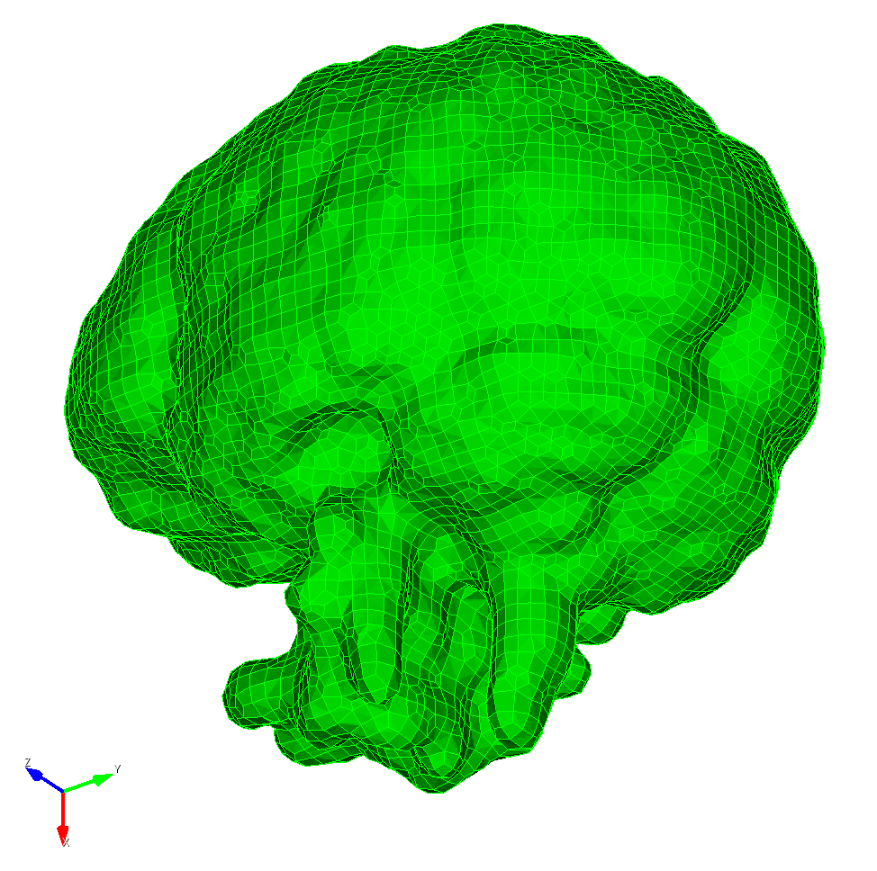 | 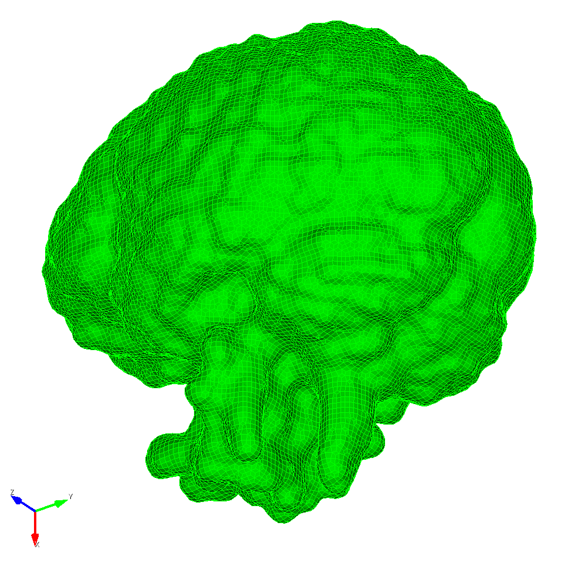 |
n_cells | 50 | 100 |
cell_size |  200 mm / 50 cell =  4 mm/cell | 2 mm/cell |
`.inp` file | [`cell_050_050_050_v02.inp`](https://www.dropbox.com/s/zeklu8dlygnzh9r/cell_050_050_050_v02.inp?dl=0) | [`cell_100_100_100_v02.inp`](https://www.dropbox.com/s/xif58oxt3bdmses/cell_100_100_100_v02.inp?dl=0) |
n_elements | 32,248 | 244,136  |
volume | 1.69348e+06 mm^3 = 1.69 L | 1.69322e+06 mm^3 = 1.69 L |

The volume numbers make sense, as we are including part of the spine with the head volume.
The expected head volume, is between 1 and 2 L:

> *Living humans have a cranial capacity ranging from about 950 cc to 1800 cc, with the average about 1400 cc.*

### Box and whisker plots

Create the `.csv` quality files, for example:

```bash
(.venv) ~/autotwin/mesh/doc/T1_Utah_SCI_brain> cubit_inp_to_minsj_csv cell_050_msj.yml
(.venv) ~/autotwin/mesh/doc/T1_Utah_SCI_brain> cubit_inp_to_minsj_csv cell_100_msj.yml
```

Using [box_plots.py](../box_plots.py) 

```bash
(.venv) ~/autotwin/mesh> python doc/box_plots.py
n_bins: 7
delta_bin: 0.08571428571428572
bins: [0.4, 0.48571428571428577, 0.5714285714285714, 0.6571428571428571, 0.7428571428571429, 0.8285714285714286, 0.9142857142857143, 1.0]
Reading file /Users/chovey/Downloads/scratch/Utah_SCI_brain/cell_050_msj.csv
Reading file /Users/chovey/Downloads/scratch/Utah_SCI_brain/cell_100_msj.csv
Serialized to doc/box_plots.png
```

to create

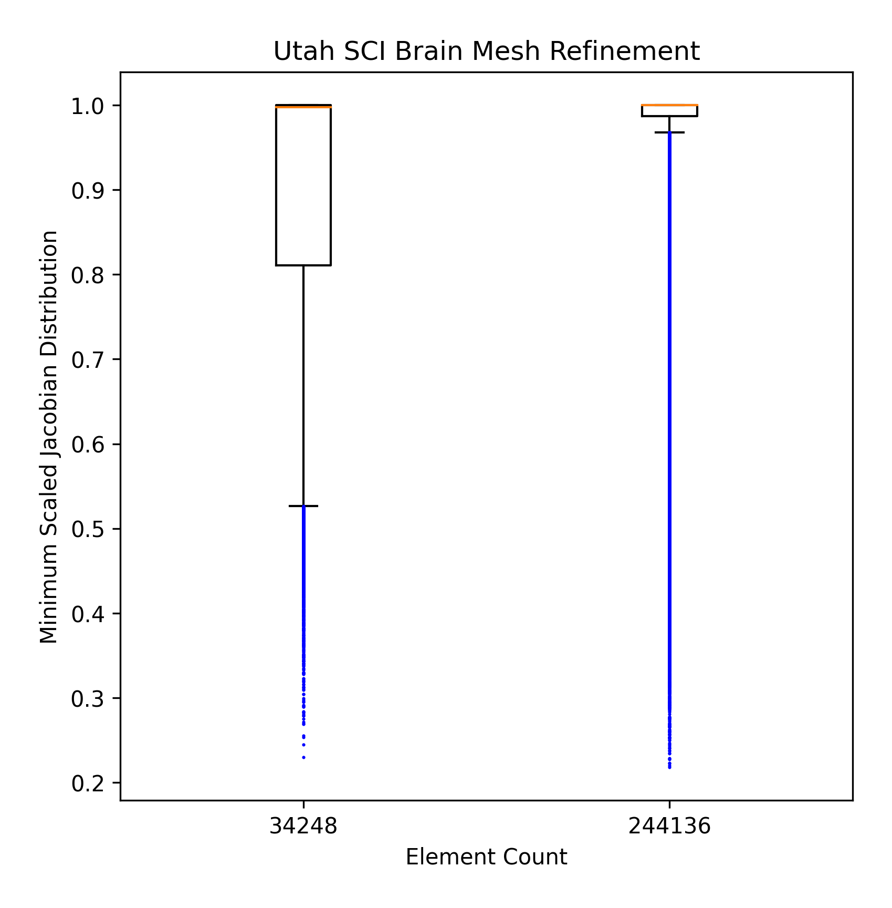

## Brain with Outer

Input Files: 

* [`stl_to_inp_cell_size_8.yml`](stl_to_inp_cell_size_8.yml)
* [`stl_to_inp_cell_size_4.yml`](stl_to_inp_cell_size_4.yml)
* [`stl_to_inp_cell_size_2.yml`](stl_to_inp_cell_size_2.yml)
* [`stl_to_inp_cell_size_1.yml`](stl_to_inp_cell_size_1.yml)

```bash
(.venv) ~/autotwin/mesh> arch -x86_64 sculpt_stl_to_inp doc/T1_Utah_SCI_brain/stl_to_inp_cell_size_4.yml 
```

Selected output:

```bash
Begin smoothing hexes using:
  Curve Smoothing              = SMOOTH_CURV_VFRAC
  Surface Smoothing            = SMOOTH_SURF_HYBRID
  Volume Smoothing             = SMOOTH_VOL_HYBRID_CAMAL
  Boundary Buffer Improvement  = YES
  Surface Projection Type      = LINEAR_SURFACE_PROJECTION
  Laplacian Iterations         = 2
  Maximum Optimization Iters   = 5
  Optimization Threshold       = 0.600000
  Curve Opt. Threshold         = 0.100000
  Max Parallel Coloring Iters  = 100
  Parallel Coloring Threshold  = 0.200000
  Max Guaranteed Quality Iters = 0
  Guaranteed Quality Threshold = 0.200000
Laplacian Iter: 1
Laplacian Iter: 2
Smoothing 95314 hexes on 2 processors
Jacobi Opt Iter: 1,  Num bad: 186, Num poor: 1583, Min SJ: -0.979403
WARNING: Unconstrained curve optimization was used for at least one node.
Some nodes may not lie on owning curves.
(Use curve_opt_thresh = -1 to turn off behavior)
Jacobi Opt Iter: 2,  Num bad: 80, Num poor: 1105, Min SJ: -0.795509
Jacobi Opt Iter: 3,  Num bad: 40, Num poor: 683, Min SJ: -0.784675
Jacobi Opt Iter: 4,  Num bad: 27, Num poor: 433, Min SJ: -0.816633
Jacobi Opt Iter: 5,  Num bad: 19, Num poor: 311, Min SJ: -0.866516
Begin parallel color smoothing 1559 nodes below threshold 0.200000
Coloring Opt Iter: 0, Num Smooths: 0, Num bad: 39, Num poor: 813, Min Vol: -0.027585
Coloring Opt Iter: 5, Num Smooths: 247, Num bad: 9, Num poor: 271, Min Vol: -0.006298
Coloring Opt Iter: 10, Num Smooths: 301, Num bad: 5, Num poor: 270, Min Vol: -0.006298
Coloring Opt Iter: 15, Num Smooths: 334, Num bad: 0, Num poor: 265, Min SJ: 0.008676
Coloring Opt Iter: 20, Num Smooths: 362, Num bad: 0, Num poor: 264, Min SJ: 0.051415
Coloring Opt Iter: 25, Num Smooths: 398, Num bad: 0, Num poor: 269, Min SJ: 0.073437
Coloring Opt Iter: 30, Num Smooths: 448, Num bad: 0, Num poor: 257, Min SJ: 0.073437
Coloring Opt Iter: 35, Num Smooths: 490, Num bad: 0, Num poor: 214, Min SJ: 0.073437
WARNING: Smoothing terminated. Unable to make additional improvement.
Coloring Opt Iter: 39, Num Smooths: 515, Num bad: 0, Num poor: 227, Min SJ: 0.073437
building exodus mesh...
generating global ids...
generating parallel communication maps...
================ MESH SUMMARY ===================
Base Filename   sculpt_parallel.diatom_result
Num Procs       2
Num Nodes       102241
Num Elements    95314
Num Blocks      2
Num Nodesets    0
Num Sidesets    0
Num Bad Qual    0
Num Poor Qual   22
Min Quality     0.148665
Avg Quality     0.869348
Min Edge Len    0.571388
Min Qual Rank   0
```

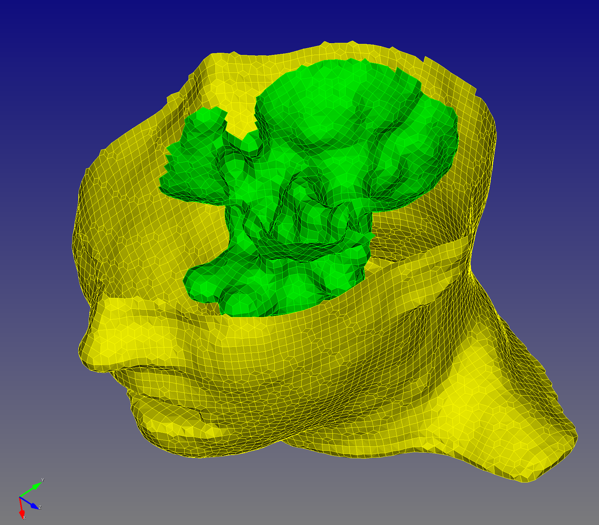

```bash
(.venv) ~/autotwin/mesh> arch -x86_64 sculpt_stl_to_inp doc/T1_Utah_SCI_brain/stl_to_inp_cell_size_2.yml 
```

Selected output:

```bash
Begin smoothing hexes using:
  Curve Smoothing              = SMOOTH_CURV_VFRAC
  Surface Smoothing            = SMOOTH_SURF_HYBRID
  Volume Smoothing             = SMOOTH_VOL_HYBRID_CAMAL
  Boundary Buffer Improvement  = YES
  Surface Projection Type      = LINEAR_SURFACE_PROJECTION
  Laplacian Iterations         = 2
  Maximum Optimization Iters   = 5
  Optimization Threshold       = 0.600000
  Curve Opt. Threshold         = 0.100000
  Max Parallel Coloring Iters  = 100
  Parallel Coloring Threshold  = 0.200000
  Max Guaranteed Quality Iters = 0
  Guaranteed Quality Threshold = 0.200000
Laplacian Iter: 1
Laplacian Iter: 2
Smoothing 647599 hexes on 2 processors
Jacobi Opt Iter: 1,  Num bad: 191, Num poor: 4335, Min SJ: -0.525729
Jacobi Opt Iter: 2,  Num bad: 47, Num poor: 2678, Min SJ: -0.191610
Jacobi Opt Iter: 3,  Num bad: 18, Num poor: 1351, Min SJ: -0.093843
Jacobi Opt Iter: 4,  Num bad: 2, Num poor: 788, Min SJ: -0.028774
Jacobi Opt Iter: 5,  Num bad: 0, Num poor: 700, Min SJ: 0.060104
Begin parallel color smoothing 4199 nodes below threshold 0.200000
Coloring Opt Iter: 0, Num Smooths: 0, Num bad: 0, Num poor: 2198, Min SJ: 0.020239
Coloring Opt Iter: 2, Num Smooths: 527, Num bad: 0, Num poor: 407, Min SJ: 0.056812
Coloring Opt Iter: 4, Num Smooths: 592, Num bad: 0, Num poor: 306, Min SJ: 0.077682
Coloring Opt Iter: 6, Num Smooths: 632, Num bad: 0, Num poor: 257, Min SJ: 0.078006
Coloring Opt Iter: 8, Num Smooths: 652, Num bad: 0, Num poor: 238, Min SJ: 0.078006
Coloring Opt Iter: 10, Num Smooths: 660, Num bad: 0, Num poor: 234, Min SJ: 0.078006
Coloring Opt Iter: 12, Num Smooths: 662, Num bad: 0, Num poor: 234, Min SJ: 0.078006
Coloring Opt Iter: 14, Num Smooths: 664, Num bad: 0, Num poor: 232, Min SJ: 0.078006
Coloring Opt Iter: 16, Num Smooths: 666, Num bad: 0, Num poor: 230, Min SJ: 0.078006
Coloring Opt Iter: 17, Num Smooths: 667, Num bad: 0, Num poor: 230, Min SJ: 0.078006
building exodus mesh...
generating global ids...
generating parallel communication maps...
================ MESH SUMMARY ===================
Base Filename   sculpt_parallel.diatom_result
Num Procs       2
Num Nodes       675101
Num Elements    647599
Num Blocks      2
Num Nodesets    0
Num Sidesets    0
Num Bad Qual    0
Num Poor Qual   0
Min Quality     0.216737
Avg Quality     0.923489
Min Edge Len    0.273492
Min Qual Rank   0
```

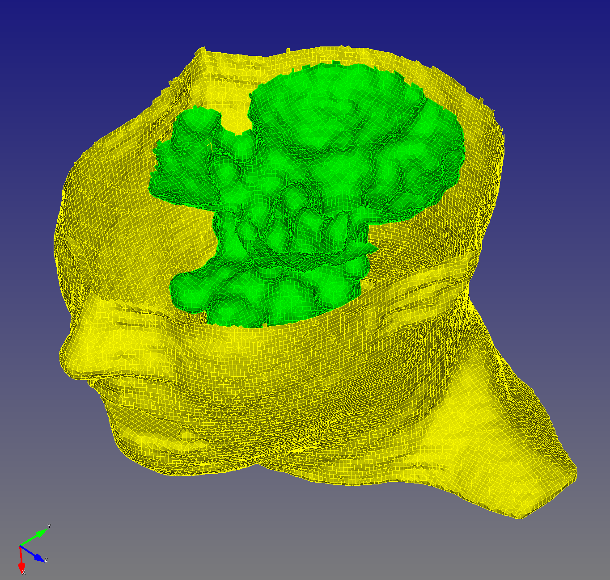

Output files:

* cell_size_8.inp
* [cell_size_4.inp](https://www.dropbox.com/s/vdox7ldvcypvghk/cell_size_4.inp?dl=0) 14 MB
* [cell_size_2.inp](https://www.dropbox.com/s/a1pydxpnaz2o648/cell_size_2.inp?dl=0) 95 MB
* cell_size_1 

Hex element count:

file | brain | outer | total
-- | --: | --: | --:
`cell_size_8.inp` | 5,185 | | 
`cell_size_4.inp` | 34,341 | 60,973 | 95,314
`cell_size_2.inp` | 244,105 | 403,494 | 647,599
`cell_size_1.inp` | | | 
free sculpt | 902,410 | | 

### Command Line Cubit

Bash: 

```bash
cd /Applications/Cubit-16.08
./cubit_command
```

Cubit command line: 

```bash
cd '~/Downloads/scratch/Utah_SCI_brain'
import stl "T1_Utah_SCI_brain.stl"
sculpt parallel processors 3 gen_sidesets 2 size 8.0
draw block all
reset
```

```bash
# manually recreate cell_100_100_100.yml
import stl "T1_Utah_SCI_brain.stl" # 272994 facets, xxx load time
sculpt parallel processors 3 gen_sidesets 2 size 2.0 box location position 22.0 46.0 12.0 location position 222.0 246.0 212.0
draw block all
export abaqus "/Users/chovey/Downloads/scratch/Utah_SCI_brain/cell_100_100_100.inp" overwrite

# review ABAQUS file
reset
import abaqus 'cell_100_100_100.inp'
quality block 1 scaled jacobian global draw histogram draw mesh
```

```bash
# manually recreate cell_size_2.inp
import stl "T1_Utah_SCI_brain.stl" # 272994 facets, xxx load time
sculpt parallel processors 3 gen_sidesets 2 size 2.0 box location position 9.5 19.5 -0.5 location position 227.5 251.5 227.5
draw block all
export abaqus "/Users/chovey/Downloads/scratch/Utah_SCI_brain/cell_size_2.inp" overwrite

# review ABAQUS file
reset
import abaqus 'cell_size_2.inp'
quality block 1 scaled jacobian global draw histogram draw mesh
```

##  Brain Parameterized

* Create a Python script, [`brain_cell_size_param.py`](brain_cell_size_param.py), that generates two
  * `stl_to_inp_to_msj_cell_size_8.yml` and `stl_to_inp_to_msj_cell_size_4.yml` files, named automatically with the paramter (cell size), where a single `.yml` input file has data for
    * `stl -> inp`, and
    * `inp -> msj`.
  * `.pdf` MSJ histograms

Working from `.yml` (listed as of 2024-04-24 listed below),

```yml
autotwin_header:
  created: 2023-04-24T10_01_52_556643
  source: /Users/chovey/autotwin/mesh/doc/T1_Utah_SCI_brain/brain_cell_size_param.py
bounding_box:
  auto: true
  defeatured: true
  xmax: 234.0
  xmin: 10.0
  ymax: 258.0
  ymin: 34.0
  zmax: 208.5
  zmin: 16.5
cell_size: 8
cubit_path: /Applications/Cubit-16.10/Cubit.app/Contents/MacOS
inp_path_file: /Users/chovey/Downloads/scratch/Utah_SCI_brain/cell_size_8_2023-04-24T10_01_52_556643.inp
journaling: false
n_proc: 3
stl_path_files:
- /Users/chovey/Downloads/scratch/Utah_SCI_brain/T1_Utah_SCI_brain.stl
version: 1.5
working_dir: /Users/chovey/Downloads/scratch/Utah_SCI_brain
```

which created `cell_size_8_2023-04-24T10_01_52_556643.inp`, with MSJ quality metric as,

iso | iso-cut | histogram
:--: | :--: | :--:
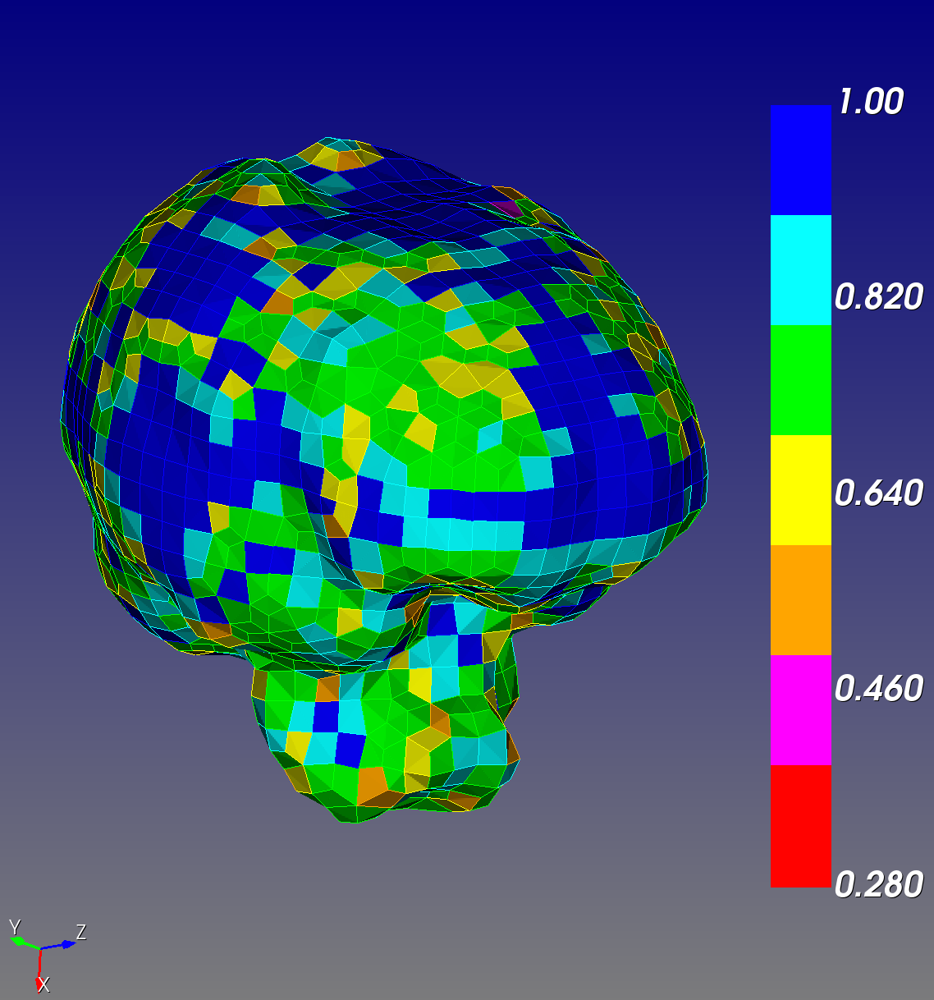 | 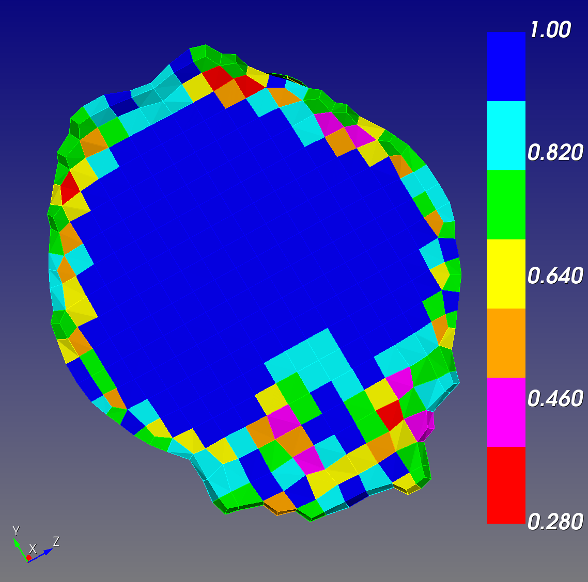 | 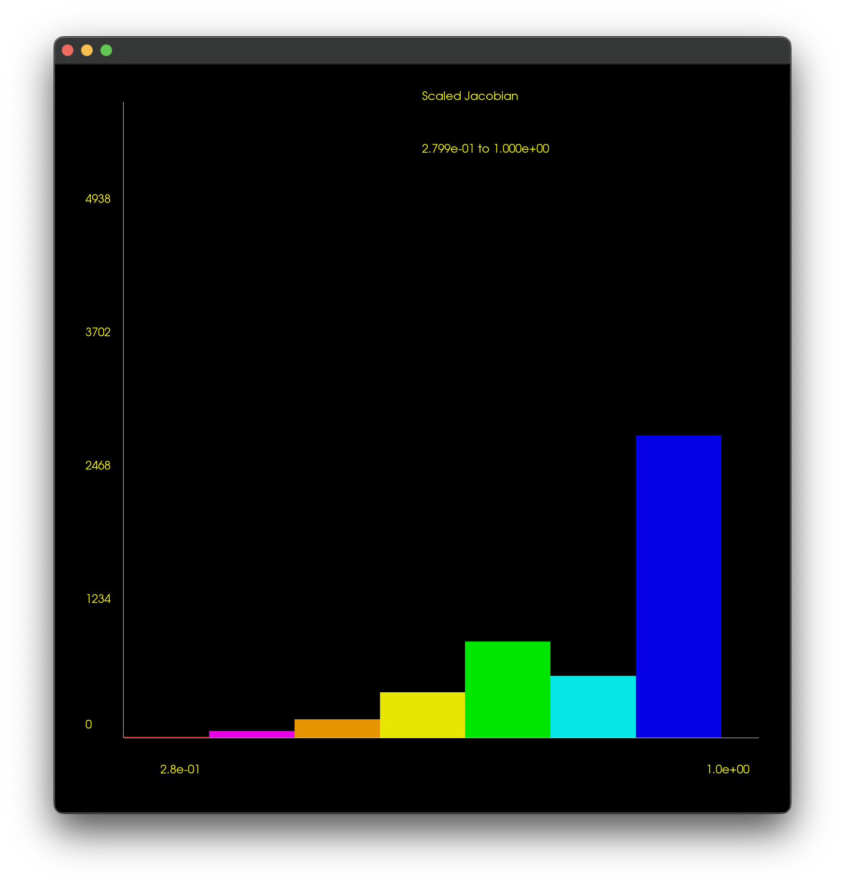

```bash
Cubit>
Cubit>quality hex all scaled jacobian global draw histogram draw mesh

 Hex quality, 4938 elements:
	Scaled Jacobian ranges from 2.799e-01 to 1.000e+00 (4938 entities)
	     Red ranges from 2.799e-01 to 3.827e-01 (12 entities)
	 Magenta ranges from 3.827e-01 to 4.856e-01 (63 entities)
	DkYellow ranges from 4.856e-01 to 5.885e-01 (172 entities)
	  Yellow ranges from 5.885e-01 to 6.914e-01 (421 entities)
	   Green ranges from 6.914e-01 to 7.942e-01 (892 entities)
	    Cyan ranges from 7.942e-01 to 8.971e-01 (576 entities)
	    Blue ranges from 8.971e-01 to 1.000e+00 (2802 entities)

 Hex quality, 4938 elements:
------------------------------------
   Function Name    Average      Std Dev      Minimum   (id)      Maximum   (id)
 ---------------    ---------    ---------    ----------------    --------------
 Scaled Jacobian    8.718e-01    1.469e-01    2.799e-01 (4179)    1.000e+00 (32)
------------------------------------
```

### Simulations

2023-05-03: Data from Anu Tripathy:

| Simulation | Brain Stiffness (Pa) | Peak Acc (rad/s2) | Failure Time (s)
| - | --: | --:  | --: 
| <td colspan=4> `cell_size_8_2023-04-24T10_01_52_556643.inp`
| skull stiffness | `8.0E+09` | `8000` | completed
| intermediate stiffness | `8.0E+05` | `8000` | completed
| brain stiffness | `3.2E+03` | `8000` | `8.10E-03`
| | `3.2E+03` | `4000` | `1.07E-02`
| | `3.2E+03` | `800` |  completed
| <td colspan=4> `cell_050_050_050_v02.inp`
| skull stiffness | `8.0E+09` | `8000` | completed
| intermediate stiffness | `8.0E+05` | `8000` | `2.5E-02`
| diagnostics, cutoff ratio=1000 | `8.0E+05` | `8000` |


## Brain with Adaptivity

We start from `stl_to_inp_cell_size_8.yml`, the coarsest of the four input files, because we anticipate one or two levels of apativity, which will make the small-scale elements `8 / 2 / 2 = 2`, approximately equal to the `stl_to_inp_cell_size_2.yml` file (which has no adaptivity).
