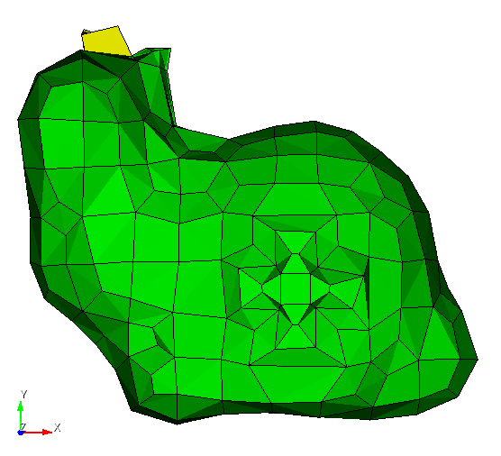
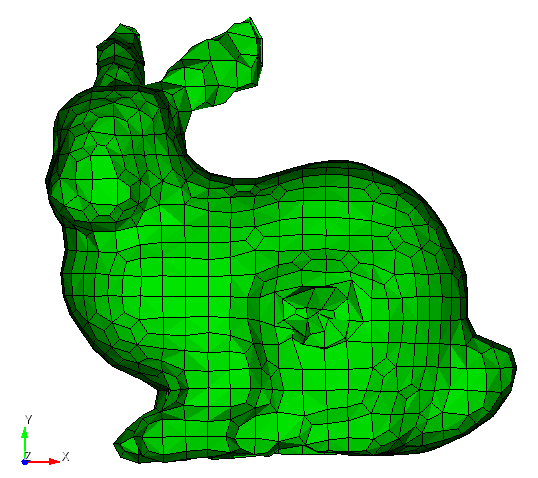
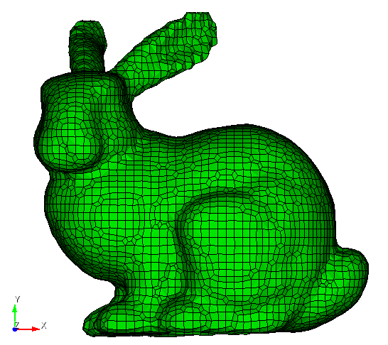
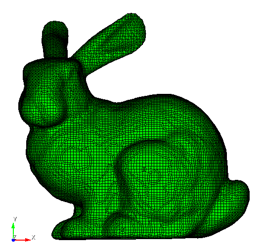
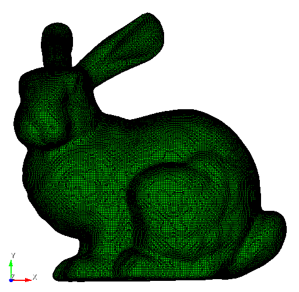

# Bunny mesh refinement

## Methods

* stl input file [bunny_20cm.stl](https://github.com/autotwin/data/blob/main/stl/bunny_20cm.stl)

### Input `.stl` file data

From *MeshLab v2022.02d*, the following Geometry Metrics (Filters > Quality Measure and Computations > Compute Geometric Measures) are found:

```bash
Mesh Bounding Box Size 19.992360 19.731260 15.457130
Mesh Bounding Box Diag 32.061503 
Mesh Bounding Box min -9.995300 -9.862690 -7.714010
Mesh Bounding Box max 9.997060 9.868570 7.743120
Mesh Surface Area is 946.919495
Mesh Total Len of 42864 Edges is 11877.368509 Avg Len 0.277094
Mesh Total Len of 42864 Edges is 11877.368509 Avg Len 0.277094 (including faux edges))
Thin shell (faces) barycenter: -1.258401 -2.181056 1.297677
Vertices barycenter -1.254750 -2.204145 1.289656
Mesh Volume is 1597.626598
Center of Mass is -0.523989 -2.975465 1.594548
Inertia Tensor is :
| 35351.430436 11102.561249 366.536683 |
| 11102.561249 43778.328759 888.689437 |
| 366.536683 888.689437 57356.932576 |
Principal axes are :
| 0.822873 -0.568184 0.006853 |
| 0.562360 0.812592 -0.153117 |
| -0.081430 -0.129850 -0.988184 |
axis momenta are :
| 27688.302786 51294.476149 57503.912836 |
Applied filter Compute Geometric Measures in 71 msec
```

### Setting Bounding box

The default settings chosen by Sculpt, when `cell_0010_stl_to_inp.yml` does not 
specify bounding box information, is as follows:

```bash
Input: /Applications/Cubit-16.06/Cubit.app/Contents/MacOS/psculpt
  --num_procs   -j  4
  --diatom_file -d  sculpt_parallel.diatom
  --exodus_file -e  sculpt_parallel.diatom_result
  --nelx        -x  562
  --nely        -y  555
  --nelz        -z  436
  --xmin        -t  -10.083937
  --ymin        -u  -9.956266
  --zmin        -v  -7.809253
  --xmax        -q  10.085697
  --ymax        -r  9.962146
  --zmax        -s  7.838363
```

This gives cell dimension of

* x = (10.085697 + 10.083937) / 562 = 20.169634 / 562 = 0.0358890
* y = (9.962146 + 9.956266) / 555 = 19.918412 / 555 = 0.0358890
* z = (7.838363 + 7.809253) / 436 = 15.647616 / 436 = 0.0358890

### Create `.inp` files

Length scale characteristic dimenion `dx` is set as the bounding box dimension, e.g., `xmin` and `xmax` (and so on for `y` and `z`),

* `dx = xmax - xmin`
* case 1: `dx / 10`
* case 2: `dx / (10 * 2) = dx / 20`
* case 3: `dx / (10 * 2^2) = dx / 40`
* case 4: `dx / (10 * 2^3) = dx / 80`
* case 5: `dx / (10 * 2^4) = dx / 160`

```bash
(atmeshenv) /Users/chovey/autotwin/mesh> python src/atmesh/sculpt_stl_to_inp.py doc/bunny_delta_cell/cell_0010_stl_to_inp.yml
```

and so on for `cell_nnnn_stl_to_inp.yml` files.

study | 0 | 1 | 2 | 3 | 4 | 5
-- | --: | --: | --: | --: | --: | --:
`.stl` and `.yml` config | [bunny.stl](https://github.com/autotwin/data/blob/main/stl/bunny_20cm.stl) | [cell_0010_stl_to_inp.yml](bunny_delta_cell/cell_0010_stl_to_inp.yml) | [cell_0020_stl_to_inp.yml](bunny_delta_cell/cell_0020_stl_to_inp.yml) | [cell_0040_stl_to_inp.yml](bunny_delta_cell/cell_0040_stl_to_inp.yml) | [cell_0080_stl_to_inp.yml](bunny_delta_cell/cell_0080_stl_to_inp.yml) | [cell_0160_stl_to_inp.yml](bunny_delta_cell/cell_0160_stl_to_inp.yml)
image |  |  |  |  |  | 
n_cells | -- | 10 | 20 | 40 | 80 | 160
`filename` | -- |  `0010.inp` | `0020.inp` | `0040.inp` | `0080.inp` | `0160.inp`
n_facets | 16,890 tri | -- | -- | -- | -- | --
n_elements | -- | 432 | 2,906 | 18,102 | 124,041 | 905,694
volume | 1597.626598 | 1496.19 | 1589.35 | 1595.53 | 1597.74 | 1597.65


