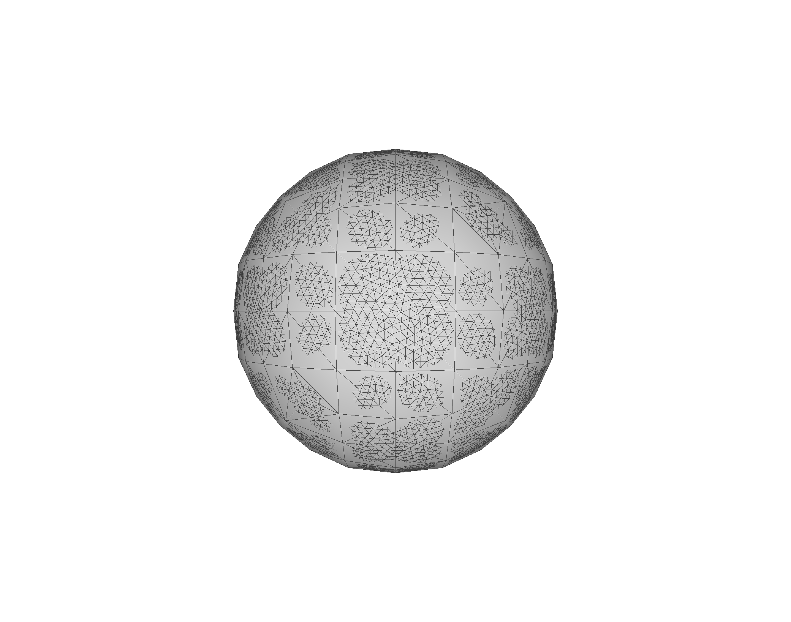
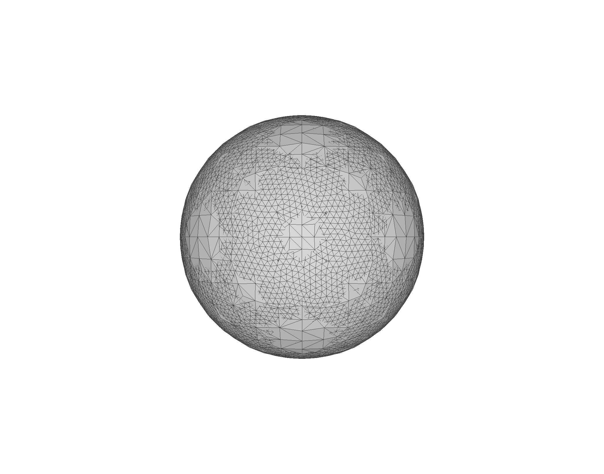
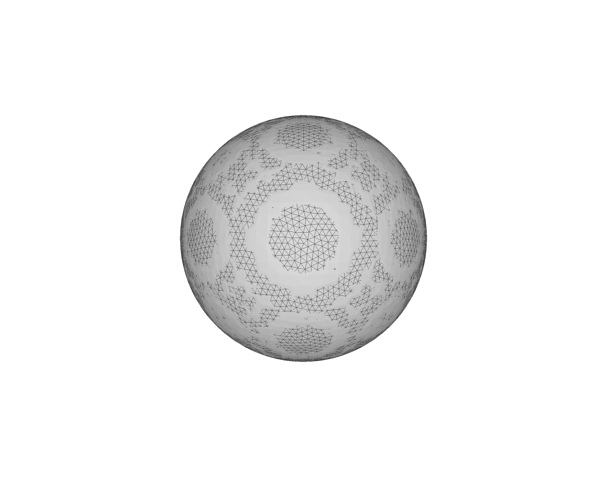
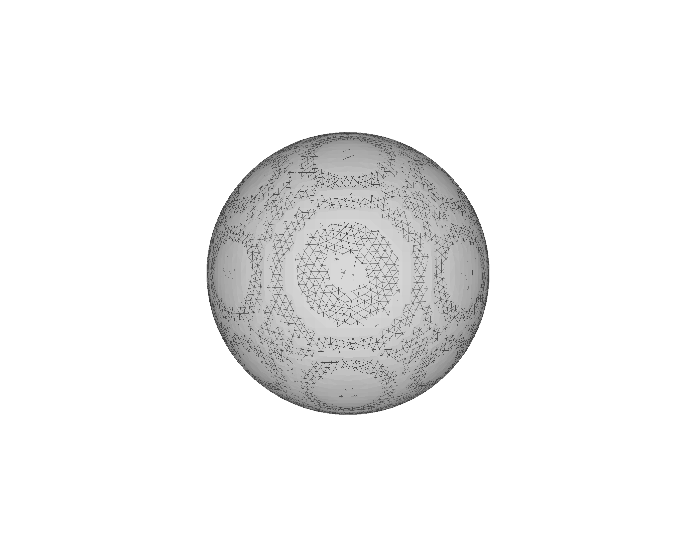
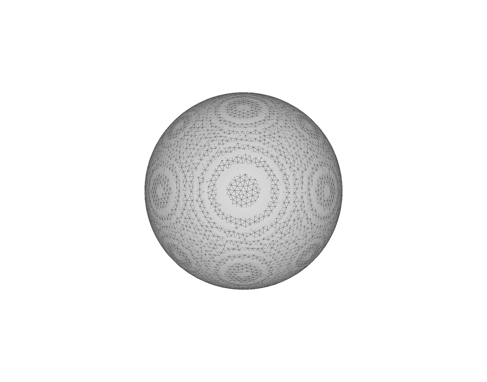

# Hausdorff Distance

## Unit Test

Cubit

* Import `sphere.stl`, `Cubit> vol 1 scale 10`, export `sphere_radius_5.stl`
* Reset
* Import `sphere.stl`, `Cubit> vol 1 scale 20`, export `sphere_radius_10.stl`

MeshLab

* Import `sphere_radius_5.stl`
* Import `sphere_radius_10.stl`
* Filters, Sampling, Hausdorff distance, sample `sphere_radius_10.stl` target mesh `sphere_radius_5.stl`, sample vertices, number of samples 8,447.


```bash
Hausdorff Distance computed
Sampled 8447 pts (rng: 0) on sphere_radius_10.stl searched closest on sphere_radius_5.stl
min : 4.989961 max 5.000005 mean : 4.993577 RMS : 4.993577
Values w.r.t. BBox Diag (34.607265)
min : 0.144188 max 0.144478 mean : 0.144293 RMS : 0.144293 
Applied filter Hausdorff Distance in 639 msec
```

## Data

Reference file: `~/autotwin/mesh/tests/files/sphere.stl`

Cubit, input file: `~/Downloads/0010.inp`

```
Cubit>

import abaqus mesh geometry "/Users/cbh/Downloads/0010.inp" feature_angle 135

skin volume 1 make block

delete block 1

# block 2 contains 192 SHELL4 elements with 194 nodes

export stl "/Users/cbh/Downloads/0010_shell.stl" overwrite
```

MeshLab import `0010_shell.stl`, 194 vertices, 384 faces (each quad face generated two triangle faces).

(a) | (b) | (c) | (d) | (e)
:--: | :--: | :--: | :--: | :--: 
 |  |  |  | 

> Figure 1: The `sphere.stl` (small triangular tessilation) with overlay of (larger triangular mesh) in MeshLab (a) `0010_shell.stl` (b) `0020_shell.stl` (c) `0040_shell.stl` (d) `0050_shell.stl`, (e) `0100_shell.stl`.

Sampled mesh: `sphere.stl`
Target mesh: `0010_shell.stl`

- [x] sample vertices with 8,447 samples

```bash
min : 0.000002 max 0.011737 mean : 0.002528 RMS : 0.003266
Values w.r.t. BBox Diag (1.730363)
min : 0.000001 max 0.006783 mean : 0.001461 RMS : 0.001887 
```

And so on for `0020.inp`, `0040.inp`, `0050.inp` and `0100.inp` 

* using diagonal normalized distance, e.g., 
* `Values w.r.t. BBox Diag (1.730363) min : 0.000001 max 0.006783 mean : 0.001461 RMS : 0.001887 )`

file | nnp | n_quads | n_tri | H_min | H_max | H_mean | H_rms
-- | --: | --: | --: | --: | --: | --: | --:
`0010_shell.inp` | 194 | 192 | 384 | 0.000001 | 0.006783 | 0.001461 | 0.001887 
`0020_shell.inp` | 842 | 840 | 1,680 | 0.000006 | 0.002713 | 0.000981 | 0.001182 
`0040_shell.inp` | 3,338 | 3,336 | 6,672 | 0.000000 | 0.001609 | 0.000316 | 0.000409 
`0050_shell.inp` | 5,234 | 5,232 | 10,464 | 0.000000 | 0.001060 | 0.000259 | 0.000323 
`0100_shell.inp` | 20,843 | 20,832 | 41,664 | 0.000000 | 0.000723 | 0.000144 | 0.000183 
