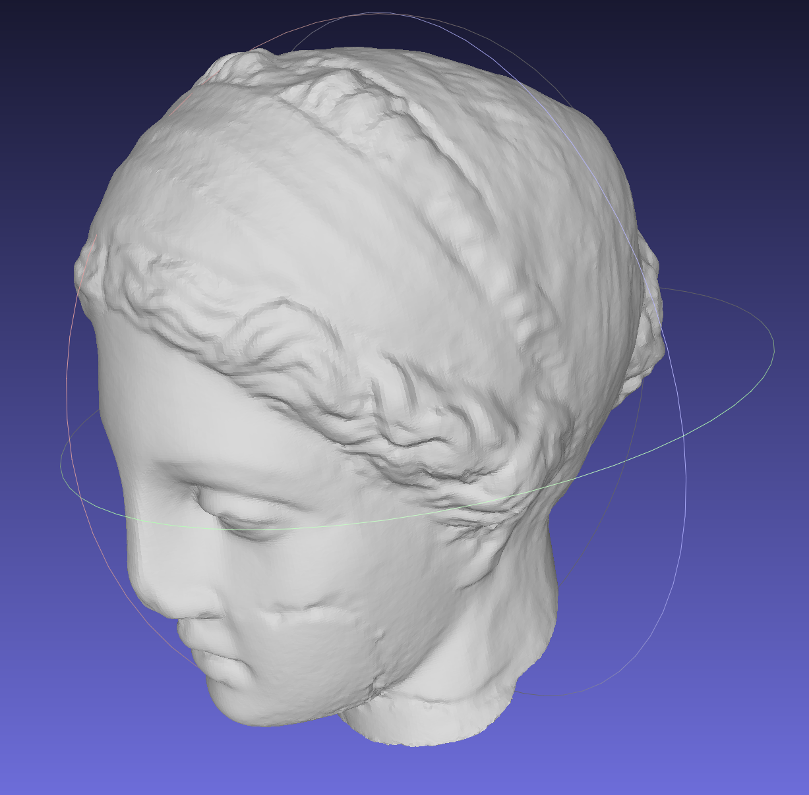
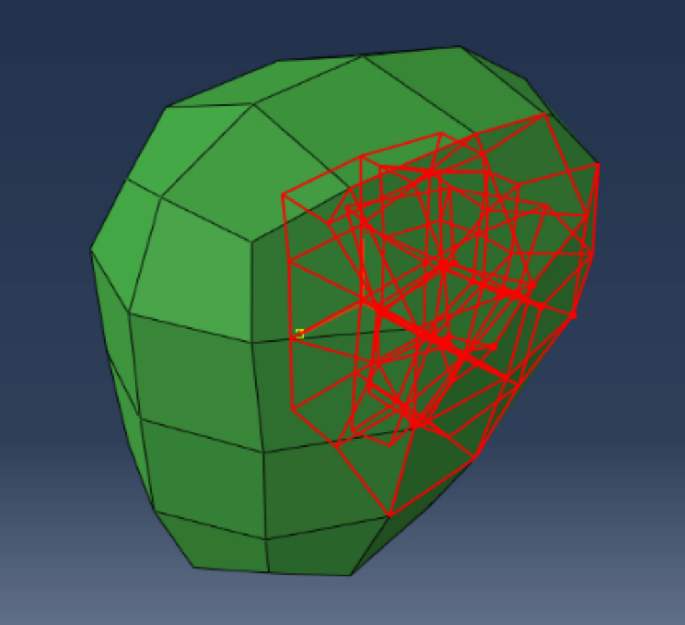
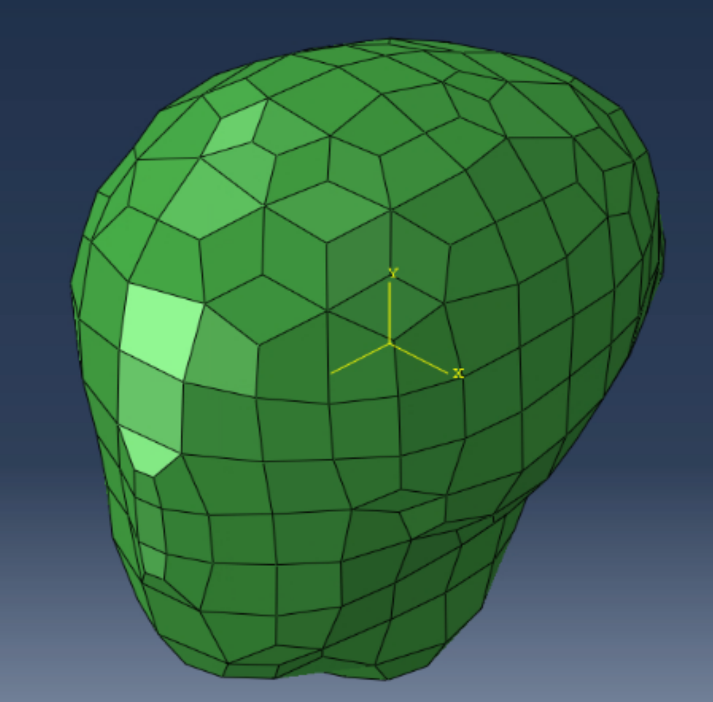
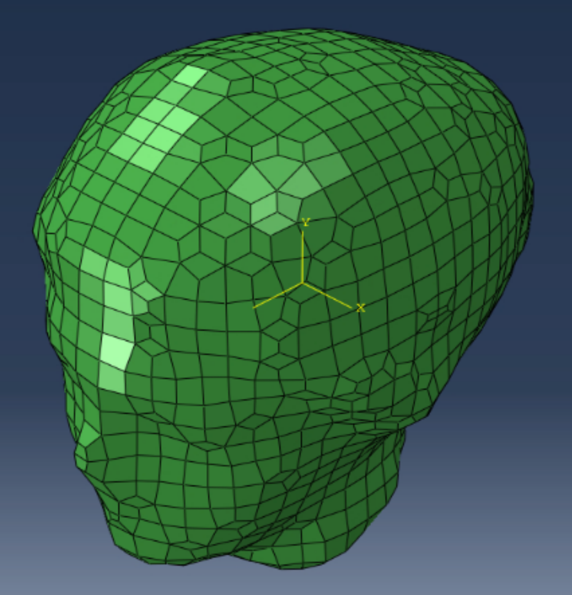
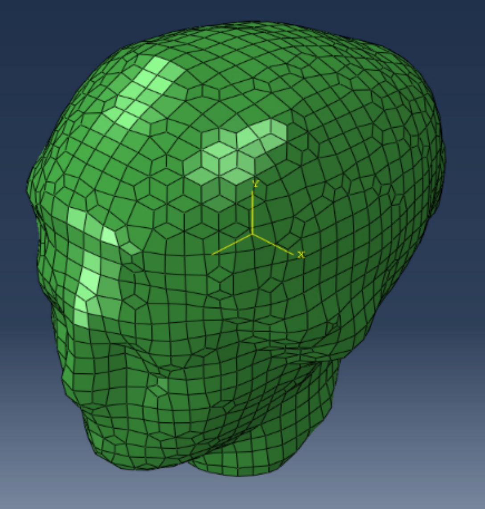
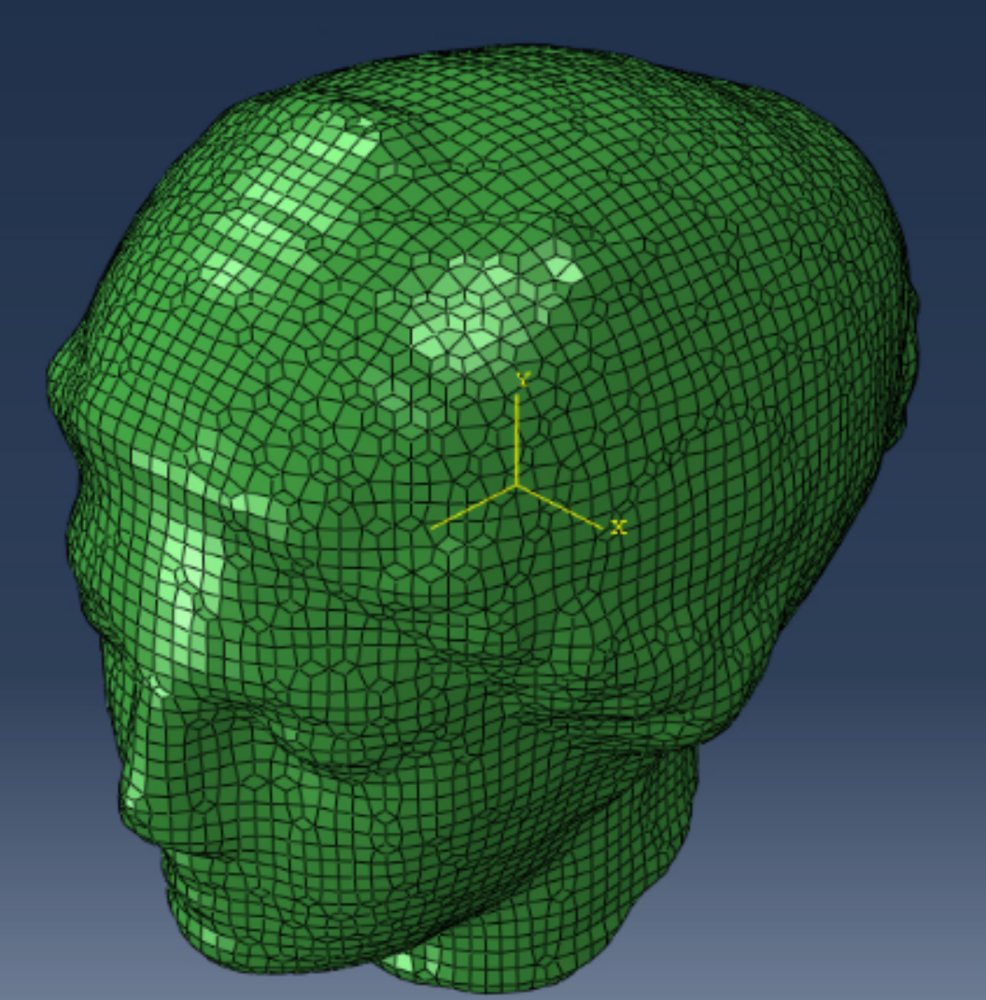
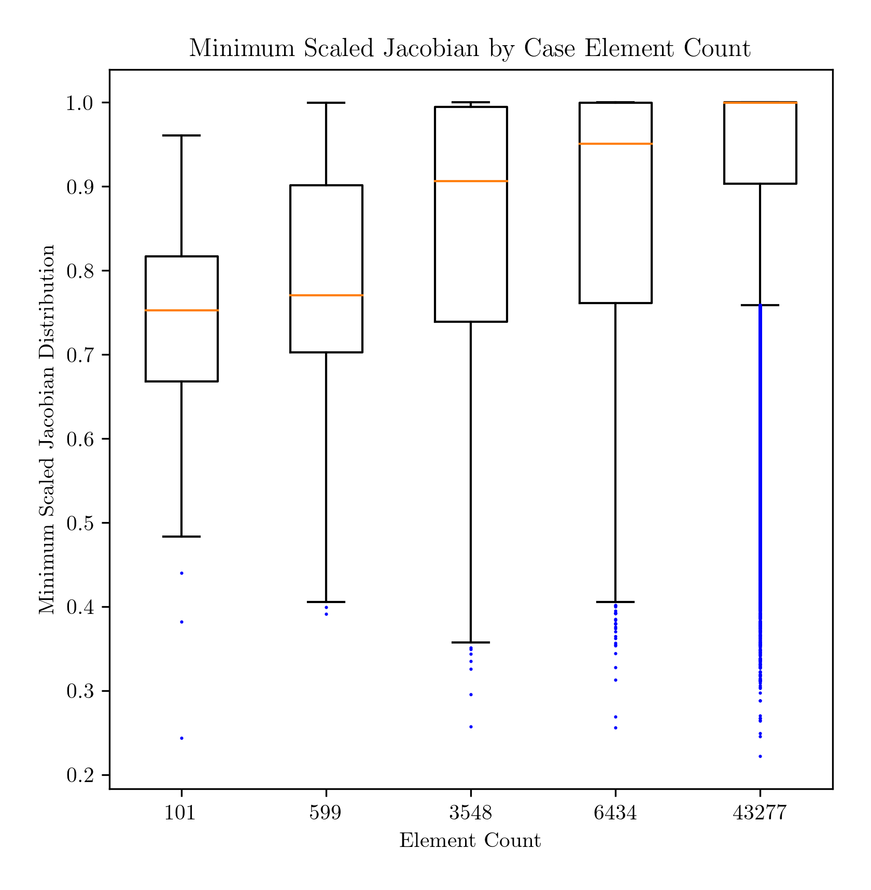

# Sphere Mesh Refinement

## Introduction

Sculpt uses an isosurface input (`.stl` format) to create an all-hex finite element mesh (e.g., in ABAQUS `.inp` format).

For a fixed volume domain, increases in Sculpt *cell count* lead to increasing levels of mesh refinement.  We use element count as a proxy for mesh refinement, since the Sculpt FE mesh is largely regular and uniform.  In general, the more refined the mesh, the higher the element count.

We examine how mesh the population of element minimum scaled Jacobian quality metric changes as a function of element count.  We use box and whisker plots to normalize across populations.

## Hypothesis

We hypothesize that increases in element count (aka refinement) will lead to increases in element quality, evidenced by migration of the median and quartile values away from zero and toward unity.

We anticipate that a threshold may occur where additional increases in element count no longer lead to improvements in mesh quality (e.g., the minimum scaled Jacobian histogram is no longer sensitive to element count).

## Methods

* source [stl file](../tests/files/sphere.stl)
* Cubit GUI - manual assessment to get approximate sculpt input parameters to feed to the Python driver script (below)
* ~~Python [driver script](../examples/sensitivity.py)~~

### Input `.stl` file

From *MeshLab v2022.02d*, the following Geometry Metrics (Filters > Quality Measure and Computations > Compute Geometric Measures) are found:

```bash
Mesh Bounding Box Size 0.069112 0.099338 0.099076
Mesh Bounding Box Diag 0.156399 
Mesh Bounding Box min -0.034556 -0.049669 -0.049538
Mesh Bounding Box max 0.034556 0.049669 0.049538
Mesh Surface Area is 0.023503
Mesh Total Len of 403029 Edges is 193.643997 Avg Len 0.000480
Mesh Total Len of 403029 Edges is 193.643997 Avg Len 0.000480 (including faux edges))
Thin shell (faces) barycenter: 0.000922 0.002285 0.004572
Vertices barycenter 0.001005 0.002486 0.004514
Mesh Volume is 0.000279
Center of Mass is 0.000822 0.004474 0.004490
Inertia Tensor is :
| 0.000000 -0.000000 -0.000000 |
| -0.000000 0.000000 0.000000 |
| -0.000000 0.000000 0.000000 |
Principal axes are :
| 0.000107 -0.851804 0.523860 |
| -0.046845 -0.523289 -0.850867 |
| 0.998902 -0.024449 -0.039958 |
axis momenta are :
| 0.000000 0.000000 0.000000 |
Applied filter Compute Geometric Measures in 1046 msec
```

### Create `.inp` files

```bash
# verify version 0.0.7 or later
(atmeshenv) ~/autotwin/mesh/version
autotwin mesh module version:
0.0.7

(atmeshenv) ~/autotwin/mesh> sculpt_stl_to_inp doc/sphere_delta_cell/cell_0010_stl_to_inp.yml

# deprecated after version 0.0.7
# (atmeshenv) /Users/chovey/autotwin/mesh> python src/atmesh/sculpt_stl_to_inp.py doc/igea_delta_cell/cell_0010_stl_to_inp.yml
```

and so on for `cell_nnnn_stl_to_inp.yml` files.

## An Important Caveat to the Igea Study ##
These results were produced on a Windows machine. The sphere study was carried out on MacOS. Directories are modified in the following .yml files to match the Windows environment. This study also utilizes Cubit 16.06. Ensure that your version of Cubit matches the .yml when reproducing the results.

study | 0 | 1 | 2 | 3 | 4 | 5
-- | --: | --: | --: | --: | --: | --:
`.stl` and `.yml` config | [igea.stl](../tests/files/igea.stl) | [cell_0010_stl_to_inp.yml](igea_delta_cell/cell_0010_stl_to_inp.yml) | [cell_0020_stl_to_inp.yml](igea_delta_cell/cell_0020_stl_to_inp.yml) | [cell_0040_stl_to_inp.yml](igea_delta_cell/cell_0040_stl_to_inp.yml) | [cell_0050_stl_to_inp.yml](igea_delta_cell/cell_0050_stl_to_inp.yml) | [cell_0100_stl_to_inp.yml](igea_delta_cell/cell_0100_stl_to_inp.yml)
image |  |  |  |  |  | 
n_cells | -- | 10 | 20 | 40 | 50 | 100
`filename` | -- |  `0010-igea.inp` | `0020-igea.inp` | `0040-igea.inp` | `0050-igea.inp` | `0100-igea.inp`
n_facets | 268,686 tri | -- | -- | -- | -- | --
n_elements | -- |151 | 791 | 4,275 | 7,545 | 47,652
volume | 0.000278524 | 0.00026759 | 0.000277055 | 0.000278075 | 0.000278356 | 0.000278504 
### Create minimum scaled Jacobian `.csv` files

```bash
# verify version 0.0.7 or later
(atmeshenv) ~/autotwin/mesh/version
autotwin mesh module version:
0.0.7

(atmeshenv) ~/autotwin/mesh> cubit_inp_to_minsj_csv doc/igea_delta_cell/cell_0010_inp_to_minsj_csv.yml

# deprecated after version 0.0.7
# (atmeshenv) chovey@s1060600/Users/chovey/autotwin/mesh> python src/atmesh/cubit_inp_to_minsj_csv.py doc/igea_delta_cell/cell_0010_inp_to_minsj_csv.yml
```

and so on for `cell_nnnn_inp_to_minsj_csv.yml` files.

study | 1 | 2 | 3 | 4 | 5
-- | --: | --: | --: | --: | --:
`.yml` config | [cell_0010_inp_to_minsj_csv.yml](igea_delta_cell/cell_0010_inp_to_minsj_csv.yml) | [cell_0020_inp_to_minsj_csv.yml](igea_delta_cell/cell_0020_inp_to_minsj_csv.yml) | [cell_0040_inp_to_minsj_csv.yml](igea_delta_cell/cell_0040_inp_to_minsj_csv.yml) | [cell_0050_inp_to_minsj_csv.yml](igea_delta_cell/cell_0050_inp_to_minsj_csv.yml) | [cell_0100_inp_to_minsj_csv.yml](igea_delta_cell/cell_0100_inp_to_minsj_csv.yml)

### Create box and whisker plots

Using [box_plots_igea.py](box_plots_igea.py) to produce:




