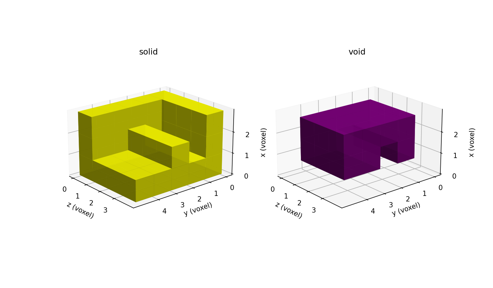
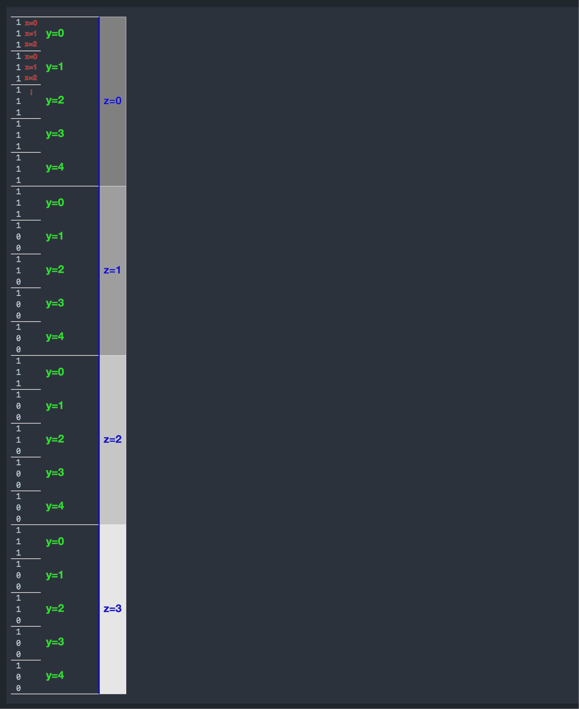

# `npy_to_mesh`


## Manual process

Below is the manual process that is automated with the autotwin `npy_to_mesh` module.

Consider a solid letter `F` shown in the (x, y) plane, and extruded along the z-axis, as shown below:


  The ``(x, y)`` image slice of the solid volume letter ``F``.  The solid phase is shown in yellow.  The void phase is shown in purple.  The width is 3 pixels.  The height is 5 pixels.

All the pixels in the slice can be classified as ``1`` for solid and ``0`` for void.  
The slice has the ``[y, x]`` representation as a ``(5 x 3)`` matrix:

```python
import numpy as np

letter_f_pixel = np.array([[1, 1, 1], [1, 0, 0], [1, 1, 0], [1, 0, 0], [1, 0, 0]], dtype=np.uint8)

array([[1, 1, 1],
       [1, 0, 0],
       [1, 1, 0],
       [1, 0, 0],
       [1, 0, 0]], dtype=uint8)
```

In numpy, in two dimensions, the ``y`` axis is the ``axis 0`` (the first axis)
and the ``x`` axis is the ``axis 1`` (the second axis).  In this 2D example, the
y-axis data has length of 5 and indices ``0..4``, the x-axis data has length 
of 3 and indices ``0..2``.

A volumetric voxel representation of the letter ``F`` is created by
stacking the image in the ``z`` axis three times.
To assist with visualization, an all-solid base layer is placed as the first layer;
the letter ``F`` slices are placed as subsequent layers.
The ``[z, y, x]`` volumetric representation of the letter ``F`` with base layer appears below:



The ``[z, y, x]`` visualization of the solid volume letter ``F`` with base layer.  The solid phase is shown in yellow.  The void is shown in purple.  The width (``x``) is 3 voxels.  The height (``y``) is 5 voxels.  The depth (``z``) is 4 voxels (equivalent to the number of slices and number of images).


The solid volume has the ``[4 x 5 x 3]`` voxel representation, composed of 4 slice matrices:

```python
      [[[1, 1, 1],
        [1, 1, 1],
        [1, 1, 1],
        [1, 1, 1],
        [1, 1, 1]],

       [[1, 1, 1],
        [1, 0, 0],
        [1, 1, 0],
        [1, 0, 0],
        [1, 0, 0]],

       [[1, 1, 1],
        [1, 0, 0],
        [1, 1, 0],
        [1, 0, 0],
        [1, 0, 0]],

       [[1, 1, 1],
        [1, 0, 0],
        [1, 1, 0],
        [1, 0, 0],
        [1, 0, 0]]]
```

In numpy, in three dimensions, the ``z`` axis is the ``axis 0`` (the first axis),
the ``y`` axis is the ``axis 1`` (the second axis), and the ``x`` axis is the
``axis 2`` (the third axis).  In this 3D example, the z-axis data has length of
4 and indices ``0..3``, the y-axis data has length of 5 and indices ``0..4``,
and the x-axis data has length of 3 and indices ``0..2``.

See the ``recon3d/examples/voxel_letter_f.py`` script, used to create the
pixel visualization, voxel visualization, and ``.tif`` image stack files,
saved to ``~/scratch``.
The ``.tif`` images are also included included with the module at ``recon3d/data/letter_f``.

Thumbnail images of the ``.tif`` images appear below:


## Cubit input `.spn` file

The `autotwin/mesh/tests/files/letter_f.i` file:

```bash
BEGIN SCULPT
  nelx = 3
  nely = 5
  nelz = 4
  stair = 1
  input_spn = letter_f.spn
  exodus_file = letter_f
  spn_xyz_order = 5
END SCULPT
```

The [`autotwin/mesh/tests/files/letter_f.spn`](../tests/files/letter_f.spn) file, consisting of 60 lines, one line for each of the voxels in the (4 x 5 x 3) voxel volume:

```bash
1
1
1
1
1
1
1
1
1
1
1
1
1
1
1
1
1
1
1
0
0
1
1
0
1
0
0
1
0
0
1
1
1
1
0
0
1
1
0
1
0
0
1
0
0
1
1
1
1
0
0
1
1
0
1
0
0
1
0
0
```

The `.spn` array is annotated below to illustrate the `[z, y, x]` ordering:



## Sculpt run

The [`tests/files/letter_f.i`](../tests/files/letter_f.i) file:

```bash
BEGIN SCULPT
  nelx = 3
  nely = 5
  nelz = 4
  stair = 1
  input_spn = letter_f.spn
  exodus_file = letter_f
  spn_xyz_order = 5
END SCULPT
```

Then,

```bash
cd ~/autotwin/mesh/tests/files

/Applications/Cubit-16.14/Cubit.app/Contents/MacOS/sculpt -i letter_f.i

SCULPT Running on host name: s1088757
At time: Wed May 22 17:12:32 2024

Initializing MPI on 1 Processors: mpiexec = /Applications/Cubit-16.14/Cubit.app/Contents/MacOS/mpiexec


/Applications/Cubit-16.14/Cubit.app/Contents/MacOS/mpiexec --mca oob_tcp_if_include lo0 --mca btl ^tcp -n 1 /Applications/Cubit-16.14/Cubit.app/Contents/MacOS/psculpt -i letter_f.i

Reading input file letter_f.i...
Finished reading input file...

                 SANDIA NATIONAL LABORATORIES

     SSSSS     CCCCC    UU   UU   LL        PPPPPP    TTTTTT
    SS   SS   CC   CC   UU   UU   LL        PP   PP     TT
    SS        CC        UU   UU   LL        PP   PP     TT
     SSSSS    CC        UU   UU   LL        PPPPPP      TT
         SS   CC        UU   UU   LL        PP          TT
    SS   SS   CC   CC   UU   UU   LL        PP          TT
     SSSSS     CCCCC     UUUUU    LLLLLLL   PP          TT

                     PARALLEL HEX MESHING
                            FROM
                     VOLUME FRACTION DATA

              SCULPT Version 16.14.7 Build bf6ed33e6b
              Copyright 2015 Sandia Corporation
      Revised Fri Dec 15 08:36:16 2023 -0700
      User Support and Bug Reports: cubit-help@sandia.gov
  
     SCULPT includes CAMAL by Sandia National Laboratories
  SCULPT includes CTH Diatoms by Sandia National Laboratories
  SCULPT is a companion application to the CUBIT Geometry and 
       Meshing Toolkit by Sandia National Laboratories

Input: /Applications/Cubit-16.14/Cubit.app/Contents/MacOS/psculpt
  --input_file      -i    letter_f.i  
  --input_spn       -isp  letter_f.spn
  --spn_xyz_order   -spo  5           
  --exodus_file     -e    letter_f    
  --nelx            -x    3           
  --nely            -y    5           
  --nelz            -z    4           
  --stair           -str  ON (1)      
  --smooth          -S    3           
  --csmooth         -CS   2           
  --laplacian_iters -LI   10          

Decomposing Cartesian grid for parallel...
  Rank 0 Number of cells/segment in directions X         3
  Rank 0 Number of cells/segment in directions Y         5
  Rank 0 Number of cells/segment in directions Z         4
  Global Number of grid segments in directions X         1
  Global Number of grid segments in directions Y         1
  Global Number of grid segments in directions Z         1

Summary of imported Microstructures spn file grid parameters
  Name of spn file  = letter_f.spn
  Num. Cartesian grid intervals = 3  5  4
  Cartesian Grid Bounds (Min.)  = 0.000000  0.000000  0.000000
  Cartesian Grid Bounds (Max.)  = 3.000000  5.000000  4.000000
  Expanded initial Cartesian grid by 0 layers
  Number of Materials           = 2

Total Cells                = 60
Number of Processors       = 1
Approx. Num Cells per Proc = 60

begin SCULPT meshing...
(1/9) computing normals...
(2/9) classifying materials...
(3/9) resolving non-manifolds...
(4/9) computing dual edge intersections...
(5/9) computing material interfaces...
(6/9) generating geometry...
(7/9) generating buffer hexes...
(8/9) generating interior hexes...
(9/9) begin smoothing...
building exodus mesh...
generating global ids...
================ MESH SUMMARY ===================
Base Filename   letter_f
Num Procs       1
Num Nodes       120
Num Elements    60
Num Blocks      2
Num Nodesets    0
Num Sidesets    0
Num Bad Qual    0
Num Poor Qual   0
Min Quality     1.000000
Avg Quality     1.000000
Min Edge Len    1.000000
Min Qual Rank   0

Job Completed Wed May 22 17:12:33 2024

Elapsed Time            0.028416 sec. (0.000474 min.)
Total Time on 1 Procs   0.028416 sec. (0.000474 min.)
Slow Rank               0
Done!
```

## Exodus mesh file output

The mesh output file, `letter_f.e.1.0` (7 kB), is shown below:

a | b
:---: | :---:
 | 
 | 

## Mesh modification via Sculpt

In this section, we tranlate and scale the mesh created above.
We also generate side sets with `variable` (also known as magic number `2`), which
is described in the only help (`sculpt --help --gen_sidesets`) as 

```bash
variable (2): A variable number of sidesets will be generated with the
            following characteristics:

                -  Surfaces at the domain boundary
                -  Exterior material surfaces
                -  Interfaces between materials
```

Review the Sculpt online help for translation and scale operations:

```bash
# overview of API via Sculpt help

chovey@s1088757/Users/chovey/autotwin/mesh/tests/files>
/Applications/Cubit-16.14/Cubit.app/Contents/MacOS/sculpt

SCULPT Running on host name: s1088757
At time: Fri May 24 08:53:48 2024
Usage: /Applications/Cubit-16.14/Cubit.app/Contents/MacOS/sculpt -j <nprocs> [-mpi <path/to/mpiexec>] [psculpt [options]]
Usage: /Applications/Cubit-16.14/Cubit.app/Contents/MacOS/psculpt [options]

Sculpt: All-hex parallel mesh generation from volume fractions.

Following is a listing of the available input commands to either sculpt
or psculpt. When used from the unix command line, commands may be issued
using the short form argument, designated with a single dash(-), or with the
longer form, designated with two dashes (--). When used in an input file, only
the long form may be used, omitting the two dashes (--)

  --help,		-h <args>	Displays this information

Process Control 	--process 	-pc
  --num_procs                -j    <arg> Number of processors requested
  --input_file               -i    <arg> File containing user input data
  --debug_processor          -D    <arg> Sleep to attach to processor for debug
  --debug_flag               -dbf  <arg> Dump debug info based on flag
  --quiet                    -qt         Suppress output
  --print_input              -pi         Print input values and defaults then stop
  --version                  -vs         Print version number and exit
  --threads_process          -tpp  <arg> Number of threads per process
  --iproc                    -ip   <arg> Number of processors in I direction
  --jproc                    -jp   <arg> Number of processors in J direction
  --kproc                    -kp   <arg> Number of processors in K direction
  --build_ghosts             -bg         Write ghost layers to exodus files for debug
  --vfrac_method             -vm   <arg> Set method for computing volume fractions

Input Data Files 	--input 	-inp
  --stl_file                 -stl  <arg> Input STL file
  --diatom_file              -d    <arg> Input Diatom description file
  --input_vfrac              -ivf  <arg> Input from Volume Fraction file base name
  --input_micro              -ims  <arg> Input from Microstructure file
  --input_cart_exo           -ice  <arg> Input from Cartesian Exodus file
  --input_spn                -isp  <arg> Input from Microstructure spn file
  --spn_xyz_order            -spo  <arg> Ordering of cells in spn file
  --compress_spn_ids         -csp  <arg> Compress IDs from SPN file
  --input_stitch             -ist  <arg> Input from Stitch file
  --stitch_timestep          -stt  <arg> Timestep in Stitch file to read
  --stitch_timestep_id       -stn  <arg> Timestep ID in Stitch file to read
  --stitch_field             -stf  <arg> Field in Stitch file to read
  --stitch_info              -sti        List header info for Stitch file
  --lattice                  -l    <arg> STL Lattice Template File

Output 	--output 	-out
  --exodus_file              -e    <arg> Output Exodus file base name
  --large_exodus             -le   <arg> Output large Exodus file(s)
  --volfrac_file             -vf   <arg> Output Volume Fraction file base name
  --quality                  -Q    <arg> Dump quality metrics to file
  --export_comm_maps         -C          Export parallel comm maps to debug exo files
  --write_geom               -G          Write geometry associativity file
  --write_mbg                -M          Write mesh based geometry file <beta>
  --compare_volume           -cv         Report vfrac and mesh volume comparison
  --compute_ss_stats         -css        Report sideset statistics

Overlay Grid Specification 	--overlay 	-ovr
  --nelx                     -x    <arg> Num cells in X in overlay Cartesian grid
  --nely                     -y    <arg> Num cells in Y in overlay Cartesian grid
  --nelz                     -z    <arg> Num cells in Z in overlay Cartesian grid
  --xmin                     -t    <arg> Min X coord of overlay Cartesian grid
  --ymin                     -u    <arg> Min Y coord of overlay Cartesian grid
  --zmin                     -v    <arg> Min Z coord of overlay Cartesian grid
  --xmax                     -q    <arg> Max X coord of overlay Cartesian grid
  --ymax                     -r    <arg> Max Y coord of overlay Cartesian grid
  --zmax                     -s    <arg> Max Z coord of overlay Cartesian grid
  --cell_size                -cs   <arg> Cell size (nelx, nely, nelz ignored)
  --align                    -a          Automatically align geometry to grid
  --bbox_expand              -be   <arg> Expand tight bbox by percent
  --input_mesh               -im   <arg> Input Base Exodus mesh
  --input_mesh_blocks        -imb  <arg> Block ids of Input Base Exodus mesh
  --input_mesh_material      -imm  <arg> Material definition with input mesh
  --input_mesh_pamgen        -imp  <arg> Input Base mesh defined by Pamgen
  --join_parallel            -jp   <arg> Join parallel files

Mesh Type 	--type 	-typ
  --stair                    -str  <arg> Generate Stair-step mesh
  --mesh_void                -V    <arg> Mesh void
  --trimesh                  -tri        Generate tri mesh of geometry surfaces
  --tetmesh                  -tet  <arg> Under Development
  --deg_threshold            -dg   <arg> Convert hexes below threshold to degenerates
  --max_deg_iters            -dgi  <arg> Maximum number of degenerate iterations
  --htet                     -ht   <arg> Convert hexes below quality threshold to tets
  --htet_method              -hti  <arg> Method used for splitting hexes to tets
  --htet_material            -htm  <arg> Convert hexes in given materials to tets
  --htet_transition          -htt  <arg> Transition method between hexes and tets
  --htet_pyramid             -htp  <arg> Local transition pyramid
  --htet_tied_contact        -htc  <arg> Local transition tied contact
  --htet_no_interface        -htn  <arg> Local transition none
  --periodic                 -per        Generate periodic mesh
  --check_periodic           -cp   <arg> Check for periodic geometry
  --check_periodic_tol       -cpt  <arg> Tolerance for checking periodicity
  --periodic_axis            -pax  <arg> Axis periodicity is about
  --periodic_nodesets        -pns  <arg> Nodesets ids of master/slave nodesets

Boundary Conditions 	--boundary_condition 	-bc
  --void_mat                 -VM   <arg> Void material ID (when mesh_void=true)
  --separate_void_blocks     -SVB        Separate void into unique block IDs
  --material_name            -mn   <arg> Label Material (Block) with Name
  --sideset_name             -sn   <arg> Label Sideset with Name
  --nodeset_name             -nn   <arg> Label Nodeset with Name
  --sideset                  -sid  <arg> User Defined Sideset
  --nodeset                  -nid  <arg> User Defined Nodeset
  --gen_sidesets             -SS   <arg> Generate sidesets
  --free_surface_sideset     -FS   <arg> Free Surface Sideset
  --match_sidesets           -mss  <arg> Sidesets ids of matching pairs
  --match_sidesets_nodeset   -msn  <arg> Nodeset defining match_sidesets

Adaptive Meshing 	--adapt 	-adp
  --adapt_type               -A    <arg> Adaptive meshing type
  --adapt_threshold          -AT   <arg> Threshold for adaptive meshing
  --adapt_levels             -AL   <arg> Number of levels of adaptive refinement
  --adapt_material           -AM   <arg> Info for adapting material
  --adapt_export             -AE         Export exodus mesh of refined grid
  --adapt_non_manifold       -ANM        Refine at non-manifold conditions
  --adapt_load_balance       -ALB        Adaptive parallel load balancing
  --adapt_memory_stats       -AMS        Write memory usage stats for adaptivity

Smoothing 	--smoothing 	-smo
  --smooth                   -S    <arg> Smoothing method
  --csmooth                  -CS   <arg> Curve smoothing method
  --laplacian_iters          -LI   <arg> Number of Laplacian smoothing iterations
  --max_opt_iters            -OI   <arg> Max. number of parallel Jacobi opt. iters.
  --opt_threshold            -OT   <arg> Stopping criteria for Jacobi opt. smoothing
  --curve_opt_thresh         -COT  <arg> Min metric at which curves won't be honored
  --max_pcol_iters           -CI   <arg> Max. number of parallel coloring smooth iters.
  --pcol_threshold           -CT   <arg> Stopping criteria for parallel color smooth
  --max_gq_iters             -GQI  <arg> Max. number of guaranteed quality smooth iters.
  --gq_threshold             -GQT  <arg> Guaranteed quality minimum SJ threshold
  --geo_smooth_max_deviation -GSM  <arg> Geo Smoothing Maximum Deviation

Mesh Improvement 	--improve 	-imp
  --pillow                   -p    <arg> Set pillow criteria (1=surfaces)
  --pillow_surfaces          -ps         Turn on pillowing for all surfaces
  --pillow_curves            -pcv        Turn on pillowing for bad quality at curves
  --pillow_boundaries        -pb         Turn on pillowing at domain boundaries
  --pillow_curve_layers      -pcl  <arg> Number of elements to buffer at curves
  --pillow_curve_thresh      -pct  <arg> S.J. threshold to pillow hexes at curves
  --pillow_smooth_off        -pso        Turn off smoothing following pillow operations
  --capture                  -c    <arg> Project to facet geometry <beta>
  --capture_angle            -ca   <arg> Angle at which to split surfaces <beta>
  --capture_side             -sc   <arg> Project to facet geometry with surface ID
  --defeature                -df   <arg> Apply automatic defeaturing
  --min_vol_cells            -mvs  <arg> Minimum number of cells in a volume
  --defeature_bbox           -dbb        Defeature Filtering at Bounding Box
  --defeature_iters          -dfi  <arg> Maximum Number of Defeaturing Iterations
  --thicken_material         -thm  <arg> Expand a given material into surrounding cells
  --thicken_void             -thv  <arg> Insert void material to remove overlap
  --micro_expand             -me   <arg> Expand Microstructure grid by N layers
  --micro_shave              -ms         Remove isolated cells at micro. boundaries
  --remove_bad               -rb   <arg> Remove hexes with Scaled Jacobian < threshold
  --wear_method              -wm   <arg> Method for removing void at free surface
  --crack_min_elem_thickness -cmet <arg> Minimum element thickness in crack
  --min_num_layers           -mnl  <arg> Minimum number of layers to keep using wear_method=2

Mesh Transformation 	--transform 	-tfm
  --xtranslate               -xtr  <arg> Translate final mesh coordinates in X
  --ytranslate               -ytr  <arg> Translate final mesh coordinates in Y
  --ztranslate               -ztr  <arg> Translate final mesh coordinates in Z
  --xscale                   -xsc  <arg> Scale final mesh coordinates in X
  --yscale                   -ysc  <arg> Scale final mesh coordinates in Y
  --zscale                   -zsc  <arg> Scale final mesh coordinates in Z

Boundary Layers 	--boundary_layer 	-bly
  --begin                    -beg  <arg> Begin specification blayer or blayer_block
  --end                      -zzz  <arg> End specification blayer or blayer_block
  --material                 -mat  <arg> Boundary layer material specification
  --num_elem_layers          -nel  <arg> Number of element layers in blayer block
  --thickness                -th   <arg> Thickness of first element layer in block
  --bias                     -bi   <arg> Bias of element thicknesses in blayer block

Use --help <args> or -h <args> to display detailed help on any option.
Use "all" argument to display help for all options.
```

On the `.spn` file input:

```bash
chovey@s1088757/Applications/Cubit-16.14/Cubit.app/Contents/MacOS>
/Applications/Cubit-16.14/Cubit.app/Contents/MacOS/sculpt --help --input_spn
SCULPT Running on host name: s1088757
At time: Fri May 24 09:05:25 2024

================================= SCULPT HELP =====================================
Input Microstructure SPN File
Command: input_spn     Input from Microstructure spn file

Input file command:   input_spn <arg>
Command line options: -isp <arg>
Argument Type:        file name with path
Command Description:
    A .spn file is an optional method for importing volume fraction data into
    sculpt for meshing. This format is a simple ascii text file containing one
    integer per cell of a Cartesian grid. Each integer represents a unique
    material identifier. Any number of materials may be used, however for
    practical purposes, the number of unique materials should not exceed more than
    about 50 for reasonable performance.
    An example file containing a 3 x 3 x 3 grid with 2 materials may be defined
    as follows:

        1 1 2 1 2 1 1 1 1
        1 2 2 1 2 2 1 1 2
        2 1 1 1 2 1 1 2 2

    Any unique integer may be used to identify a material. All cells with the
    same ID will be defined as a continuous block with the same exodus block ID
    in the final mesh. All integers should be separated by a space or newline.
    The number of integers in the file should exactly correspond to the size of
    the Cartesian grid. The dimensions of the Cartesian grid must be specified
    on the command line as part of the input. The following is an example:

        sculpt -j 8 -x 10 -y 24 -z 15 -isp "my_spn_file.spn" -p 1

    The default order of the cells in the input file will be read according to the
    following schema:

        for (i=0; i<nx; i++)
          for (j=0; j<ny; j++)
            for (k=0; k<nz; k++)
               // read next value from file

    Where nx, ny, nz are the number of cells in each Cartesian direction. This
    ordering can be changed to nz, ny, nx using the spn_xyz_order option.  The
    initial size of the Cartesian grid will be exactly nx X ny X nz with the
    minimum coordinate at (0.0, 0.0, 0.0). If a size other than the default is
    required, consider using the scale and/or translate options.

    Smoothing: Sculpt will set automatic defaults for smoothing if user options
    have not been defined. These include:

    --smooth 9 (surface smoothing option - no surface projection)
    --csmooth 2 (curve smoothing option - hermite interpolation)

    These options will generally provide a smoother curve and surface representation
    but may not adhere strictly to the volume fraction geometric definition. To
    over-ride the defaults, consider using the following options:

    --smooth 8 (surface smoothing option - projection to interpolated surface)
    --csmooth 5 (curve smoothing option - projection to interpolated curve)

    Pillowing: For most 3D models it is recommended using pillowing since
    triple junctions (curves with at least 3 adjacent materials) will typically
    be defined where malformed hex elements would otherwise be generated.
    Surface pillowing (option 1) is usually sufficient to remove poor quality
    elements at triple junctions.
```

On the `spn_xyz_order`:

```bash
# help on spn_xyz_order

chovey@s1088757/Users/chovey/autotwin/mesh/tests/files>
/Applications/Cubit-16.14/Cubit.app/Contents/MacOS/sculpt --help --spn_xyz_order

SCULPT Running on host name: s1088757
At time: Fri May 24 08:57:38 2024

================================= SCULPT HELP =====================================
XYZ ordering of cells in SPN File
Command: spn_xyz_order     Ordering of cells in spn file

Input file command:   spn_xyz_order <arg>
Command line options: -spo <arg>
Argument Type:        integer (0 to 5)
Input arguments: xyz (0)
                 xzy (1)
                 yxz (2)
                 yzx (3)
                 zxy (4)
                 zyx (5)
Command Description:
    This option is valid with the 'input_spn' option. The default
    order of the cells in the spn input file will be read according to the
    following schema:

        for (i=0; i<nx; i++)
          for (j=0; j<ny; j++)
            for (k=0; k<nz; k++)
               // read next value from file

    If the spn file has the cells in a different order, use this option to
    specify the order.  0 (xyz) is the default.
```

Translation (e.g., `xtranslate`) is done on a per-axis basis, for example, the x-axis:

```bash
chovey@s1088757/Applications/Cubit-16.14/Cubit.app/Contents/MacOS>
/Applications/Cubit-16.14/Cubit.app/Contents/MacOS/sculpt --help --xtranslate
SCULPT Running on host name: s1088757
At time: Fri May 24 09:01:17 2024

================================= SCULPT HELP =====================================
Translate Mesh Coordinates in X
Command: xtranslate     Translate final mesh coordinates in X

Input file command:   xtranslate <arg>
Command line options: -xtr <arg>
Argument Type:        floating point value
Command Description:
    Translate all mesh coordinates written to Exodus file by X delta distance.
```

Scaling (e.g., `xscale`) is done on a per-axis basis, for example, the y-axis:

```bash
chovey@s1088757/Applications/Cubit-16.14/Cubit.app/Contents/MacOS>
/Applications/Cubit-16.14/Cubit.app/Contents/MacOS/sculpt --help --yscale
SCULPT Running on host name: s1088757
At time: Fri May 24 09:03:42 2024

================================= SCULPT HELP =====================================
Scale Y Mesh Coordinates
Command: yscale     Scale final mesh coordinates in Y

Input file command:   yscale <arg>
Command line options: -ysc <arg>
Argument Type:        floating point value
Command Description:
    Scale all mesh Y coordinates written to Exodus file by given factor
```

Copy [`tests/files/letter_f.i`](../tests/files/letter_f.i) to [`tests/files/letter_f_translate_scale.i`](../tests/files/letter_f_translate_scale.i).

**NOTE: From experimentation, we observe Sculpt does the scaling first, and then the translation second.  So, the tranlation values should in the scaled units, not the original units!**

```bash
BEGIN SCULPT
  nelx = 3
  nely = 5
  nelz = 4
  # xtranslate = -1.5
  # ytranslate = -2.5
  # ztranslate = -2.0
  xscale = 10
  yscale = 10
  zscale = 10
  xtranslate = -15.0
  ytranslate = -25.0
  ztranslate = -20.0
  gen_sidesets = variable
  stair = 1
  input_spn = letter_f.spn
  exodus_file = letter_f_translate_scale
  spn_xyz_order = 5
END SCULPT
```

Then run Sculpt:

```bash
chovey@s1088757/Users/chovey/autotwin/mesh/tests/files>
/Applications/Cubit-16.14/Cubit.app/Contents/MacOS/sculpt -i letter_f_translate_scale.i

SCULPT Running on host name: s1088757
At time: Fri May 24 09:40:59 2024

Initializing MPI on 1 Processors: mpiexec = /Applications/Cubit-16.14/Cubit.app/Contents/MacOS/mpiexec


/Applications/Cubit-16.14/Cubit.app/Contents/MacOS/mpiexec --mca oob_tcp_if_include lo0 --mca btl ^tcp -n 1 /Applications/Cubit-16.14/Cubit.app/Contents/MacOS/psculpt -i letter_f_translate_scale.i

Reading input file letter_f_translate_scale.i...
Finished reading input file...

                 SANDIA NATIONAL LABORATORIES

     SSSSS     CCCCC    UU   UU   LL        PPPPPP    TTTTTT
    SS   SS   CC   CC   UU   UU   LL        PP   PP     TT
    SS        CC        UU   UU   LL        PP   PP     TT
     SSSSS    CC        UU   UU   LL        PPPPPP      TT
         SS   CC        UU   UU   LL        PP          TT
    SS   SS   CC   CC   UU   UU   LL        PP          TT
     SSSSS     CCCCC     UUUUU    LLLLLLL   PP          TT

                     PARALLEL HEX MESHING
                            FROM
                     VOLUME FRACTION DATA

              SCULPT Version 16.14.7 Build bf6ed33e6b
              Copyright 2015 Sandia Corporation
      Revised Fri Dec 15 08:36:16 2023 -0700
      User Support and Bug Reports: cubit-help@sandia.gov

     SCULPT includes CAMAL by Sandia National Laboratories
  SCULPT includes CTH Diatoms by Sandia National Laboratories
  SCULPT is a companion application to the CUBIT Geometry and
       Meshing Toolkit by Sandia National Laboratories

Input: /Applications/Cubit-16.14/Cubit.app/Contents/MacOS/psculpt
  --input_file      -i    letter_f_translate_scale.i
  --input_spn       -isp  letter_f.spn
  --spn_xyz_order   -spo  5
  --exodus_file     -e    letter_f_translate_scale
  --nelx            -x    3
  --nely            -y    5
  --nelz            -z    4
  --stair           -str  ON (1)
  --gen_sidesets    -SS   2
  --smooth          -S    3
  --csmooth         -CS   2
  --laplacian_iters -LI   10
  --xtranslate      -xtr  -15.000000
  --ytranslate      -ytr  -25.000000
  --ztranslate      -ztr  -20.000000
  --xscale          -xsc  10.000000
  --yscale          -ysc  10.000000
  --zscale          -zsc  10.000000

Decomposing Cartesian grid for parallel...
  Rank 0 Number of cells/segment in directions X 	 3
  Rank 0 Number of cells/segment in directions Y 	 5
  Rank 0 Number of cells/segment in directions Z 	 4
  Global Number of grid segments in directions X 	 1
  Global Number of grid segments in directions Y 	 1
  Global Number of grid segments in directions Z 	 1

Summary of imported Microstructures spn file grid parameters
  Name of spn file  = letter_f.spn
  Num. Cartesian grid intervals = 3  5  4
  Cartesian Grid Bounds (Min.)  = 0.000000  0.000000  0.000000
  Cartesian Grid Bounds (Max.)  = 3.000000  5.000000  4.000000
  Expanded initial Cartesian grid by 0 layers
  Number of Materials           = 2

Total Cells                = 60
Number of Processors       = 1
Approx. Num Cells per Proc = 60

begin SCULPT meshing...
(1/9) computing normals...
(2/9) classifying materials...
(3/9) resolving non-manifolds...
(4/9) computing dual edge intersections...
(5/9) computing material interfaces...
(6/9) generating geometry...
(7/9) generating buffer hexes...
(8/9) generating interior hexes...
(9/9) begin smoothing...
building exodus mesh...
generating global ids...
building sidesets...
================ MESH SUMMARY ===================
Base Filename	letter_f_translate_scale
Num Procs	1
Num Nodes	120
Num Elements	60
Num Blocks	2
Num Nodesets	0
Num Sidesets	10
Num Bad Qual	0
Num Poor Qual	0
Min Quality	1.000000
Avg Quality	1.000000
Min Edge Len	10.000000
Min Qual Rank	0

Job Completed Fri May 24 09:41:00 2024

Elapsed Time		0.007119 sec. (0.000119 min.)
Total Time on 1 Procs	0.007119 sec. (0.000119 min.)
Slow Rank		0
Done!
```

The mesh output file, `letter_f_translate_scale.e.1.0` (7 kB), is shown below:

SideSet2 highlighted | SideSet3 highlighted
:---: | :---:
 | 

## References

The sculpt help is accessed via

```bash
/Applications/Cubit-16.14/Cubit.app/Contents/MacOS/sculpt --help
```

Next: [npy_to_mesh_part_2.md](npy_to_mesh_part_2.md)
