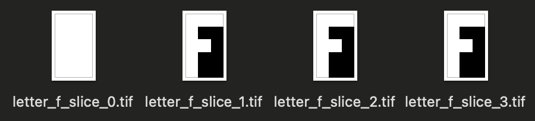
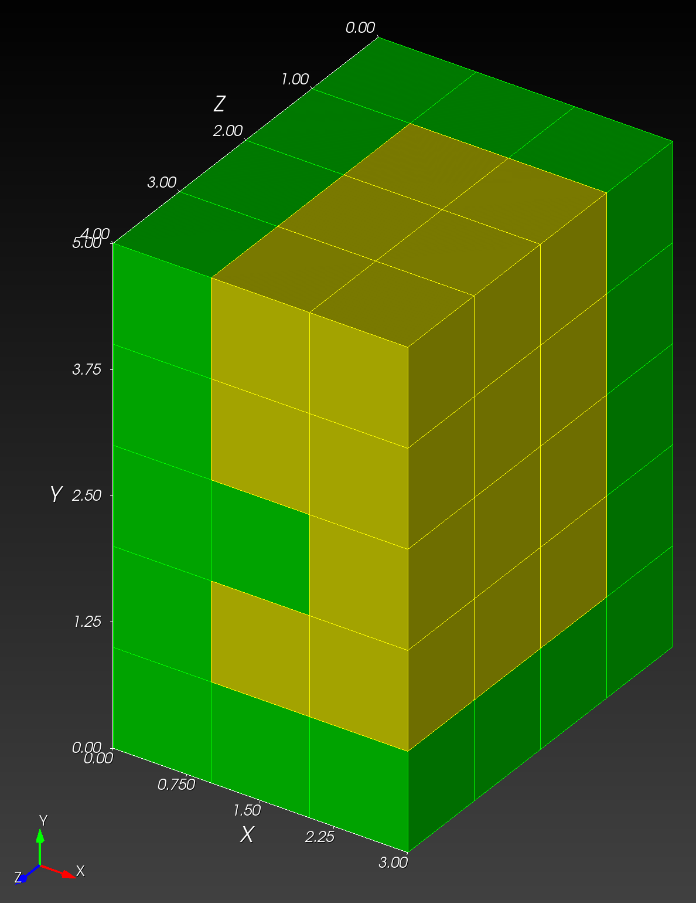

# `npy_to_mesh`


## Manual process

Below is the manual process that is automated with the autotwin `npy_to_mesh` module.

Consider a solid letter `F` shown in the (x, y) plane, and extruded along the z-axis, as shown below:


  The ``(x, y)`` image slice of the solid volume letter ``F``.  The solid phase is shown in yellow.  The void phase is shown in purple.  The width is 3 pixels.  The height is 5 pixels.

All the pixels in the slice can be classified as ``1`` for solid and ``0`` for void.  
The slice has the ``[y, x]`` representation as a ``(5 x 3)`` matrix:

```python
import numpy as np

letter_f_pixel = np.array([[1, 1, 1], [1, 0, 0], [1, 1, 0], [1, 0, 0], [1, 0, 0]], dtype=np.uint8)

array([[1, 1, 1],
       [1, 0, 0],
       [1, 1, 0],
       [1, 0, 0],
       [1, 0, 0]], dtype=uint8)
```

In numpy, in two dimensions, the ``y`` axis is the ``axis 0`` (the first axis)
and the ``x`` axis is the ``axis 1`` (the second axis).  In this 2D example, the
y-axis data has length of 5 and indices ``0..4``, the x-axis data has length 
of 3 and indices ``0..2``.

A volumetric voxel representation of the letter ``F`` is created by
stacking the image in the ``z`` axis three times.
To assist with visualization, an all-solid base layer is placed as the first layer;
the letter ``F`` slices are placed as subsequent layers.
The ``[z, y, x]`` volumetric representation of the letter ``F`` with base layer appears below:


The ``[z, y, x]`` visualization of the solid volume letter ``F`` with base layer.  The solid phase is shown in yellow.  The void is shown in purple.  The width (``x``) is 3 voxels.  The height (``y``) is 5 voxels.  The depth (``z``) is 4 voxels (equivalent to the number of slices and number of images).


The solid volume has the ``[4 x 5 x 3]`` voxel representation, composed of 4 slice matrices:

.. code-block:: python

      [[[1, 1, 1],
        [1, 1, 1],
        [1, 1, 1],
        [1, 1, 1],
        [1, 1, 1]],

       [[1, 1, 1],
        [1, 0, 0],
        [1, 1, 0],
        [1, 0, 0],
        [1, 0, 0]],

       [[1, 1, 1],
        [1, 0, 0],
        [1, 1, 0],
        [1, 0, 0],
        [1, 0, 0]],

       [[1, 1, 1],
        [1, 0, 0],
        [1, 1, 0],
        [1, 0, 0],
        [1, 0, 0]]]

In numpy, in three dimensions, the ``z`` axis is the ``axis 0`` (the first axis),
the ``y`` axis is the ``axis 1`` (the second axis), and the ``x`` axis is the
``axis 2`` (the third axis).  In this 3D example, the z-axis data has length of
4 and indices ``0..3``, the y-axis data has length of 5 and indices ``0..4``,
and the x-axis data has length of 3 and indices ``0..2``.

See the ``recon3d/examples/voxel_letter_f.py`` script, used to create the
pixel visualization, voxel visualization, and ``.tif`` image stack files,
saved to ``~/scratch``.
The ``.tif`` images are also included included with the module at ``recon3d/data/letter_f``.

Thumbnail images of the ``.tif`` images appear below:




## Cubit input `.spn` file

The `autotwin/mesh/tests/files/letter_f.i` file:

```bash
BEGIN SCULPT
  nelx = 3
  nely = 5
  nelz = 4
  stair = 1
  input_spn = letter_f.spn
  exodus_file = letter_f
  spn_xyz_order = 5
END SCULPT
```

The `autotwin/mesh/tests/files/letter_f.spn` file, consisting of 60 lines, one line for each of the voxels in the (4 x 5 x 3) voxels:

```bash
1
1
1
1
1
1
1
1
1
1
1
1
1
1
1
1
1
1
1
0
0
1
1
0
1
0
0
1
0
0
1
1
1
1
0
0
1
1
0
1
0
0
1
0
0
1
1
1
1
0
0
1
1
0
1
0
0
1
0
0
```

The `.spn` array is annotated below to illustrate the `[z, y, x]` ordering:


## Sculpt run

```bash
cd ~/autotwin/mesh/tests/files

/Applications/Cubit-16.14/Cubit.app/Contents/MacOS/scu
lpt -i letter_f.i

SCULPT Running on host name: s1088757
At time: Wed May 22 17:12:32 2024

Initializing MPI on 1 Processors: mpiexec = /Applications/Cubit-16.14/Cubit.app/Contents/MacOS/mpiexec


/Applications/Cubit-16.14/Cubit.app/Contents/MacOS/mpiexec --mca oob_tcp_if_include lo0 --mca btl ^tcp -n 1 /Applications/Cubit-16.14/Cubit.app/Contents/MacOS/psculpt -i letter_f.i

Reading input file letter_f.i...
Finished reading input file...

                 SANDIA NATIONAL LABORATORIES

     SSSSS     CCCCC    UU   UU   LL        PPPPPP    TTTTTT
    SS   SS   CC   CC   UU   UU   LL        PP   PP     TT
    SS        CC        UU   UU   LL        PP   PP     TT
     SSSSS    CC        UU   UU   LL        PPPPPP      TT
         SS   CC        UU   UU   LL        PP          TT
    SS   SS   CC   CC   UU   UU   LL        PP          TT
     SSSSS     CCCCC     UUUUU    LLLLLLL   PP          TT

                     PARALLEL HEX MESHING
                            FROM
                     VOLUME FRACTION DATA

              SCULPT Version 16.14.7 Build bf6ed33e6b
              Copyright 2015 Sandia Corporation
      Revised Fri Dec 15 08:36:16 2023 -0700
      User Support and Bug Reports: cubit-help@sandia.gov
  
     SCULPT includes CAMAL by Sandia National Laboratories
  SCULPT includes CTH Diatoms by Sandia National Laboratories
  SCULPT is a companion application to the CUBIT Geometry and 
       Meshing Toolkit by Sandia National Laboratories

Input: /Applications/Cubit-16.14/Cubit.app/Contents/MacOS/psculpt
  --input_file      -i    letter_f.i  
  --input_spn       -isp  letter_f.spn
  --spn_xyz_order   -spo  5           
  --exodus_file     -e    letter_f    
  --nelx            -x    3           
  --nely            -y    5           
  --nelz            -z    4           
  --stair           -str  ON (1)      
  --smooth          -S    3           
  --csmooth         -CS   2           
  --laplacian_iters -LI   10          

Decomposing Cartesian grid for parallel...
  Rank 0 Number of cells/segment in directions X         3
  Rank 0 Number of cells/segment in directions Y         5
  Rank 0 Number of cells/segment in directions Z         4
  Global Number of grid segments in directions X         1
  Global Number of grid segments in directions Y         1
  Global Number of grid segments in directions Z         1

Summary of imported Microstructures spn file grid parameters
  Name of spn file  = letter_f.spn
  Num. Cartesian grid intervals = 3  5  4
  Cartesian Grid Bounds (Min.)  = 0.000000  0.000000  0.000000
  Cartesian Grid Bounds (Max.)  = 3.000000  5.000000  4.000000
  Expanded initial Cartesian grid by 0 layers
  Number of Materials           = 2

Total Cells                = 60
Number of Processors       = 1
Approx. Num Cells per Proc = 60

begin SCULPT meshing...
(1/9) computing normals...
(2/9) classifying materials...
(3/9) resolving non-manifolds...
(4/9) computing dual edge intersections...
(5/9) computing material interfaces...
(6/9) generating geometry...
(7/9) generating buffer hexes...
(8/9) generating interior hexes...
(9/9) begin smoothing...
building exodus mesh...
generating global ids...
================ MESH SUMMARY ===================
Base Filename   letter_f
Num Procs       1
Num Nodes       120
Num Elements    60
Num Blocks      2
Num Nodesets    0
Num Sidesets    0
Num Bad Qual    0
Num Poor Qual   0
Min Quality     1.000000
Avg Quality     1.000000
Min Edge Len    1.000000
Min Qual Rank   0

Job Completed Wed May 22 17:12:33 2024

Elapsed Time            0.028416 sec. (0.000474 min.)
Total Time on 1 Procs   0.028416 sec. (0.000474 min.)
Slow Rank               0
Done!
```

## Exodus mesh file output

The mesh output file, `letter_f.e.1.0` (7 kB), is shown below:

a | b
:---: | :---:
 | 
 | 

## References

The sculpt help is accessed via

```bash
/Applications/Cubit-16.14/Cubit.app/Contents/MacOS/sculpt --help
```
