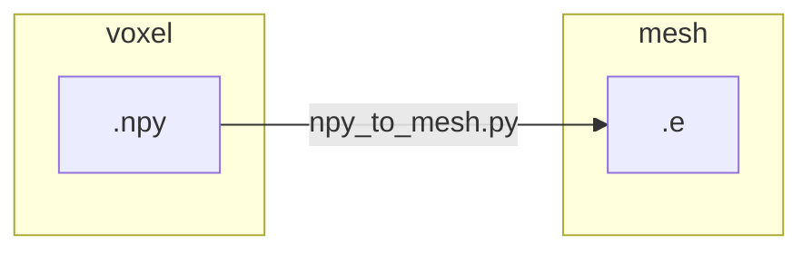
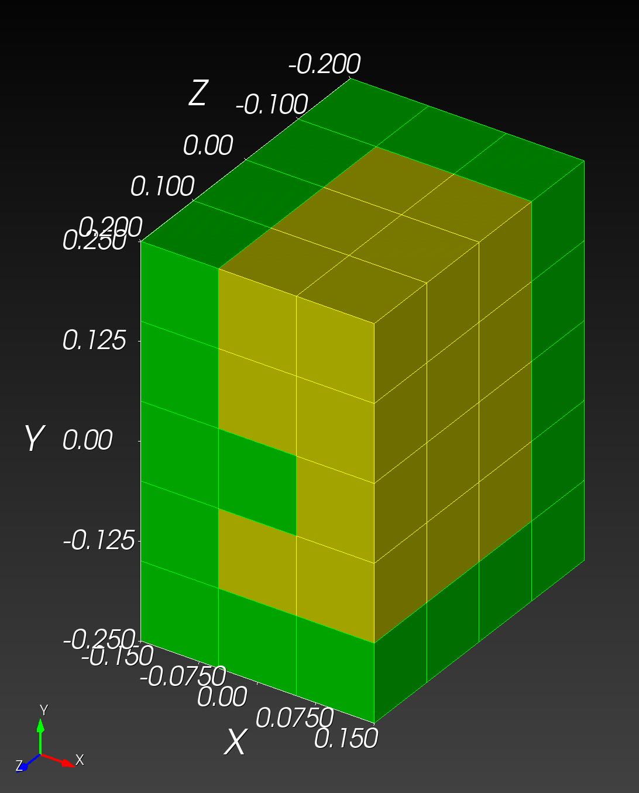

# `npy_to_mesh` part 2

Previous | Next
:---: | :---:
[npy_to_mesh.md](npy_to_mesh.md) | [npy_to_mesh_part_3.md](npy_to_mesh_part_3.md)

Now we automatic the manual workflow presented in [npy_to_mesh.md](npy_to_mesh.md).



First, create the [letter_f_autotwin.yml](../tests/files/letter_f_autotwin.yml) recipe:

```yml
sculpt_binary: /Applications/Cubit-16.14/Cubit.app/Contents/MacOS/sculpt # Path
npy_input: ~/autotwin/mesh/tests/files/letter_f_autotwin.npy # Path
scale_x: 0.1 # float
scale_y: 0.1
scale_z: 0.1
translate_x: -0.15 # float
translate_y: -0.25
translate_z: -0.20
spn_xyz_order: 5 # int
yml_schema_version: 1.8 # float
```

Navigate to the `autotwin/mesh` directory, and activate the virutal environment:

```bash
cd ~/autotwin/mesh
source .venv/bin/activate.fish  # for example, with the fish shell

```

Run the application:

```bash
npy_to_mesh tests/files/letter_f_autotwin.yml
```

The output:

```bash
--------------------
autotwin/mesh module
--------------------

atmesh> This is /Users/chovey/autotwin/mesh/src/atmesh/npy_to_mesh.py
atmesh> Processing file: tests/files/letter_f_autotwin.yml
atmesh> Success: database created from file: tests/files/letter_f_autotwin.yml
{'sculpt_binary': '/Applications/Cubit-16.14/Cubit.app/Contents/MacOS/sculpt', 'npy_input': '~/autotwin/mesh/tests/files/letter_f_autotwin.npy', 'scale_x': 0.1, 'scale_y': 0.1, 'scale_z': 0.1, 'translate_x': -0.15, 'translate_y': -0.25, 'translate_z': -0.2, 'yml_schema_version': 1.8}
atmesh> Saved spn file: /Users/chovey/autotwin/mesh/tests/files/letter_f_autotwin.spn
atmesh> Saved Sculpt input .i file: tests/files/letter_f_autotwin.i
SCULPT Running on host name: s1088757
At time: Mon May 27 20:23:38 2024

Initializing MPI on 1 Processors: mpiexec = /Applications/Cubit-16.14/Cubit.app/Contents/MacOS/mpiexec


/Applications/Cubit-16.14/Cubit.app/Contents/MacOS/mpiexec --mca oob_tcp_if_include lo0 --mca btl ^tcp -n 1 /Applications/Cubit-16.14/Cubit.app/Contents/MacOS/psculpt -i tests/files/letter_f_autotwin.i

Reading input file tests/files/letter_f_autotwin.i...
Finished reading input file...

                 SANDIA NATIONAL LABORATORIES

     SSSSS     CCCCC    UU   UU   LL        PPPPPP    TTTTTT
    SS   SS   CC   CC   UU   UU   LL        PP   PP     TT
    SS        CC        UU   UU   LL        PP   PP     TT
     SSSSS    CC        UU   UU   LL        PPPPPP      TT
         SS   CC        UU   UU   LL        PP          TT
    SS   SS   CC   CC   UU   UU   LL        PP          TT
     SSSSS     CCCCC     UUUUU    LLLLLLL   PP          TT

                     PARALLEL HEX MESHING
                            FROM
                     VOLUME FRACTION DATA

              SCULPT Version 16.14.7 Build bf6ed33e6b
              Copyright 2015 Sandia Corporation
      Revised Fri Dec 15 08:36:16 2023 -0700
      User Support and Bug Reports: cubit-help@sandia.gov

     SCULPT includes CAMAL by Sandia National Laboratories
  SCULPT includes CTH Diatoms by Sandia National Laboratories
  SCULPT is a companion application to the CUBIT Geometry and
       Meshing Toolkit by Sandia National Laboratories

Input: /Applications/Cubit-16.14/Cubit.app/Contents/MacOS/psculpt
  --input_file      -i    tests/files/letter_f_autotwin.i
  --input_spn       -isp  /Users/chovey/autotwin/mesh/tests/files/letter_f_autotwin.spn
  --spn_xyz_order   -spo  5
  --exodus_file     -e    tests/files/letter_f_autotwin
  --nelx            -x    3
  --nely            -y    5
  --nelz            -z    4
  --stair           -str  ON (1)
  --gen_sidesets    -SS   2
  --smooth          -S    3
  --csmooth         -CS   2
  --laplacian_iters -LI   10
  --xtranslate      -xtr  -0.150000
  --ytranslate      -ytr  -0.250000
  --ztranslate      -ztr  -0.200000
  --xscale          -xsc  0.100000
  --yscale          -ysc  0.100000
  --zscale          -zsc  0.100000

Decomposing Cartesian grid for parallel...
  Rank 0 Number of cells/segment in directions X 	 3
  Rank 0 Number of cells/segment in directions Y 	 5
  Rank 0 Number of cells/segment in directions Z 	 4
  Global Number of grid segments in directions X 	 1
  Global Number of grid segments in directions Y 	 1
  Global Number of grid segments in directions Z 	 1

Summary of imported Microstructures spn file grid parameters
  Name of spn file  = /Users/chovey/autotwin/mesh/tests/files/letter_f_autotwin.spn
  Num. Cartesian grid intervals = 3  5  4
  Cartesian Grid Bounds (Min.)  = 0.000000  0.000000  0.000000
  Cartesian Grid Bounds (Max.)  = 3.000000  5.000000  4.000000
  Expanded initial Cartesian grid by 0 layers
  Number of Materials           = 2

Total Cells                = 60
Number of Processors       = 1
Approx. Num Cells per Proc = 60

begin SCULPT meshing...
(1/9) computing normals...
(2/9) classifying materials...
(3/9) resolving non-manifolds...
(4/9) computing dual edge intersections...
(5/9) computing material interfaces...
(6/9) generating geometry...
(7/9) generating buffer hexes...
(8/9) generating interior hexes...
(9/9) begin smoothing...
building exodus mesh...
generating global ids...
building sidesets...
================ MESH SUMMARY ===================
Base Filename	tests/files/letter_f_autotwin
Num Procs	1
Num Nodes	120
Num Elements	60
Num Blocks	2
Num Nodesets	0
Num Sidesets	10
Num Bad Qual	0
Num Poor Qual	0
Min Quality	1.000000
Avg Quality	1.000000
Min Edge Len	0.100000
Min Qual Rank	0

Job Completed Mon May 27 20:23:38 2024

Elapsed Time		0.014642 sec. (0.000244 min.)
Total Time on 1 Procs	0.014642 sec. (0.000244 min.)
Slow Rank		0
Done!
```

The mesh file visualized in Cubit is as expected:



Previous | Next
:---: | :---:
[npy_to_mesh.md](npy_to_mesh.md) | [npy_to_mesh_part_3.md](npy_to_mesh_part_3.md)
