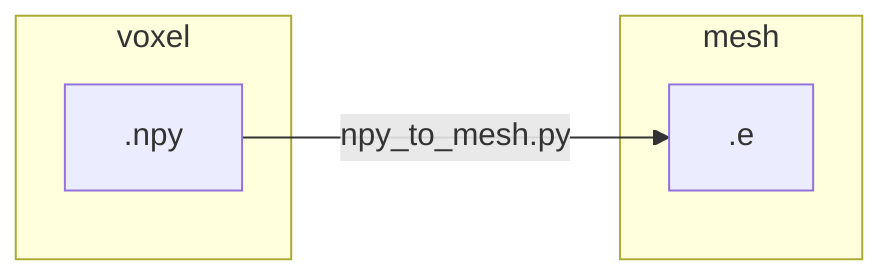

# `npy_to_mesh` part 3

Previous: [npy_to_mesh_part_2.md](npy_to_mesh_part_2.md)

We develop the manual workflow with a single subject `IXI012-HH-1211-T1`.
From the `ensemble` worflow, we generated for this patient three resolutions
(see `autotwin/mesh/tests/files` folder),

* `IXI012-HH-1211-T1_small.npy` (99 kB)
* `IXI012-HH-1211-T1_medium.npy` (614 kB)
* `IXI012-HH-1211-T1_large.npy` (4.3 MB)

and one initial visizualization,


From the `.npy` inputs, we wish to produce an Exodus mesh file with the
`npy_to_mesh.py` workflow:



The `npy_to_mesh.py` module must:

* Input
  * Read in the input `.npy` file.
* Intermediate outputs
  * Create a `.spn` file representation of the `.npy` file.
  * Create a Sculpt input `.i` file.
* Ouptut
  * Run Sculpt to create an Exodus `.e` mesh file output.

```bash
cd ~/autotwin/mesh
source .venv/bin/activate.fish
```

## References

* [EXODUS: A Finite Element Data Model](https://sandialabs.github.io/seacas-docs/exodusII-new.pdf)
* [Exomerge](https://github.com/sandialabs/exomerge)
* [h5py](https://docs.h5py.org/en/stable/) for postprocessing Exodus files
* [Network Common Data Form (NetCDF)](https://www.unidata.ucar.edu/software/netcdf/)
* [SEACAS GitHub](https://github.com/sandialabs/seacas)
* [SEACAS documentation](https://sandialabs.github.io/seacas-docs/sphinx/html/index.html)

## Exomerge

Attempt to get `exomerge` running locally without the use of `module load seacas` on the HPC.

###  Traditional method

```bash
# cd into a directory with the Exodus output file output.exo

# interative
module load seacas         # for exomerge module
module load aue/anaconda3  # for a modern version of Python, e.g., 3.11.5
(skybridge)$ python
Python 3.11.5 (main, Sep 11 2023, 13:54:46) [GCC 11.2.0] on linux
Type "help", "copyright", "credits" or "license" for more information.
>>> import exomerge
>>> exomerge.VERSION
'8.6.1'

object = exomerge.import_model('output.exo')
obj2 = exomerge.import_model('output.exo', timesteps='last')

object.get_element_count()
432864
```

### Proposed local method

Copy the `exodus.py` and `exomerge.py` scripts from:

```bash
/projects/seacas/cts1/current/lib $ ls *.py
exodus2.py  exodus3.py  exodus.py  exomerge2.py  exomerge3.py  exomerge.py
```

to local.

Open-source locations:

* [exomerge.py](https://github.com/sandialabs/exomerge/blob/master/exomerge.py)
* [exodus.py](https://github.com/sandialabs/seacas/blob/master/packages/seacas/scripts/exodus3.in.py)

```bash
 chovey@s1088757/Users/chovey/scratch/exodus_local> python3.11
Python 3.11.9 (v3.11.9:de54cf5be3, Apr  2 2024, 07:12:50) [Clang 13.0.0 (clang-1300.0.29.30)] on darwin
Type "help", "copyright", "credits" or "license" for more information.
>>> import exomerge
Traceback (most recent call last):
  File "/Users/chovey/scratch/exodus_local/exodus.py", line 177, in <module>
    EXODUS_LIB = ctypes.cdll.LoadLibrary(pip_so_path)
                 ^^^^^^^^^^^^^^^^^^^^^^^^^^^^^^^^^^^^
  File "/Library/Frameworks/Python.framework/Versions/3.11/lib/python3.11/ctypes/__init__.py", line 454, in LoadLibrary
    return self._dlltype(name)
           ^^^^^^^^^^^^^^^^^^^
  File "/Library/Frameworks/Python.framework/Versions/3.11/lib/python3.11/ctypes/__init__.py", line 376, in __init__
    self._handle = _dlopen(self._name, mode)
                   ^^^^^^^^^^^^^^^^^^^^^^^^^
OSError: dlopen(/Users/chovey/scratch/exodus_local/libexodus.dylib, 0x0006): tried: '/Users/chovey/scratch/exodus_local/libexodus.dylib' (no such file), '/System/Volumes/Preboot/Cryptexes/OS/Users/chovey/scratch/exodus_local/libexodus.dylib' (no such file), '/Users/chovey/scratch/exodus_local/libexodus.dylib' (no such file)

During handling of the above exception, another exception occurred:

Traceback (most recent call last):
  File "<stdin>", line 1, in <module>
  File "/Users/chovey/scratch/exodus_local/exomerge.py", line 76, in <module>
    import exodus
  File "/Users/chovey/scratch/exodus_local/exodus.py", line 181, in <module>
    EXODUS_LIB = ctypes.cdll.LoadLibrary(EXODUS_SO)
                 ^^^^^^^^^^^^^^^^^^^^^^^^^^^^^^^^^^
  File "/Library/Frameworks/Python.framework/Versions/3.11/lib/python3.11/ctypes/__init__.py", line 454, in LoadLibrary
    return self._dlltype(name)
           ^^^^^^^^^^^^^^^^^^^
  File "/Library/Frameworks/Python.framework/Versions/3.11/lib/python3.11/ctypes/__init__.py", line 376, in __init__
    self._handle = _dlopen(self._name, mode)
                   ^^^^^^^^^^^^^^^^^^^^^^^^^
OSError: dlopen(@ACCESSDIR@/@SEACAS_LIBDIR@/libexodus.dylib, 0x0006):
``
