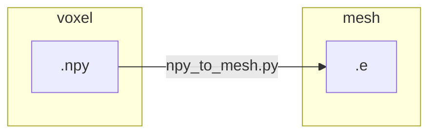

# `npy_to_mesh` part 3

We develop the manual workflow with a single subject `IXI012-HH-1211-T1`.
From the `ensemble` worflow, we generated for this patient three resolutions
(see `autotwin/mesh/tests/files` folder),

* `IXI012-HH-1211-T1_small.npy` (99 kB)
* `IXI012-HH-1211-T1_medium.npy` (614 kB)
* `IXI012-HH-1211-T1_large.npy` (4.3 MB)

and one initial visizualization,


From the `.npy` inputs, we wish to produce an Exodus mesh file with the
`npy_to_mesh.py` workflow:



The `npy_to_mesh.py` module must:

* Input
  * Read in the input `.npy` file.
* Intermediate outputs
  * Create a `.spn` file representation of the `.npy` file.
  * Create a Sculpt input `.i` file.
* Ouptut
  * Run Sculpt to create an Exodus `.e` mesh file output.

```bash
cd ~/autotwin/mesh
source .venv/bin/activate.fish
```

## References

* [EXODUS: A Finite Element Data Model](https://sandialabs.github.io/seacas-docs/exodusII-new.pdf)
* [Exomerge](https://github.com/sandialabs/exomerge)
* [h5py](https://docs.h5py.org/en/stable/) for postprocessing Exodus files
* [Network Common Data Form (NetCDF)](https://www.unidata.ucar.edu/software/netcdf/)
* [SEACAS GitHub](https://github.com/sandialabs/seacas)
* [SEACAS documentation](https://sandialabs.github.io/seacas-docs/sphinx/html/index.html)
