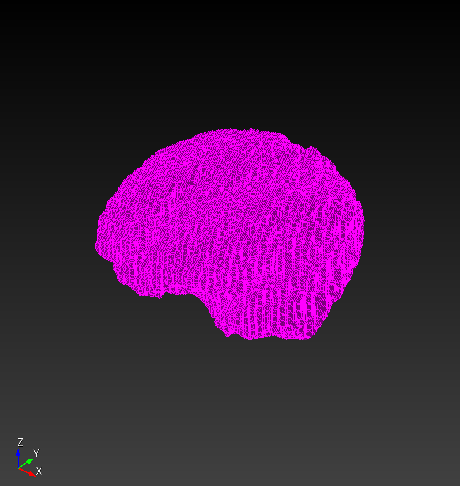

# `npy_to_mesh` part 3

Previous: [npy_to_mesh_part_2.md](npy_to_mesh_part_2.md)

We exercise the autotwin meshing workflow with a
single subject `IXI012-HH-1211-T1`.
From the `ensemble` worflow, we generated for this patient three resolutions
(see `autotwin/mesh/tests/files` folder),

* `IXI012-HH-1211-T1_tiny.npy` (2 kB)
* `IXI012-HH-1211-T1_small.npy` (99 kB)
* `IXI012-HH-1211-T1_medium.npy` (614 kB)
* `IXI012-HH-1211-T1_large.npy` (4.3 MB)

and one initial visizualization,


From the `.npy` inputs, we wish to produce an Exodus mesh file with the
`npy_to_mesh.py` workflow:


The `npy_to_mesh.py` module must:

* Input
  * Read in the input `.npy` file.
* Intermediate outputs
  * Create a `.spn` file representation of the `.npy` file.
  * Create a Sculpt input `.i` file.
* Ouptut
  * Run Sculpt to create an Exodus `.e` mesh file output.

## Meshing Workflow

```bash
cd ~/autotwin/mesh
source .venv/bin/activate.fish

npy_to_mesh tests/files/IXI012-HH-1211-T1_tiny.yml
--------------------
autotwin/mesh module
--------------------

atmesh> This is /Users/chovey/autotwin/mesh/src/atmesh/npy_to_mesh.py
atmesh> Processing file: tests/files/IXI012-HH-1211-T1_tiny.yml
atmesh> Success: database created from file: tests/files/IXI012-HH-1211-T1_tiny.yml
{'sculpt_binary': '/Applications/Cubit-16.14/Cubit.app/Contents/MacOS/sculpt', 'npy_input': '~/autotwin/mesh/tests/files/IXI012-HH-1211-T1_tiny.npy', 'scale_x': 1.0, 'scale_y': 1.0, 'scale_z': 1.0, 'translate_x': 0.0, 'translate_y': 0.0, 'translate_z': 0.0, 'spn_xyz_order': 0, 'yml_schema_version': 1.8}
atmesh> Saved spn file: /Users/chovey/autotwin/mesh/tests/files/IXI012-HH-1211-T1_tiny.spn
atmesh> Saved Sculpt input .i file: tests/files/IXI012-HH-1211-T1_tiny.i
SCULPT Running on host name: s1088757
At time: Tue Jun  4 08:51:56 2024

Initializing MPI on 1 Processors: mpiexec = /Applications/Cubit-16.14/Cubit.app/Contents/MacOS/mpiexec


/Applications/Cubit-16.14/Cubit.app/Contents/MacOS/mpiexec --mca oob_tcp_if_include lo0 --mca btl ^tcp -n 1 /Applications/Cubit-16.14/Cubit.app/Contents/MacOS/psculpt -i tests/files/IXI012-HH-1211-T1_tiny.i

Reading input file tests/files/IXI012-HH-1211-T1_tiny.i...
Finished reading input file...

                 SANDIA NATIONAL LABORATORIES

     SSSSS     CCCCC    UU   UU   LL        PPPPPP    TTTTTT
    SS   SS   CC   CC   UU   UU   LL        PP   PP     TT
    SS        CC        UU   UU   LL        PP   PP     TT
     SSSSS    CC        UU   UU   LL        PPPPPP      TT
         SS   CC        UU   UU   LL        PP          TT
    SS   SS   CC   CC   UU   UU   LL        PP          TT
     SSSSS     CCCCC     UUUUU    LLLLLLL   PP          TT

                     PARALLEL HEX MESHING
                            FROM
                     VOLUME FRACTION DATA

              SCULPT Version 16.14.7 Build bf6ed33e6b
              Copyright 2015 Sandia Corporation
      Revised Fri Dec 15 08:36:16 2023 -0700
      User Support and Bug Reports: cubit-help@sandia.gov
  
     SCULPT includes CAMAL by Sandia National Laboratories
  SCULPT includes CTH Diatoms by Sandia National Laboratories
  SCULPT is a companion application to the CUBIT Geometry and 
       Meshing Toolkit by Sandia National Laboratories

Input: /Applications/Cubit-16.14/Cubit.app/Contents/MacOS/psculpt
  --input_file      -i    tests/files/IXI012-HH-1211-T1_tiny.i                              
  --input_spn       -isp  /Users/chovey/autotwin/mesh/tests/files/IXI012-HH-1211-T1_tiny.spn
  --spn_xyz_order   -spo  0                                                                 
  --exodus_file     -e    tests/files/IXI012-HH-1211-T1_tiny                                
  --nelx            -x    11                                                                
  --nely            -y    14                                                                
  --nelz            -z    12                                                                
  --stair           -str  ON (1)                                                            
  --gen_sidesets    -SS   2                                                                 
  --smooth          -S    3                                                                 
  --csmooth         -CS   2                                                                 
  --laplacian_iters -LI   10                                                                
  --xtranslate      -xtr  0.000000                                                          
  --ytranslate      -ytr  0.000000                                                          
  --ztranslate      -ztr  0.000000                                                          
  --xscale          -xsc  1.000000                                                          
  --yscale          -ysc  1.000000                                                          
  --zscale          -zsc  1.000000                                                          

Decomposing Cartesian grid for parallel...
  Rank 0 Number of cells/segment in directions X         11
  Rank 0 Number of cells/segment in directions Y         14
  Rank 0 Number of cells/segment in directions Z         12
  Global Number of grid segments in directions X         1
  Global Number of grid segments in directions Y         1
  Global Number of grid segments in directions Z         1

Summary of imported Microstructures spn file grid parameters
  Name of spn file  = /Users/chovey/autotwin/mesh/tests/files/IXI012-HH-1211-T1_tiny.spn
  Num. Cartesian grid intervals = 11  14  12
  Cartesian Grid Bounds (Min.)  = 0.000000  0.000000  0.000000
  Cartesian Grid Bounds (Max.)  = 11.000000  14.000000  12.000000
  Expanded initial Cartesian grid by 0 layers
  Number of Materials           = 4

Total Cells                = 1848
Number of Processors       = 1
Approx. Num Cells per Proc = 1848

begin SCULPT meshing...
(1/9) computing normals...
(2/9) classifying materials...
(3/9) resolving non-manifolds...
(4/9) computing dual edge intersections...
(5/9) computing material interfaces...
(6/9) generating geometry...
(7/9) generating buffer hexes...
(8/9) generating interior hexes...
(9/9) begin smoothing...
building exodus mesh...
generating global ids...
building sidesets...
================ MESH SUMMARY ===================
Base Filename   tests/files/IXI012-HH-1211-T1_tiny
Num Procs       1
Num Nodes       2340
Num Elements    1848
Num Blocks      4
Num Nodesets    0
Num Sidesets    44
Num Bad Qual    0
Num Poor Qual   0
Min Quality     1.000000
Avg Quality     1.000000
Min Edge Len    1.000000
Min Qual Rank   0

Job Completed Tue Jun  4 08:51:56 2024

Elapsed Time            0.235479 sec. (0.003925 min.)
Total Time on 1 Procs   0.235479 sec. (0.003925 min.)
Slow Rank               0
Done!
```

Visualize in Cubit, then repeat the mesh and visualization processes for the successively larger `.npy` files:

```bash
Cubit>
import mesh "/Users/chovey/autotwin/mesh/tests/files/IXI012-HH-1211-T1_tiny.e.1.0" lite

   Reading 2340 nodes
   Reading 1848 elements
   Reading 4 blocks
   Reading 44 sidesets

   Input Details:
      Reading block 0 containing 1216 elements of type HEX8
      Reading block 1 containing 207 elements of type HEX8
      Reading block 2 containing 286 elements of type HEX8
      Reading block 3 containing 139 elements of type HEX8
      Moving imported block 0 () to new id 4

view iso
view up 0 0 1
view from 100 -100 100
```

element count | mesh | block 4 (void) | block 1 (bone) | block 2 (csf) | block 3 (brain)
---: | ---: | ---: | ---: | ---: | ---:
1,848 | IXI012-HH-1211-T1_tiny.e.1.0 (138 kB) |  1,216 |  207 |  286 |  139
98,384 | IXI012-HH-1211-T1_small.e.1.0 (5.3 MB) |  55,821 |  16,009 |  16,680 |  9,874
614,304 | IXI012-HH-1211-T1_medium.e.1.0 (32 MB) |  341,033 |  60,991 |  85,969 |  126,311
4,329,925 | IXI012-HH-1211-T1_large.e.1.0 (220 MB) |  2,389,783 |  240,895 |  448,654 |  1,250,593

## Test

The `tiny` version, above, is included in automated testing:

* [/tests/files/IXI012-HH-1211-T1_tiny_test.npy](/tests/files/IXI012-HH-1211-T1_tiny_test.npy)
* [/tests/files/IXI012-HH-1211-T1_tiny_test_fiducial.spn](/tests/files/IXI012-HH-1211-T1_tiny_test_fiducial.spn)
* [/tests/files/IXI012-HH-1211-T1_tiny_test.yml](/tests/files/IXI012-HH-1211-T1_tiny_test.yml)

## References

* [Emma's Google Drive link to 100+ segmentations](https://drive.google.com/drive/folders/158MXz03QCuockuRoSBpY-YuO4fni3RVD?usp=drive_link)
* [EXODUS: A Finite Element Data Model](https://sandialabs.github.io/seacas-docs/exodusII-new.pdf)
* [Exomerge](https://github.com/sandialabs/exomerge)
* [h5py](https://docs.h5py.org/en/stable/) for postprocessing Exodus files
* [Network Common Data Form (NetCDF)](https://www.unidata.ucar.edu/software/netcdf/)
* [SEACAS GitHub](https://github.com/sandialabs/seacas)
* [SEACAS documentation](https://sandialabs.github.io/seacas-docs/sphinx/html/index.html)

## Exomerge

Attempt to get `exomerge` running locally without the use of `module load seacas` on the HPC.

###  Traditional method

```bash
# cd into a directory with the Exodus output file output.exo

# interative
module load seacas         # for exomerge module
module load aue/anaconda3  # for a modern version of Python, e.g., 3.11.5
(skybridge)$ python
Python 3.11.5 (main, Sep 11 2023, 13:54:46) [GCC 11.2.0] on linux
Type "help", "copyright", "credits" or "license" for more information.
>>> import exomerge
>>> exomerge.VERSION
'8.6.1'

object = exomerge.import_model('output.exo')
obj2 = exomerge.import_model('output.exo', timesteps='last')

object.get_element_count()
432864
```

### Proposed local method

Copy the `exodus.py` and `exomerge.py` scripts from:

```bash
/projects/seacas/cts1/current/lib $ ls *.py
exodus2.py  exodus3.py  exodus.py  exomerge2.py  exomerge3.py  exomerge.py
```

to local.

Open-source locations:

* [exomerge.py](https://github.com/sandialabs/exomerge/blob/master/exomerge.py)
* [exodus.py](https://github.com/sandialabs/seacas/blob/master/packages/seacas/scripts/exodus3.in.py)

```bash
 chovey@s1088757/Users/chovey/scratch/exodus_local> python3.11
Python 3.11.9 (v3.11.9:de54cf5be3, Apr  2 2024, 07:12:50) [Clang 13.0.0 (clang-1300.0.29.30)] on darwin
Type "help", "copyright", "credits" or "license" for more information.
>>> import exomerge
Traceback (most recent call last):
  File "/Users/chovey/scratch/exodus_local/exodus.py", line 177, in <module>
    EXODUS_LIB = ctypes.cdll.LoadLibrary(pip_so_path)
                 ^^^^^^^^^^^^^^^^^^^^^^^^^^^^^^^^^^^^
  File "/Library/Frameworks/Python.framework/Versions/3.11/lib/python3.11/ctypes/__init__.py", line 454, in LoadLibrary
    return self._dlltype(name)
           ^^^^^^^^^^^^^^^^^^^
  File "/Library/Frameworks/Python.framework/Versions/3.11/lib/python3.11/ctypes/__init__.py", line 376, in __init__
    self._handle = _dlopen(self._name, mode)
                   ^^^^^^^^^^^^^^^^^^^^^^^^^
OSError: dlopen(/Users/chovey/scratch/exodus_local/libexodus.dylib, 0x0006): tried: '/Users/chovey/scratch/exodus_local/libexodus.dylib' (no such file), '/System/Volumes/Preboot/Cryptexes/OS/Users/chovey/scratch/exodus_local/libexodus.dylib' (no such file), '/Users/chovey/scratch/exodus_local/libexodus.dylib' (no such file)

During handling of the above exception, another exception occurred:

Traceback (most recent call last):
  File "<stdin>", line 1, in <module>
  File "/Users/chovey/scratch/exodus_local/exomerge.py", line 76, in <module>
    import exodus
  File "/Users/chovey/scratch/exodus_local/exodus.py", line 181, in <module>
    EXODUS_LIB = ctypes.cdll.LoadLibrary(EXODUS_SO)
                 ^^^^^^^^^^^^^^^^^^^^^^^^^^^^^^^^^^
  File "/Library/Frameworks/Python.framework/Versions/3.11/lib/python3.11/ctypes/__init__.py", line 454, in LoadLibrary
    return self._dlltype(name)
           ^^^^^^^^^^^^^^^^^^^
  File "/Library/Frameworks/Python.framework/Versions/3.11/lib/python3.11/ctypes/__init__.py", line 376, in __init__
    self._handle = _dlopen(self._name, mode)
                   ^^^^^^^^^^^^^^^^^^^^^^^^^
OSError: dlopen(@ACCESSDIR@/@SEACAS_LIBDIR@/libexodus.dylib, 0x0006):
``
