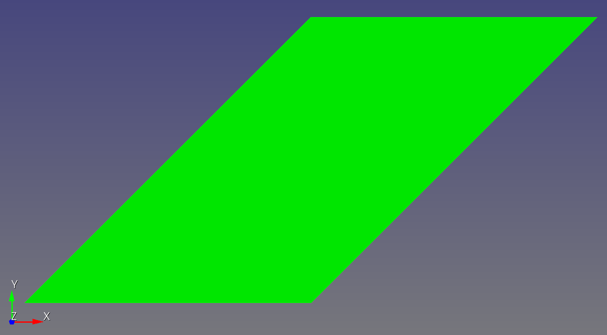

# One Quad

## Base Case

With Cubit, we create a geometry, create a single element mesh, and export the file in the ABAQUS `.inp` file format.

```bash
Cubit>
create surface rectangle width 10 height 10 zplane
curve 1 interval 1
curve 2 interval 1
curve 3 interval 1
curve 4 interval 1
mesh surface 1
export abaqus "/Users/chovey/autotwin/mesh/doc/one_quad/one_quad.inp"  overwrite  everything 

# Executive Abaqus summary:
#   Number of dimensions     = 3
#   Number of element blocks = 1
#   Number of sidesets       = 0
#   Number of nodesets       = 0
#   Number of bc sets        = 1
#   Number of elements       = 1
#   Number of nodes          = 4
# 
# Finished writing /Users/chovey/autotwin/mesh/doc/one_quad/one_quad.inp
```

Use the above file to create new quadrilaterals with known minimum scaled Jacobian (MSJ) values.

## Test Cases

Based on 

* test cases https://github.com/sandialabs/sibl/blob/master/geo/tests/test_mesh.py, e.g., `test_jacobian_of_quad_shear()`, which themselves are based on
* CIVL 7/8111, *2-D Boundary Value Problems - Quadrilateral Elements (Q4)*, http://www.ce.memphis.edu/7111/notes/notes.html and http://www.ce.memphis.edu/7111/notes/class_notes/chapter_03c_slides.pdf, accessed 2023-03-31.


test | filename | image | MSJ </br> Skew </br> AR
:--: | :-- | :--: | --:
1 | [one_quad_undeformed.inp](one_quad_undeformed.inp) |  | `1.0000000000000000` </br> `0.000` </br> `1.000`
2 | [one_quad_shear.inp](one_quad_shear.inp) |  | `0.7071067811865476` </br> `0.707` </br> `1.414`
3 | [one_quad_trapezoid.inp](one_quad_trapezoid.inp) |  | `0.8944271909999159` </br> `0.000` </br> `1.000`
4 | [one_quad_extended.inp](one_quad_extended.inp) |  | `0.8000000000000000` </br> `0.3846` </br> `1.000`
5 | [one_quad_tri_positive.inp](one_quad_tri_positive.inp) |  | `0.38461538461538486` </br> `0.4706` </br> `1.000`
6 | [one_quad_tri_negative.inp](one_quad_tri_negative.inp) |  | `-0.38461538461538486` </br> `0.7241` </br> `1.000`
7 | [one_quad_near_collapse.inp](one_quad_near_collapse.inp) |  | `-0.9756097560975608` </br> `0.9802` </br> `1.000`
8 | [one_quad_bowtie.inp](one_quad_bowtie.inp) |  | `-0.7071067811865475` </br> `0.000` </br> `0.000`
