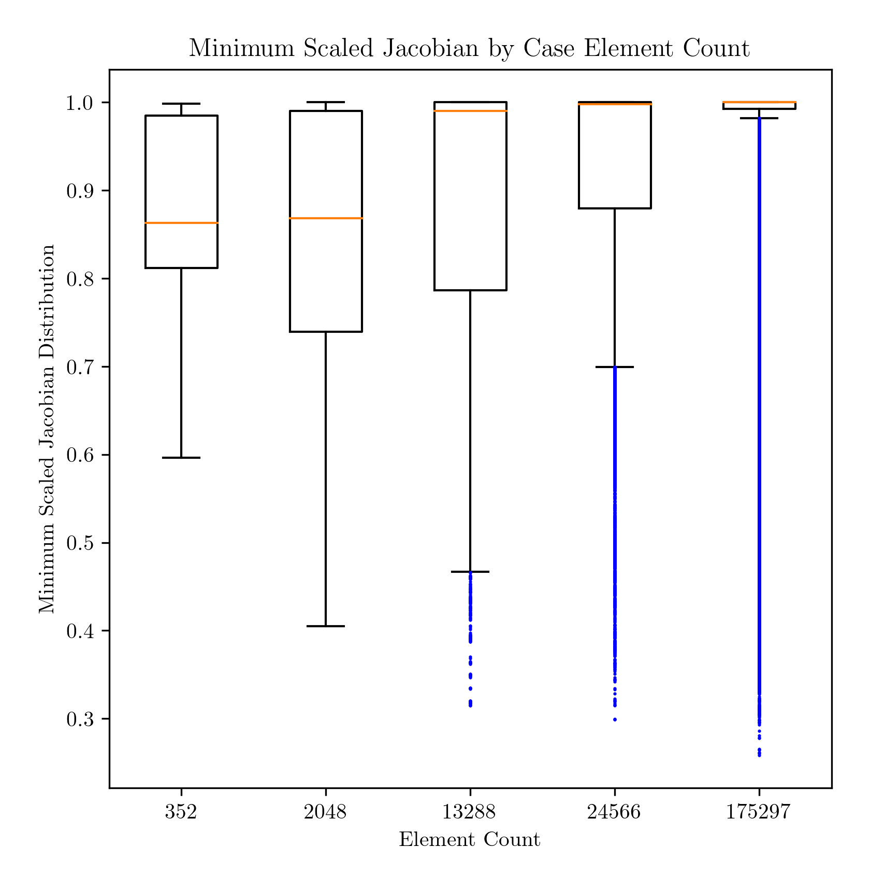

# Sphere Mesh Refinement

## Introduction

Sculpt uses an isosurface input (`.stl` format) to create an all-hex finite element mesh (e.g., in ABAQUS `.inp` format).

For a fixed volume domain, increases in Sculpt *cell count* lead to increasing levels of mesh refinement.  We use element count as a proxy for mesh refinement, since the Sculpt FE mesh is largely regular and uniform.  In general, the more refined the mesh, the higher the element count.

We examine how mesh the population of element minimum scaled Jacobian quality metric changes as a function of element count.  We use box and whisker plots to normalize across populations.

## Hypothesis

We hypothesize that increases in element count (aka refinement) will lead to increases in element quality, evidenced by migration of the median and quartile values away from zero and toward unity.

We anticipate that a threshold may occur where additional increases in element count no longer lead to improvements in mesh quality (e.g., the minimum scaled Jacobian histogram is no longer sensitive to element count).

## Methods

* source [stl file](../tests/files/sphere.stl)
* Cubit GUI - manual assessment to get approximate sculpt input parameters to feed to the Python driver script (below)
* ~~Python [driver script](../examples/sensitivity.py)~~

### Input `.stl` file

From *MeshLab v2022.02d*, the following Geometry Metrics (Filters > Quality Measure and Computations > Compute Geometric Measures) are found:

```bash
Mesh Bounding Box Size 0.999235 0.998950 0.998893
Mesh Bounding Box Diag 1.730363 
Mesh Bounding Box min -0.499664 -0.499477 -0.499503
Mesh Bounding Box max 0.499570 0.499473 0.499390
Mesh Surface Area is 3.132934
Mesh Total Len of 25335 Edges is 528.708996 Avg Len 0.020869
Mesh Total Len of 25335 Edges is 528.708996 Avg Len 0.020869 (including faux edges))
Thin shell (faces) barycenter: -0.000000 -0.000000 -0.000000
Vertices barycenter 0.000220 -0.000875 0.000465
Mesh Volume is 0.521246
Center of Mass is 0.000000 -0.000000 0.000000
Inertia Tensor is :
| 0.051968 -0.000000 0.000000 |
| -0.000000 0.051969 0.000000 |
| 0.000000 0.000000 0.051968 |
Principal axes are :
| 0.168750 0.090078 -0.981534 |
| -0.980220 -0.089130 -0.176704 |
| -0.103401 0.991938 0.073256 |
axis momenta are :
| 0.051968 0.051968 0.051969 |
Applied filter Compute Geometric Measures in 50 msec
```

### Create `.inp` files

```bash
(atmeshenv) /Users/chovey/autotwin/mesh> python src/atmesh/sculpt_stl_to_inp.py doc/sphere_delta_cell/cell_0010_stl_to_inp.yml
```

and so on for `cell_nnnn_stl_to_inp.yml` files.

study | 0 | 1 | 2 | 3 | 4 | 5
-- | --: | --: | --: | --: | --: | --:
`.stl` and `.yml` config | [sphere.stl](../tests/files/sphere.stl) | [cell_0010_stl_to_inp.yml](sphere_delta_cell/cell_0010_stl_to_inp.yml) | [cell_0020_stl_to_inp.yml](sphere_delta_cell/cell_0020_stl_to_inp.yml) | [cell_0040_stl_to_inp.yml](sphere_delta_cell/cell_0040_stl_to_inp.yml) | [cell_0050_stl_to_inp.yml](sphere_delta_cell/cell_0050_stl_to_inp.yml) | [cell_0100_stl_to_inp.yml](sphere_delta_cell/cell_0100_stl_to_inp.yml)
image |  |  |  |  |  | 
n_cells | -- | 10 | 20 | 40 | 50 | 100
`filename` | -- |  `0010.inp` | `0020.inp` | `0040.inp` | `0050.inp` | `0100.inp`
n_facets | 16,890 tri | -- | -- | -- | -- | --
n_elements | -- |352 | 2,048 | 13,288 | 24,566 | 175,297
volume | 0.521246 | 0.520335 | 0.520678 | 0.521109 | 0.521256 | 0.521187 

### Create minimum scaled Jacobian `.csv` files

```bash
(atmeshenv) chovey@s1060600/Users/chovey/autotwin/mesh>
python src/atmesh/cubit_inp_to_minsj_csv.py doc/sphere_delta_cell/cell_0010_inp_to_minsj_csv.yml
```

and so on for `cell_nnnn_inp_to_minsj_csv.yml` files.

study | 1 | 2 | 3 | 4 | 5
-- | --: | --: | --: | --: | --:
`.yml` config | [cell_0010_inp_to_minsj_csv.yml](sphere_delta_cell/cell_0010_inp_to_minsj_csv.yml) | [cell_0020_inp_to_minsj_csv.yml](sphere_delta_cell/cell_0020_inp_to_minsj_csv.yml) | [cell_0040_inp_to_minsj_csv.yml](sphere_delta_cell/cell_0040_inp_to_minsj_csv.yml) | [cell_0050_inp_to_minsj_csv.yml](sphere_delta_cell/cell_0050_inp_to_minsj_csv.yml) | [cell_0100_inp_to_minsj_csv.yml](sphere_delta_cell/cell_0100_inp_to_minsj_csv.yml)

### Create box and whisker plots

Using [box_plots.py](box_plots.py) to produce:



### Results

Increasing refinement results in

* Increase of the median MSJ quality value from just above 0.85 (case 1) to approximately 1.0 (case 5),
* Initial broadening (case 1 to case 2) and then tightening (case 2 and onward) of the interquartile range (IQR = Q3 - Q1),
* Increasing number of outliers (indicated in blue dots), and
* Decrease in the minimum population value of MSJ.

### Significance

* Mesh refinement (traditionally used to reach convergence of displacement, stress, or strain results) may be contraindicated for all-element population MSJ quality improvement.
* A tradeoff between median MSJ and minimum MSJ is seen, indicating that a balance between a median MSJ and a minimum MSJ that is sufficiently near 1.0 (ideal) is required.
* All median and minimum values found in the present studies are sufficient for solving involving time stepping. However, the bloat of elements at high resolution, with their associated longer solve times, indicates that lower refinement meshes may be sufficient for use in simulations, as MSJ quality metrics actually improve for lower refinement cases considered in this study.

### Limitations

* This study does not account for mesh convergence of solution variables, such as displacement, stress, or strain.  Such convergence should be the primary adjudicator for mesh refinement cessation.
* MSJ quality metrics do not indicate sufficient refinement has been achieved, thus their use is adjunct.
* The trends in the this study are limited to the sphere geometry at hand.  We warn that extapolation of the present results to other, more complex shapes, should be avoided.  Geometries should be assessed on a case-by-case basis.
* The present study did not examine to what degree surface area and volume of the meshed geometries represent the fiducial surface area and volume indicated by the input `.stl` file.  These, in addition to local curvature, should be examined in future studies.
* Decimation of the interior domain via dualization should also be considered.

## Deprecated below:

## Cubit

Set working directory:

```bash
Cubit>cd "/Users/cbh/autotwin/mesh/tests/files"
```

Import the `.stl` input file:

```bash
Cubit>import stl "/Users/cbh/autotwin/mesh/tests/files/sphere.stl" feature_angle 135.00 merge 
Reading facets...
  16890 facets read.
Building facet-based geometry from 16890 facets...
Body successfully created.
  Number of new vertices = 0
  Number of new curves = 0
  Number of new surfaces = 1
  Number of new shells = 1
  Number of new volumes = 1
  Number of new bodies = 1
Geometry engine set to: Facet Geometry Engine version 10.0.0
Journaled Command: import stl "/Users/cbh/autotwin/mesh/tests/files/sphere.stl" feature_angle 135 merge

Cubit>
```

### Cell Size 0.10

Sculpt input parameters:

* `Cell Size: 0.1`
  * Cartesian intervals: 16 x 16 x 16
  * `Total Cells: 4,096`
  * `Bounding Box: (-0.8, 0.8), (-0.8, 0.8), (-0.8, 0.8)`

Sculpt specific command line:

```bash
sculpt parallel volume 1 size 0.1 box location position -0.80005 -0.8 -0.80006 location position 0.79995 0.8 0.79994
```

Set camera to consistent view:

```bash
Cubit>view up 0 0 1
Cubit>view iso
Displaying iso view
Cubit>vol 1 visibility off
```


### Additional cell sizes to come...

To come.


## Results

Histograms to come.

## Discussion

To come.

## Conclusions

To come.

## Context

* [Spherical Baseline](octa_loop.md)

## References

To come.

