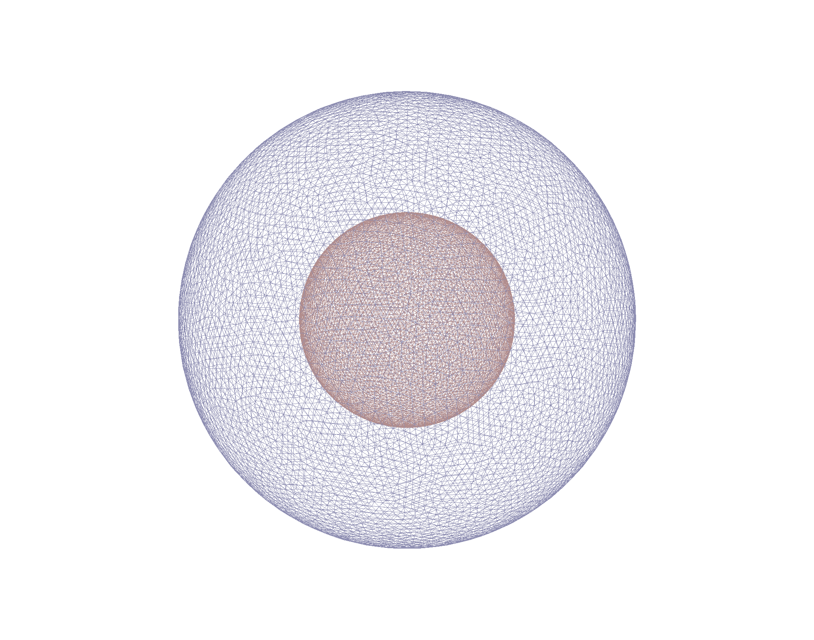
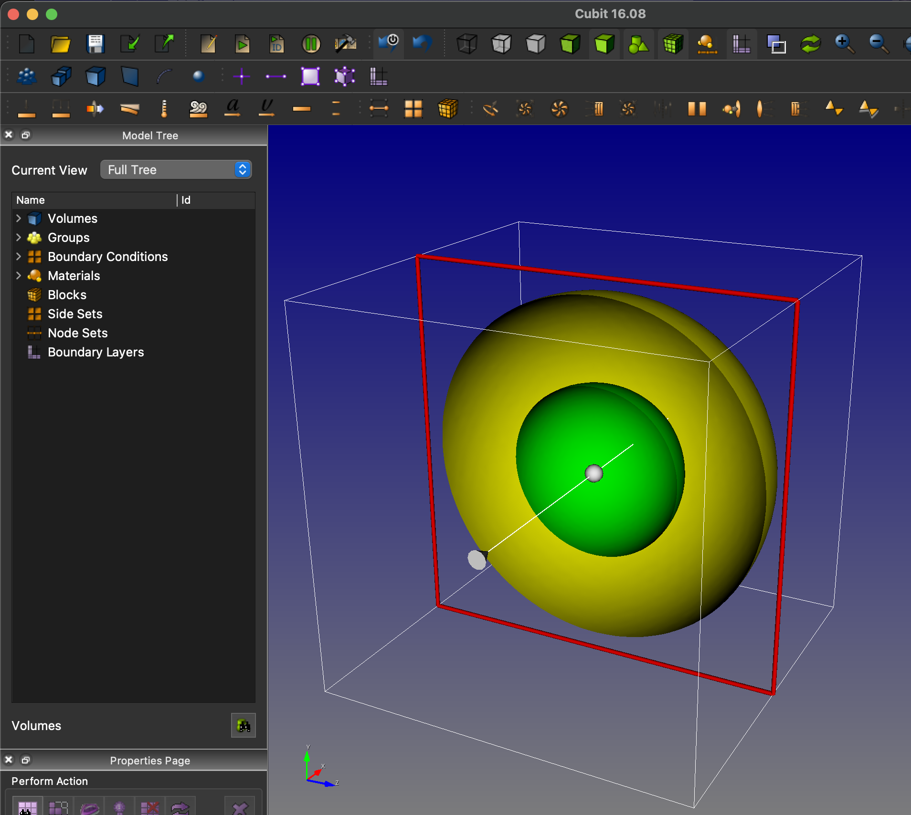
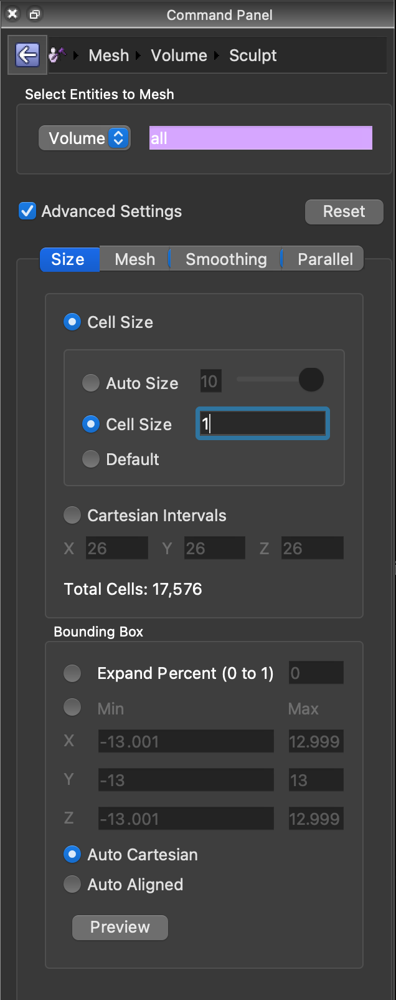
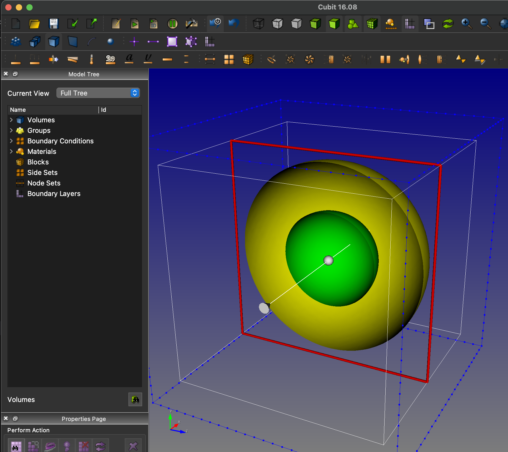
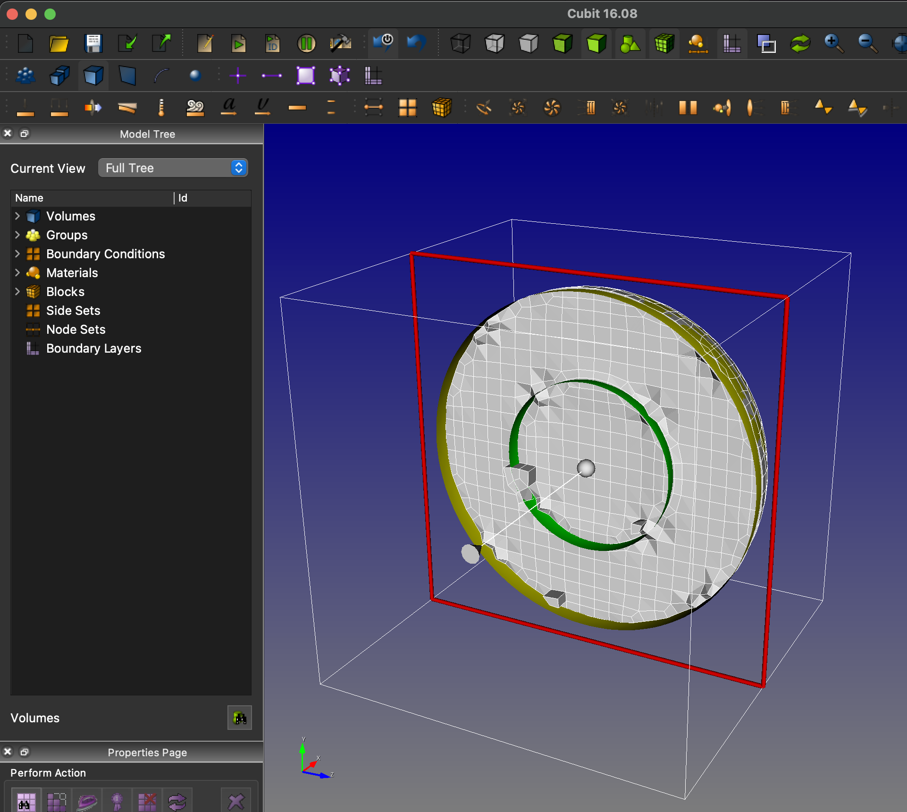
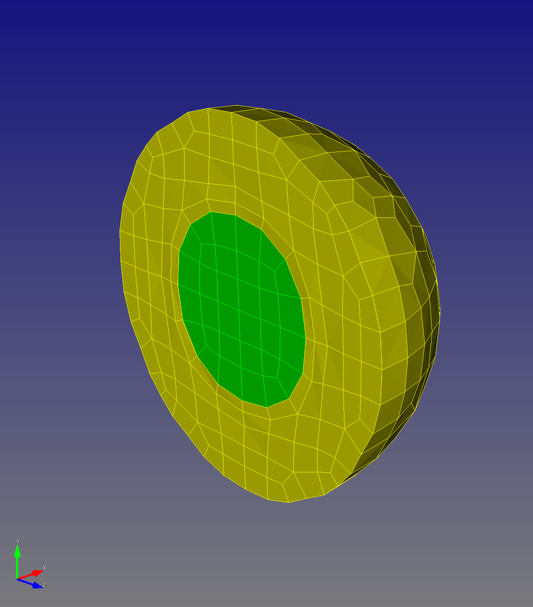
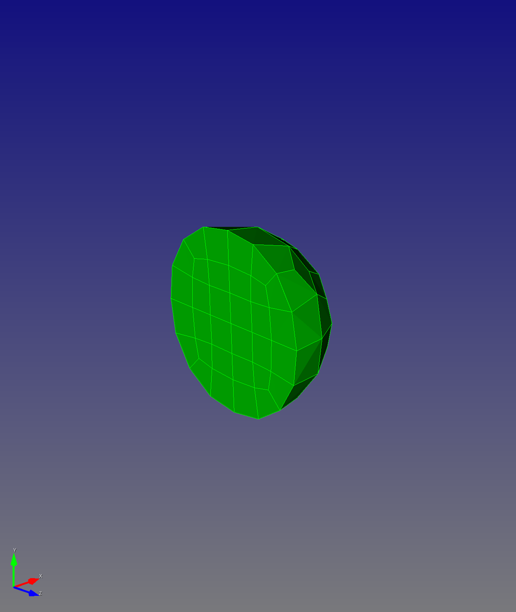
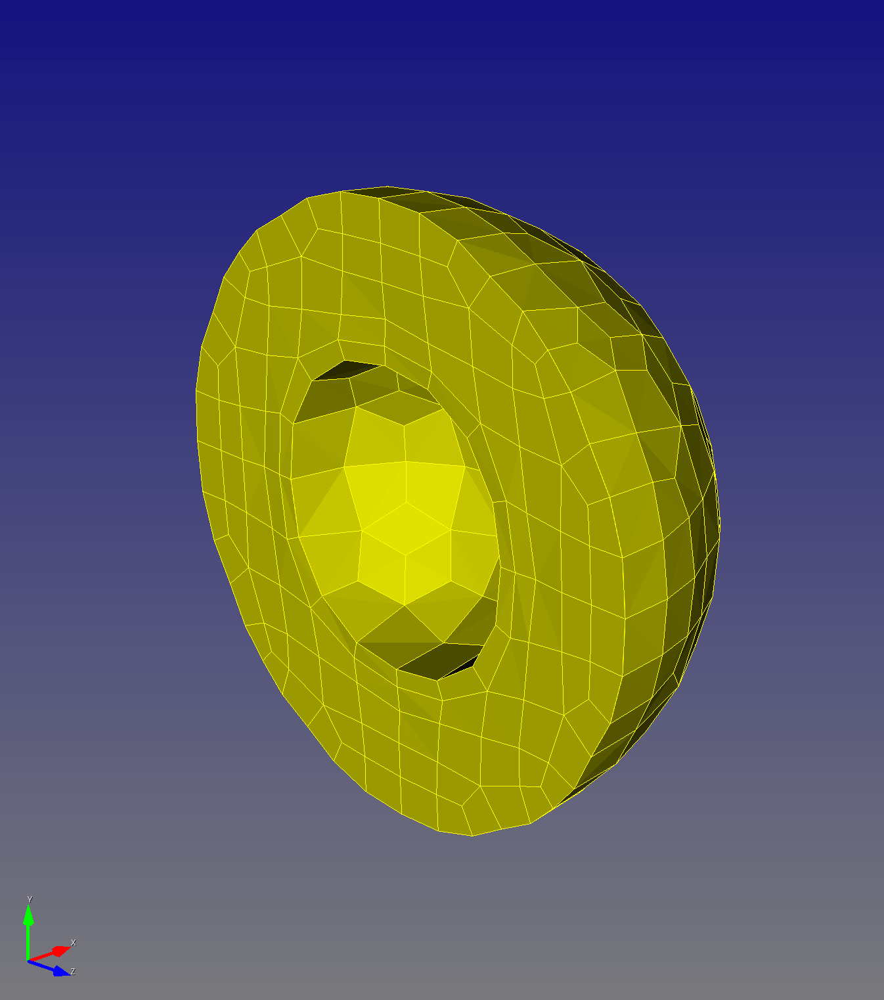
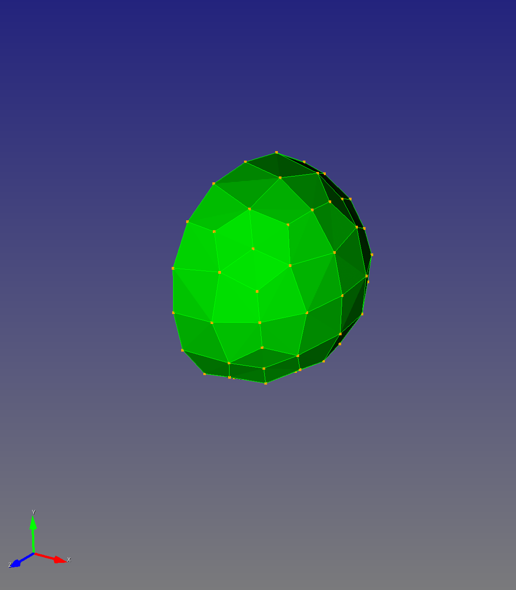
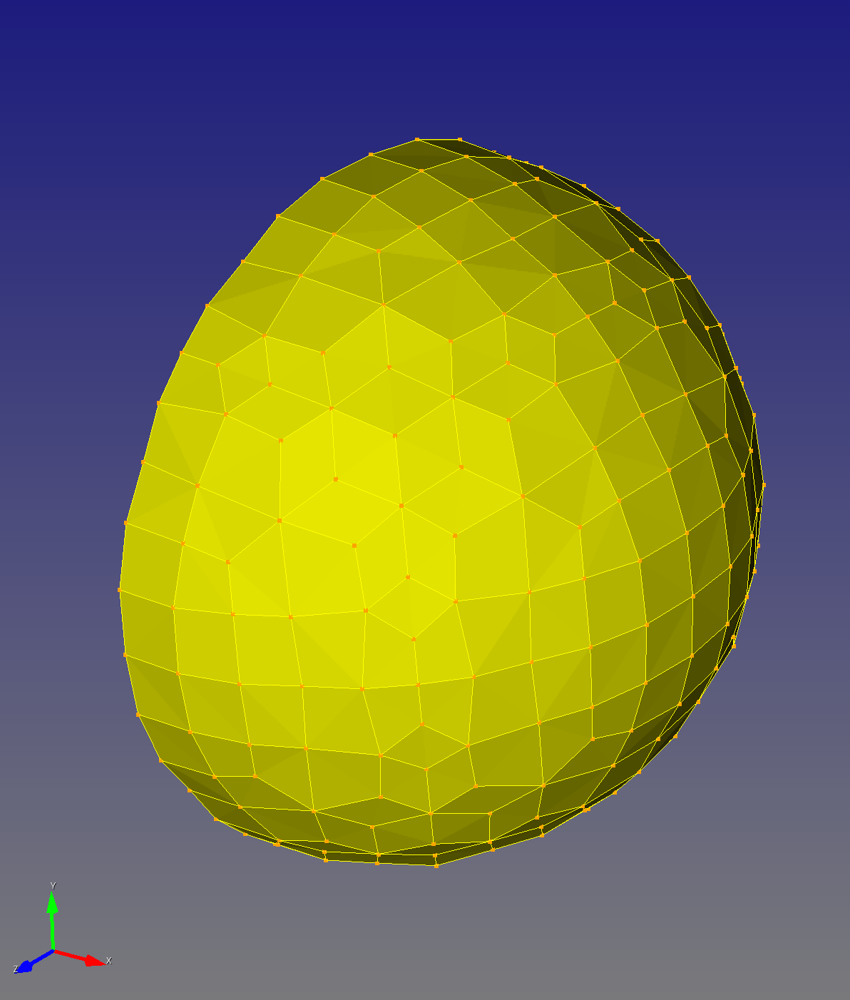

# Two Spheres

**See also [Hausdorff Distance](../hausdorff_distance.md)**

## Input

From the `~/autotwin/mesh/tests/files` folder:

* `sphere_radius_5.stl`
* `sphere_radius_10.stl`

shown together here:



* Input file [`stl_to_inp_cell_size_2.yml`](stl_to_inp_cell_size_2.yml)

```bash
(.venv) ~/autotwin/mesh> sculpt_stl_to_inp doc/two_spheres/stl_to_inp_cell_size_2.yml
```

## Manual step-by-step via Cubit GUI

This manual step-by-step walkthrough, using the Cubit GUI, is the manual process that is automated with [sculpt_slt_to_inp.py](../../src/atmesh/sculpt_stl_to_inp.py).

* Import the two `.stl` files listed above from the folder listed above.
* Toggle clipping plan to visualize the surfaces of both files.



Command Panel Steps | Image
-- | --
Command Panel > Mesh > Volume > Sculpt |
Volume All, Advanced Settings, Cell Size 1, Preview, Mesh |
Image: | 

* See blue outline with dots, indicating the bounding box



* Click the Mesh button



### Nodesets

Sculpt can generate sidesets with the `gen_sideset` option.

* Ckeck out Section 9. BOUNDARY CONDITIONS of the Sculpt [documentation](https://cubit.sandia.gov/files/cubit/16.08/help_manual/WebHelp/cubithelp.htm) and [this](https://coreform.com/cubit_help/mesh_generation/meshing_schemes/parallel/sculpt_bcs.htm?rhsearch=side_sets&rhhlterm=sidesets%20sideset).
* One can generate nodesets from sidesets.

To generate nodesets from sidesets with Sculpt:

```bash
import stl "supplied_files/sphere_radius_5.stl" feature_angle 135 merge
import stl "supplied_files/sphere_radius_10.stl" feature_angle 135 merge
sculpt volume all gen_sidesets 2
export mesh "mesh.g" overwrite # not necessary to export and then import the .g file
reset
import mesh "mesh.g" no_geom
nodeset 1 add  node in face in sideset 1
```

## Automated mesh generation

Create a `.inp` file using [`two_spheres.yml`](../../tests/files/two_spheres.yml)

```bash
(.venv) $ version
autotwin mesh module version:
0.0.7
(.venv) $ sculpt_stl_to_inp tests/files/two_spheres.yml 
```

From Cubit, open [`"~/autotwin/mesh/tests/files/two_spheres.inp"`](../../tests/files/two_spheres.inp).

Images shown below are half-sections, with the `-x` hemisphere hidden and the `+x` hemisphere shown.

all | inner | outer
:--: | :--: | :--: 
`draw block all` | `draw block 1` | `draw block 2`
 |  | 
1200 elements | 152 elements | 1048 elements |
**all** | **inner** | **outer**
-- | `draw nodeset 3` | `draw nodeset 2`
-- |  | 
1477 total (volume) |  98 nodes (surface) | 482 nodes (surface)