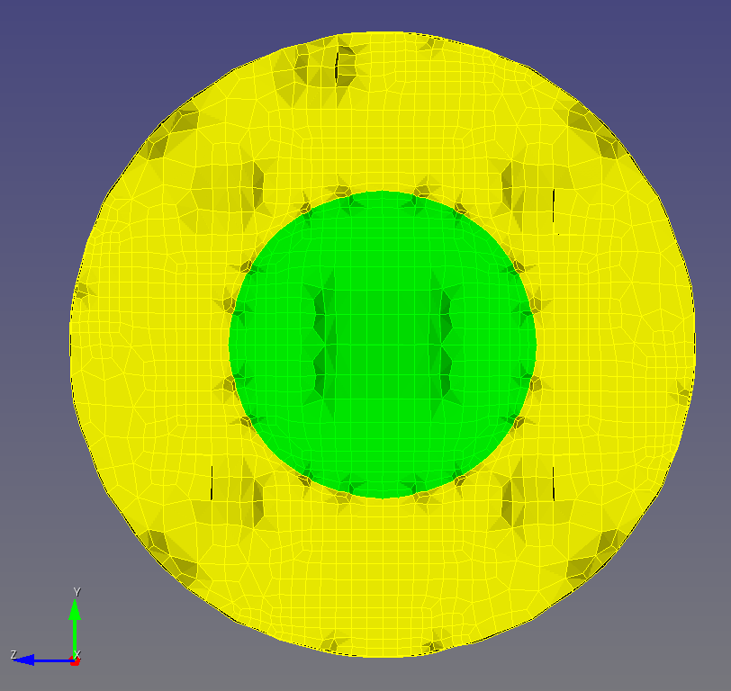

# Two Spheres

The goals for this section are

* Demonstrate the automatic mesh generation with [`sculpt_stl_to_inp.py`](../../src/atmesh/sculpt_stl_to_inp.py).

## Contents

* [Input](#input)
* [Manual step-by-step via Cubit GUI](#manual-step-by-step-via-cubit-gui)
  * [Nodesets](#nodesets)
  * [Enhanced features](#enhanced-features)
* [Automated mesh generation](#automated-mesh-generation)
* [Automation on HPC](#automation-on-hpc)

## Input

From the `~/autotwin/mesh/tests/files` folder:

* `sphere_radius_5.stl`
* `sphere_radius_10.stl`

shown together here:


> *Figure 1. MeshLab visualization of the two input files listed above.*

## Manual step-by-step via Cubit GUI

This manual step-by-step walkthrough, using the Cubit GUI, is the manual process that is automated with [sculpt_slt_to_inp.py](../../src/atmesh/sculpt_stl_to_inp.py).

* Import the two `.stl` files listed above from the folder listed above.
* Toggle clipping plan to visualize the surfaces of both files.


> *Figure 2. Cubit GUI visualizaton of the two input files listed above, with a mid-plane cut view.*

Command Panel Steps | Image
-- | --
Command Panel > Mesh > Volume > Sculpt |
Volume All, Advanced Settings, Cell Size 1, Preview, Mesh |
Image: | 

* See blue outline with dots, indicating the bounding box


> *Figure 3. Blue outline indicating the Sculpt domain.*

* Click the Mesh button


> *Figure 4. Domains meshed with Sculpt.*

### Nodesets

Sculpt can generate sidesets with the `gen_sideset` option.

* Check out Section 9. BOUNDARY CONDITIONS of the Sculpt [documentation](https://cubit.sandia.gov/files/cubit/16.08/help_manual/WebHelp/cubithelp.htm) and [this](https://coreform.com/cubit_help/mesh_generation/meshing_schemes/parallel/sculpt_bcs.htm?rhsearch=side_sets&rhhlterm=sidesets%20sideset).
* One can generate nodesets from sidesets.

To generate nodesets from sidesets with Sculpt:

```bash
import stl "supplied_files/sphere_radius_5.stl" feature_angle 135 merge
import stl "supplied_files/sphere_radius_10.stl" feature_angle 135 merge
sculpt volume all gen_sidesets 2
export mesh "mesh.g" overwrite # not necessary to export and then import the .g file
reset
import mesh "mesh.g" no_geom
nodeset 1 add  node in face in sideset 1
```

### Enhanced Features

Below, we explore advanced features, such as *adaptivity* and *pillowing*, on a cube and on the two spheres models.

```bash
Cubit>
help sculpt
brick x 20
view iso
draw block all
graphics clip off
graphics clip on location position 1 0 0 direction vector -1 0 0 # brick
graphics clip on location position -1 0 0 direction vector 1 0 0 # sphere
view left
view right
up 0 1 0
graphics perspective off
graphics clip manipulation off
graphics clip manipulation on
```

description | graphics | graphics/command
-- | -- | --
baseline 1 |  | 
-> | -> | `sculpt parallel volume all size 2 box location position -16.001 -16 -16.001 location position 15.999 16 15.999 adapt_type 1 adapt_levels 3 `
baseline 2 |  | 
-> | -> | `sculpt parallel volume all size 2 box location position -16.001 -16 -16.001 location position 15.999 16 15.999 adapt_type 2 adapt_levels 3 `
baseline 3 |  | 
-> | -> | `sculpt parallel volume all size 2 box location position -16.001 -16 -16.001 location position 15.999 16 15.999 adapt_type 3 adapt_levels 3 `
baseline 4 |  | 
-> | -> | `sculpt parallel volume all size 2 box location position -16.001 -16 -16.001 location position 15.999 16 15.999 adapt_type 4 adapt_levels 3 `
baseline sphere |  | see above view `.yml` file
pillow (layers 3, smooth) |  | `sculpt parallel volume all size 2 box location position -16 -16 -16 location position 16 16 16 pillow 1`
adapt 1 |  | `sculpt parallel volume all size 2 box location position -16.001 -16 -16.001 location position 15.999 16 15.999 adapt_type 1 adapt_levels 3`
adapt 2 |  | `sculpt parallel volume all size 2 box location position -16.001 -16 -16.001 location position 15.999 16 15.999 adapt_type 2 adapt_levels 3`
adapt 3 |  | `sculpt parallel volume all size 2 box location position -16.001 -16 -16.001 location position 15.999 16 15.999 adapt_type 3 adapt_levels 3`

## Automated mesh generation

Create a `.inp` file using [`two_spheres.yml`](../../tests/files/two_spheres.yml)

```bash
(.venv) $ version
autotwin mesh module version:
0.0.7
(.venv) $ sculpt_stl_to_inp tests/files/two_spheres.yml > tests/files/two_spheres.log
```

See [two_spheres.log](../../tests/files/two_spheres.log) for the command line outout.

From Cubit, open [`"~/autotwin/mesh/tests/files/two_spheres.inp"`](../../tests/files/two_spheres.inp).

Images shown below are half-sections, with the `-x` hemisphere hidden and the `+x` hemisphere shown.

all | inner | outer
:--: | :--: | :--: 
`draw block all` | `draw block 1` | `draw block 2`
 |  | 
1200 elements | 152 elements | 1048 elements |
**all** | **inner** | **outer**
-- | `draw nodeset 3` | `draw nodeset 2`
-- |  | 
1477 total (volume) |  98 nodes (surface) | 482 nodes (surface)

## Automation on HPC

```bash
ssh -X <remote.hostname>
hpc $
python3 --version # 3.6.8, we need 3.7.x
# module avail
# module load alegra/anaconda/3.7
# python --version
# Python 3.7.11
/projects/cubit/Cubit-16.08/bin/python3/python3.7 --version
Python 3.7.9
cd ~/autotwin/mesh
/projects/cubit/Cubit-16.08/bin/python3/python3.7 -m venv .venv
source activate .venv/bin/activate

(.venv) $
(.venv) pip list
Package    Version
---------- -------
pip        20.1.1
setuptools 47.1.0
WARNING: You are using pip version 20.1.1; however, version 22.3.1 is available.
You should consider upgrading via the '/home/chovey/autotwin/mesh/.venv/bin/python3.7 -m pip install --upgrade pip' command.

# set the pypi proxy if needed
# reference:
# https://github.com/hovey/pipe/blob/master/pip/pip_pypi_proxy.md

python -m pip install --upgrade pip

python -m pip install -e .  # note: `-e .` = `--editable .`

pytest -v

version
autotwin mesh module version:
0.0.7
```

Modify the input `.yml` file line:

```bash
# from
cubit_path: "/Applications/Cubit-16.08/Cubit.app/Contents/MacOS"

# to
cubit_path: "/projects/cubit/Cubit-16.08/bin"
```

Make sure command line Cubit without the GUI (without graphics) runs:

```bash
/projects/cubit/Cubit-16.08/cubit -nogui
/projects/cubit/cubit -nogui -nographics # alternative
/projects/cubit/Cubit-16.08/bin/cubit -nogui # alternative
```

Alternatively (when graphics are desired, and with `-X` for X11 forwarding `on` from ssh command (above):

```bash
/projects/cubit/Cubit-16.08/cubit
```

Load mpi modules:

```bash
module load sierra # to get openmpi-intel/4.0
The following have been reloaded with a version change:
  1) intel/16.0 => intel/21.3.0     2) openmpi-intel/1.10 => openmpi-intel/4.0
```

or, just load the openmpi-intel/4.0 directly:

```bash
module load openmpi-intel/4.0

The following have been reloaded with a version change:
  1) openmpi-intel/1.10 => openmpi-intel/4.0
```

Run the Python script:

```bash
sculpt_stl_to_inp tests/files/two_spheres.yml
```

**See also [Hausdorff Distance](../hausdorff_distance.md)**